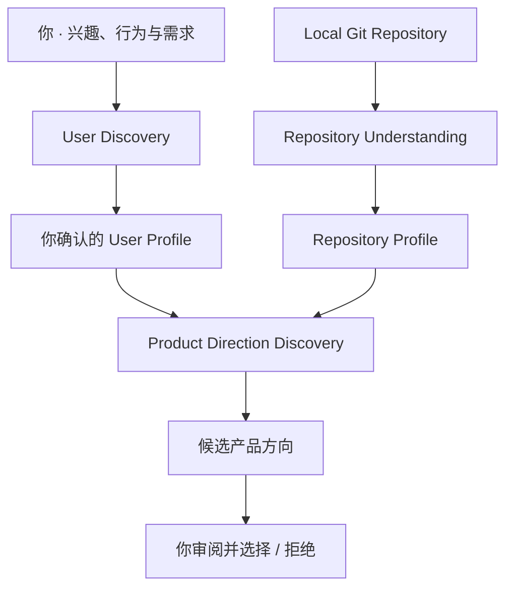

<div align="center">

# DelveForge

**Personalized project discovery and evolution.**

把真实需求与已有代码连接起来，找到你真正想做的下一个项目。

**Evolution Before Rewrite**


[了解功能](#features) · [快速开始](#getting-started) · [如何使用](#usage) · [文档](#documentation)

</div>

## 🎯 About

做完教程项目后，下一个项目做什么？热门项目清单能提供题目，却很难解释：
**为什么适合我、我会不会真的使用它、它和现有项目有什么不同？**

DelveForge 面向已有一定开发经验、希望找到个人项目方向的开发者。
它结合你的兴趣、行为、痛点、技术能力与现实约束，理解手边仓库的可复用能力，
提出值得继续探索的产品方向。

**Evolution Before Rewrite**：优先从已有软件出发，找到通往目标产品的演化路径。
目前可以完成用户探索、仓库分析和方向选择；演化规划与代码执行尚未实现。

<a id="features"></a>

## ✨ Features

- **User Discovery · 理解你的需求**<br>
  探索兴趣、真实行为、痛点、技能、目标和约束。你可以查看、纠正并明确确认生成的画像。
- **Repository Understanding · 看懂已有资产**<br>
  只读分析本地 Git 仓库的固定 commit，整理用途、技术栈、核心能力、可复用资产、限制与风险。
- **Product Direction Discovery · 找到演化方向**<br>
  将已确认画像与一个或多个仓库画像结合，生成 3–5 个个性化候选方向。
- **Human Review & Selection · 由你作出选择**<br>
  查看每个方向的用户匹配、资产复用、差异化、技术价值、复杂度、风险与依据，再选择或拒绝。

## 🧭 How It Works



**一个例子：**你想做数据由自己掌控的个人记账工具，而手边的后端项目已有
Elasticsearch 搜索与聚合能力。一个可能的方向是复用索引、筛选和聚合机制，
把商品检索演化为**账目检索与分析**。

这个例子来自已有验证中的方向建议，不代表每次都会生成相同结果，也不代表改造已经完成。
同一个需求配上不同的软件资产，可以得到不同的演化路径。

<a id="getting-started"></a>

## 🚀 Getting Started

### 准备环境

- **JDK 21**，配置好 `JAVA_HOME`；**Git CLI** 可从 `PATH` 调用。
- **Node.js `^20.19.0 || >=22.12.0` + npm**（启动前端时需要）。
- **DeepSeek API Key**，供用户探索、仓库分析与方向发现使用。
- Maven Wrapper 已包含在仓库中；SQLite 无需独立数据库服务。

### 克隆并启动后端

```bash
git clone https://github.com/ayywl288/DelveForge.git
cd DelveForge
./mvnw -DskipTests package
export DEEPSEEK_API_KEY="<your-key>"
java -jar backend/delveforge-app/target/delveforge-app-0.1.0-SNAPSHOT.jar
```

Windows PowerShell 将 `./mvnw` 换成 `./mvnw.cmd`，并用以下命令设置凭据：

```powershell
$env:DEEPSEEK_API_KEY = "<your-key>"
```

后端默认运行于 `http://localhost:8080`，SQLite 文件默认位于 `./data/delveforge.db`。
未设置 Key 时仍可启动服务，但需要模型的请求会失败。真实凭据不要提交到仓库。
高级配置见 [application.yml](backend/delveforge-app/src/main/resources/application.yml)。

### 启动前端

在仓库根目录另开终端：

```bash
cd frontend
npm ci
npm run dev
```

打开 `http://localhost:5173`；开发服务器会将 `/api` 代理到本地后端。
**当前 Vue 页面主要用于连通性检查，完整业务流程通过 REST API 使用。**

<a id="usage"></a>

## 💡 Usage

启动服务后，可使用 Postman、curl 等 HTTP 客户端按下面的顺序体验。
表中的 `{id}` 分别使用前一步返回的画像、资产或方向 ID。

| 步骤 | 操作 | API |
| --- | --- | --- |
| 1 | 创建用户画像 | `POST /api/user-profiles` |
| 2 | 提交需求，按返回问题继续探索 | `POST /api/user-profiles/{id}/discovery-turn` |
| 3 | 查看画像，必要时纠正字段 | `GET /api/user-profiles/{id}`、`PATCH /api/user-profiles/{id}` |
| 4 | 审阅后确认当前版本 | `POST /api/user-profiles/{id}/confirm` |
| 5 | 登记本地 Git 仓库及授权信息 | `POST /api/software-assets` |
| 6 | 分析仓库，取得仓库画像 | `POST /api/software-assets/{id}/analysis` |
| 7 | 以确认后的用户画像和仓库画像发现方向 | `POST /api/product-directions/discovery` |
| 8 | 查看方向，再显式选择或拒绝 | `GET /api/product-directions/{id}`、`POST /api/product-directions/{id}/select` 或 `/reject` |

Discovery turn 的请求形如 `{"input":"我想做自托管记账工具，主要会 Java，只有周末有时间。"}`。
信息不足时按 `nextQuestion` 继续回答；进入 `REVIEWING` 后检查画像，
确认时提交你实际审阅版本的 `{"revision": N}`。

登记仓库时提供 `location`、`readPermissionAllowed`、`licenseInfo` 与 `usageAuthorization`，
按真实权限填写。取得分析结果后，方向发现请求的形状如下：

```json
{
  "userProfileId": "<confirmed-user-profile-id>",
  "expectedRevision": 23,
  "repositoryProfileIds": ["<repository-profile-id>"]
}
```

将示例中的 ID 和 `23` 换成实际返回的值。选择新方向时，原先选中的方向会进入 `SUPERSEDED`；
系统不会替你选择，也不会在选择后自动修改代码。
详细操作记录见 [端到端使用示例](docs/validation/m2-product-direction-e2e-smoke.md#13-复现)。

## 🏗 Engineering & Architecture

- **AI Proposes, Domain Decides**：模型输出先经过严格解析、引用校验和领域规则，才能成为系统状态；方向整批保存，失败不留下半批结果。
- **Revision-pinned Understanding**：对固定 commit 做只读分析，在有界预算内选择材料，保留结果与仓库版本之间的联系。
- **Safe AI boundary**：Scout 只接收元数据；文件读取前排除高风险路径，内容交给外部 AI 前净化已识别凭据。规则不保证覆盖所有秘密格式。
- **Evidence-backed recommendations**：方向保留用户需求、匹配关系与可复用能力的依据，关联明确的画像版本与仓库快照，方便审阅与追溯。

Backend 采用 Maven 多模块的 Modular Monolith。App 负责装配，Infrastructure 实现外部 Ports：

```text
Frontend ──HTTP──▶ App
                    ├──▶ Application ──▶ Domain
                    └──▶ Infrastructure ──▶ Application / Domain
```

模块依赖和仓库理解的详细设计见 [ARCHITECTURE](docs/ARCHITECTURE.md) 与 [ADRs](docs/decisions/)。

## 🛠 Built With

| 层面 | 技术 |
| --- | --- |
| Backend | Java 21 · Spring Boot 3.5.x · Maven Wrapper |
| Persistence | SQLite · Flyway · MyBatis-Plus |
| 外部能力 | Git CLI · DeepSeek HTTP API |
| Frontend | Vue 3 · TypeScript · Vite |

核心流程有自动化测试与真实仓库验证覆盖。后端在根目录运行 `./mvnw clean verify`；
前端安装依赖后在 `frontend/` 运行 `npm run build`，完成类型检查与生产构建。

## 🗺 Roadmap

- ✅ **M0 — Foundation**
- ✅ **M1 — User Discovery + Repository Analysis**
- ✅ **M2 — Product Direction Discovery**
- ➡️ **M3 — Evolution Planning**：下一阶段，尚未开始

完整计划见 [ROADMAP](docs/ROADMAP.md)。当前完成的是方向发现与选择，尚不包含演化计划或代码执行。

<a id="documentation"></a>

## 📚 Documentation

- [PRODUCT](docs/PRODUCT.md) — 产品目标、用户与范围
- [ARCHITECTURE](docs/ARCHITECTURE.md) — 系统结构与技术边界
- [DOMAIN_MODEL](docs/DOMAIN_MODEL.md) — 领域语义、状态机与不变量
- [ROADMAP](docs/ROADMAP.md) — 开发计划与验收标准
- [ADRs](docs/decisions/) — 关键设计决策与取舍
- Engineering notes — [开发复盘](docs/retrospectives/) / [验证记录](docs/validation/)

贡献时请参考 [AGENTS.md](AGENTS.md)；前端开发说明见 [Frontend README](frontend/README.md)。
