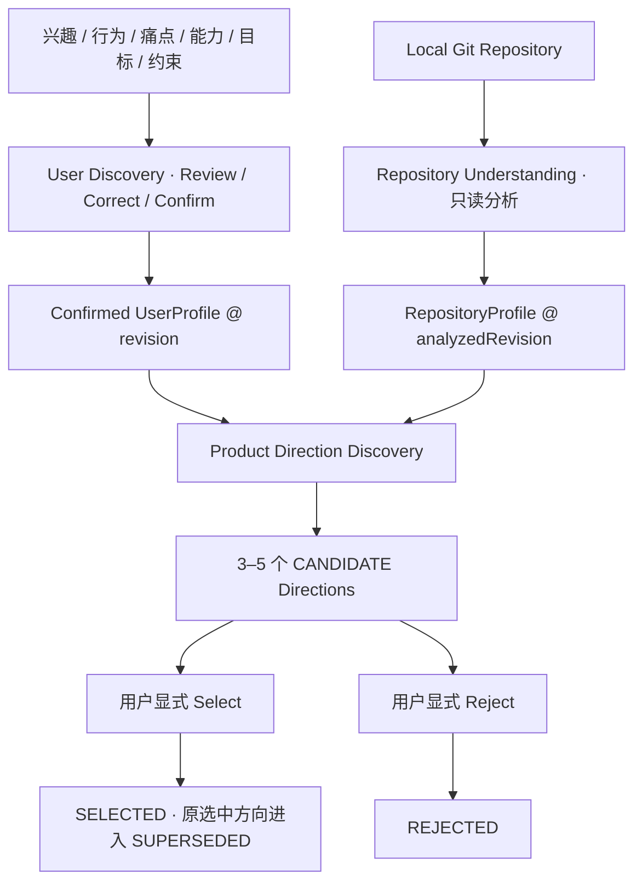
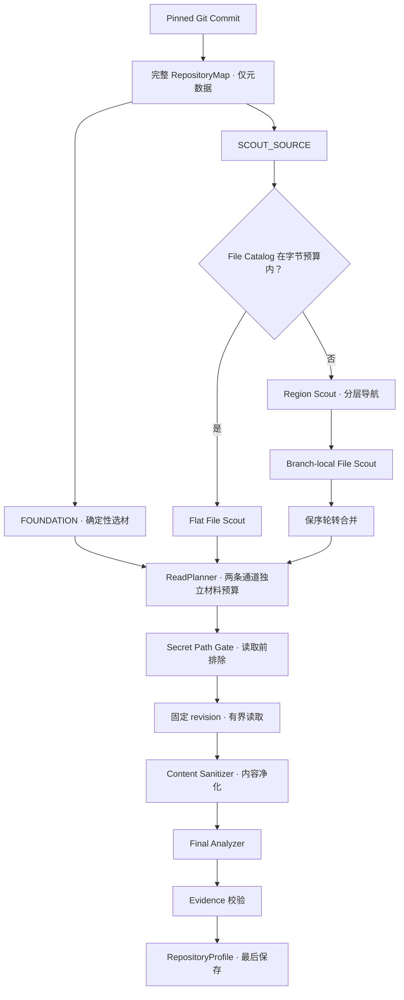

# DelveForge

*A personalized project discovery and evolution agent connecting real user needs with reusable software assets.*

有代码、有技术，却不知道下一个项目该做什么？DelveForge 从你的兴趣、真实行为、痛点与目标出发，
结合已有软件仓库的能力，发现有个人意义、也有代码基础可依托的产品方向。

**Evolution Before Rewrite：先寻找已有软件可以如何演化，再决定需要新建什么。**

目前已完成 **M0–M2**：用户探索 → 仓库理解 → 产品方向发现与用户选择。
下一阶段是 **M3 · Evolution Planning**；演化规划与代码执行尚未实现。

[当前验证](#已经验证了什么) · [工程设计](#关键工程设计) · [快速开始](#快速开始) · [项目文档](#项目文档)

## 为什么做 DelveForge

教程、热门项目清单和克隆系统能帮助开发者学习技术，却不一定回答：
**我为什么要做这个？谁会使用它？它和我已经写过的代码有什么关系？**

DelveForge 尝试把这几个问题连起来：

- 从兴趣、行为和痛点找到真实使用场景，而非先选一个技术栈再拼需求。
- 把技术能力、项目目标和时间约束纳入取舍，让方向适合具体的人。
- 理解教程项目、历史项目或开源仓库中的可复用能力，寻找差异化的演化路径。

这是一个正在验证的产品假设。当前已验证后端链路与真实仓库上的推荐结果，
尚不代表已经完成广泛的真实用户验证。

## 当前可以完成的流程



每个方向包含问题、目标产品、用户匹配点、候选资产、差异化、技术价值、复杂度、风险与依据。
系统负责提出候选，**最终选择属于用户**；当前全局最多保留一个 `SELECTED` 方向。

当前业务功能通过 **REST API** 使用。Vue 前端已有工程骨架与后端连通性检查，
尚未提供完整的用户探索或方向选择界面。

## 已经验证了什么

M2 收尾使用真实 DeepSeek 调用，以**同一个 Confirmed UserProfile** 分别配对三个真实仓库：

| 验证项 | 结果 |
| --- | --- |
| 软件资产 | hm-dianping / mall / memos |
| Product Directions | 14 个，初始均为 `CANDIDATE` |
| EvidenceBasis | 207 条，逐条核对来源 |
| basis 错配 | 0 |
| 生命周期 | Select / Reject / Supersede，以及非法转换不改变状态 |
| 失败一致性 | 无效输入基线被拒绝，相关表不留下部分方向 |
| 后端自动化验证 | 1,069 个测试通过，0 failures |

详见 [M2 端到端验证记录](docs/validation/m2-product-direction-e2e-smoke.md)。
方向文字是那次模型调用的结果；这里验证的是输入追溯、领域结构、生命周期和持久化边界，
不承诺每次调用产生相同推荐。

## 同一个需求，三条演化路径

验证中的用户希望拥有**数据由自己掌控、方便导出的个人记账工具**，
主要使用 Java / Spring Boot，前端能力和可投入时间有限。

| 输入仓库 | 已有资产 | 本次发现的方向示例 |
| --- | --- | --- |
| hm-dianping | 事务消息、消费幂等、三级缓存 | 记账数据迁移与对账流水线；复用多级缓存的月报看板 |
| mall | Elasticsearch、动态鉴权、通用后端骨架 | 把商品搜索与聚合迁移到账目检索；自托管记账与导出服务 |
| memos | memo 模型、CEL、多数据库、MCP | 将 memo 演化为账目；通过本地财务 MCP 服务查询账本 |

**用户需求相同，但可复用资产不同，因此到达目标产品的路径不同。**
这些是已生成的产品方向，不是已经完成的代码改造。

## 关键工程设计

### AI Proposes, Domain Decides

LLM 产出的是不可信 Proposal，不能直接创建合法领域状态，也不能替用户选择方向。

```text
明确的输入基线
    → AI Proposal
    → strict parsing / reference resolution
    → Application 校验 + Domain invariants
    → accepted state / persistence
```

方向发现在调用模型前校验 UserProfile 是否已确认、revision 是否匹配、RepositoryProfile 是否存在。
输出通过校验后整批写入；失败不留下半批方向。Provider 协议由 Infrastructure 处理，
业务 Proposal 的解析与引用校验由 Application 承担。

### 固定 revision 的仓库分析

一次分析只解析一次 Git HEAD，后续元数据枚举、内容读取与结果都绑定同一个 `analyzedRevision`。
分析读取已提交的 commit snapshot，不混入工作区未提交内容，也不在中途重新解析 HEAD。

Repository Analysis 只获得 Workspace 的读能力，原始仓库保持不变。
生成的 RepositoryProfile 是可追溯快照，后续分析不会覆盖旧快照的原始语义。

### 分层 Repository Understanding

先建立完整的元数据 Map，再决定读哪些文件。小目录走 flat File Scout；目录过大时，
Region Scout 逐层选择区域，各终态分支执行本地 File Scout，再按保序轮转合并候选。

Region / File Scout **只接收元数据**，引用必须在本次调用的目录内有效；
仓库分析中只有 Final Analyzer 接收净化后的文件内容。
导航调用预算与材料读取预算分开，Scout 协议失败最多重试一次，重试也消耗真实调用额度。

极大或极宽的仓库可能在预算内无法完成导航，此时 **fail closed**，不把部分结果当成成功分析。
`langflow` 是当前明确接受的 MVP bounded-failure 案例。

### Repository Source Secret Boundary

源码送往外部模型前经过两个执行点：

```text
读取前：排除规则命中的高风险路径
读取后、交给 AI 前：净化内容中识别出的凭据取值
```

路径排除避免整份凭据文件进入读取；内容净化保留配置结构，同时替换识别出的敏感值。
这是确定性规则边界，**不保证识别所有可能的秘密格式**。
详见 [ADR-0006](docs/decisions/0006-repository-source-secret-boundary.md)。

### Evidence-grounded Product Directions

方向不仅保存推荐文字，也保存「用户需求 / 用户匹配 / 可复用能力」与依据的对应关系。
每条依据关联确切的 UserProfile revision 或 RepositoryProfile，后者再绑定仓库 commit。

临时模型引用由系统解析为真实输入中的依据；模型不能新造受信任的来源身份，
也不能自行决定 Evidence 的 `confidence` 或 `confirmed`。
依据可追溯不等于模型判断必然正确，用户仍需要审阅推荐与风险。

## Repository Understanding 一图看懂



完整 Map 表示元数据可见，不意味着读取全部源码。
Final Analyzer 的 Evidence 引用必须指向本次真正送出的文件。
设计依据见 [ADR-0004](docs/decisions/0004-two-stage-repository-understanding-with-validated-file-references.md)
和 [ADR-0005](docs/decisions/0005-hierarchical-repository-scout-for-oversized-source-catalogs.md)。

## 架构与技术栈

Backend 是 Maven 多模块的 Modular Monolith，模块内部按 Feature / Domain Concept 组织。
下面箭头表示代码依赖，Frontend 通过 HTTP 访问 App：

```text
Frontend (Vue) ──HTTP──▶ App (REST / Composition Root)
                         ├──▶ Application ──▶ Domain
                         └──▶ Infrastructure ──▶ Application / Domain
```

| 模块 | 职责 |
| --- | --- |
| `delveforge-domain` | Aggregates、invariants、显式状态转换，不依赖其他业务模块 |
| `delveforge-application` | Use Cases、编排、Ports、业务解析与校验 |
| `delveforge-infrastructure` | SQLite、Git CLI、DeepSeek HTTP 等外部能力 Adapter |
| `delveforge-app` | REST、启动、配置与依赖装配 |
| `frontend` | Vue 应用；当前提供连通性验证页面 |

主要技术：**Java 21 · Spring Boot 3.5.16 · SQLite · Flyway · MyBatis-Plus · Git CLI ·
DeepSeek HTTP API · Vue 3 · TypeScript · Vite · Maven Wrapper**。

所有模型访问经过 AI Gateway，仓库操作经过 Workspace Port。
Provider 类型不进入 Domain / Application，读能力与代码修改能力保持分离。

## 项目进度

| Milestone | 状态 |
| --- | --- |
| M0 — Project Foundation | 已完成 |
| M1 — User Discovery + Repository Analysis | 已完成 |
| M2 — Product Direction Discovery | 已完成，Repository Analysis V3 已冻结 |
| M3 — Evolution Planning | 下一阶段，尚未开始 |

演化计划、Working Copy 和代码执行属于后续工作。完整范围与验收标准见 [ROADMAP](docs/ROADMAP.md)。

## 快速开始

### 环境

- **JDK 21**，`JAVA_HOME` 指向该 JDK。
- **Git CLI** 可在 `PATH` 中访问；分析输入为本地 Git Repository。
- 前端需要 **Node.js `^20.19.0 || >=22.12.0` 与 npm**，使用仓库的 `package-lock.json`。
- 无需单独安装 Maven 或数据库服务；仓库提供 Maven Wrapper，持久化使用 SQLite。

### 构建并启动后端

在仓库根目录执行：

```bash
./mvnw clean verify
export DEEPSEEK_API_KEY="<your-key>"
java -jar backend/delveforge-app/target/delveforge-app-0.1.0-SNAPSHOT.jar
```

Windows PowerShell 使用 `./mvnw.cmd clean verify`，设置凭据使用：

```powershell
$env:DEEPSEEK_API_KEY = "<your-key>"
```

后端默认地址为 `http://localhost:8080`。模型相关功能需要有效的 `DEEPSEEK_API_KEY`；
未设置时服务仍可启动，只有实际需要模型的请求会失败。不要将真实凭据写进配置文件或提交到 Git。

SQLite 默认写入相对于进程工作目录的 `./data/delveforge.db`，缺失的父目录会自动创建，
Schema 由 Flyway 管理。数据库位置可通过 `DELVEFORGE_PERSISTENCE_DATABASE_FILE` 覆盖。
其余配置见 [application.yml](backend/delveforge-app/src/main/resources/application.yml)
与 [ARCHITECTURE](docs/ARCHITECTURE.md)。

### 启动前端

另开终端：

```bash
cd frontend
npm ci
npm run dev
```

默认打开 `http://localhost:5173`，开发服务器将 `/api` 代理到本地后端。
当前页面用于确认前后端连通；业务 API 的操作顺序见
[M2 E2E 复现步骤](docs/validation/m2-product-direction-e2e-smoke.md#13-复现)。

## 验证

后端完整验证（仓库根目录）：

```bash
./mvnw clean verify
```

M2 收尾基线共有 **1,069 个后端自动化测试**；常规测试不需要真实 LLM 凭据。
真实 Provider smoke 与自动化测试分开记录。

前端验证：

```bash
cd frontend
npm ci
npm run build
```

`build` 先运行 `vue-tsc` 类型检查，再执行 Vite 生产构建。
前端当前未配置独立 test / lint 脚本，更多开发说明见 [Frontend README](frontend/README.md)。

## 项目文档

| 文档 | 从这里了解 |
| --- | --- |
| [PRODUCT](docs/PRODUCT.md) | 产品假设、目标用户与 MVP 范围 |
| [ARCHITECTURE](docs/ARCHITECTURE.md) | 模块边界、依赖方向与技术选择 |
| [DOMAIN_MODEL](docs/DOMAIN_MODEL.md) | 领域语义、状态机与不变量 |
| [ROADMAP](docs/ROADMAP.md) | 当前进度、后续 Milestone 与验收标准 |
| [Architecture Decisions](docs/decisions/) | 重要设计选择、替代方案与取舍 |
| [M2 Retrospective](docs/retrospectives/m2-product-direction.md) | 从真实失败到 V3 的演进，以及开发过程的经验 |
| [M2 E2E Validation](docs/validation/m2-product-direction-e2e-smoke.md) | 三仓库方向发现、依据核对与生命周期验证 |

[AGENTS.md](AGENTS.md) 是 Coding Agent 的贡献约定，定义任务范围、修改规则和验证要求。
