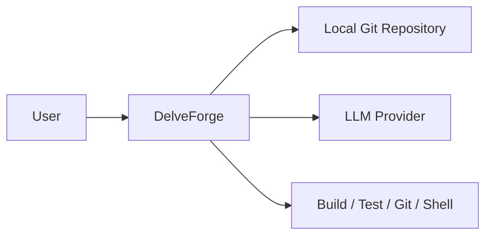
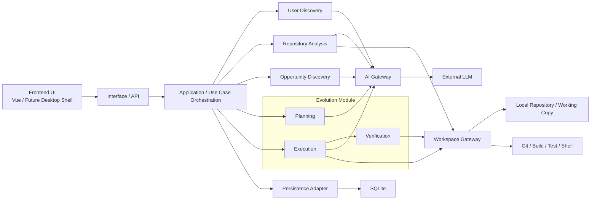
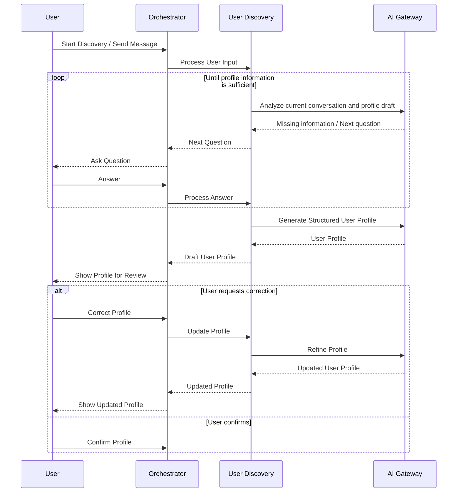
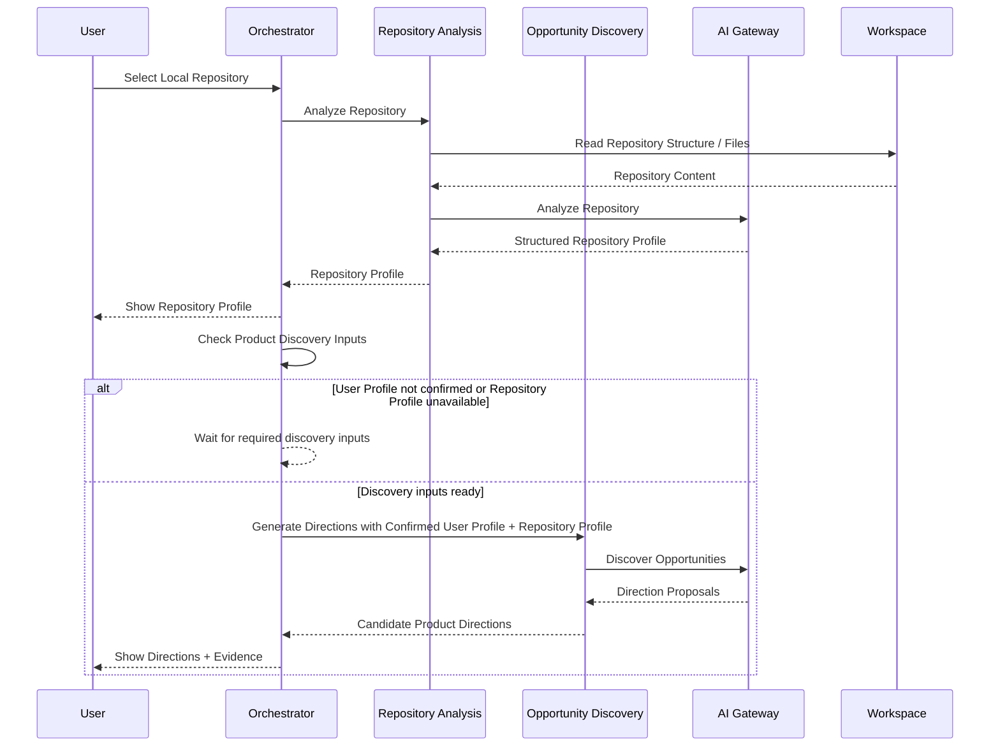
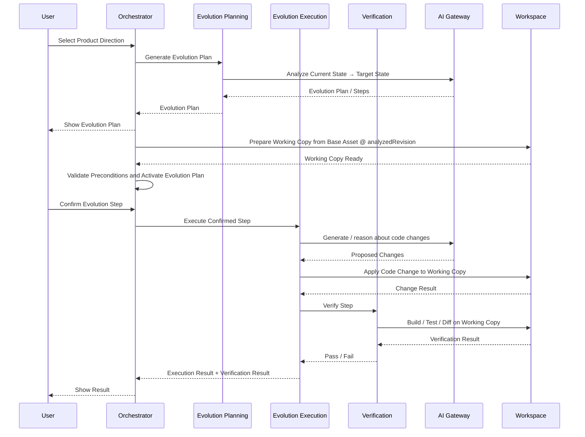

# ARCHITECTURE.md

> 本文档回答：系统准备如何实现，以及最重要的架构选择是什么。

**Status:** Stable
**Last Updated:** 2026-9-15

## 1. Architecture Goals

| Priority | Quality Attribute | Goal                                                         |
| -------- | ----------------- | ------------------------------------------------------------ |
| 1        | Modularity        | 用户探索、仓库分析、方向发现、演化执行能够独立演进           |
| 2        | Traceability      | Product Direction / Evolution Plan 能够追溯其依据的 User Profile、Repository Profile 和分析结果 |
| 3        | Safety            | Repository Analysis 对原始 Software Asset 保持只读；Evolution Execution 的代码修改必须限制在与当前 Evolution Plan 绑定的受控 Working Copy 内 |
| 4        | Verifiability     | 每个 Evolution Step 都能够产生明确的执行结果，并通过 build / test / diff 等方式验证 |
| 5        | Evolvability      | MVP 可以先采用简单架构，同时允许未来替换 LLM、Repository Analyzer 或 Coding Agent 实现 |
| 6        | Compliance        | 系统能够记录 Software Asset 的来源、许可证与使用授权信息，并在资产是否允许二次开发无法确认时给出风险提示或限制自动改造 |
| 7        | Transparency      | User Profile、Repository Profile 等关键中间产物对用户可见，并允许用户检查和纠正 |

---

## 2. Architecture Constraints

### 2.1 Project Constraints

- 当前主要由单人开发。
- MVP 优先完成完整闭环，而不是建设复杂基础设施。
- 当前 Software Asset 主要是本地 Git Repository。
- 系统需要读取用户提供的本地 Git Repository，并在隔离的 Working Copy 中执行允许的代码修改。
- 原始 Software Asset 不作为 Evolution Execution 的直接修改目标。
- MVP 不考虑多人协作。
- MVP 不考虑云端代码托管。
- MVP 不考虑长期自主运行的 Coding Agent。

### 2.2 Technology Constraints

- **Core Language / Runtime:** Java 21。MVP 核心业务、Application、Domain、AI Gateway、Workspace Gateway 与 Persistence 均以 Java 实现。
- **Optional Tool Language:** Python 不属于 MVP 必需 Runtime。未来只有在特定 Analyzer / Tool 明确依赖 Python 生态时，才允许作为独立 Tool Process 引入。
- **Application Framework:** Spring Boot 3.5.16。
- **Build Tool:** Maven + Maven Wrapper。
- **Root Java Package:** `com.ayywl.delveforge`。
- **Repository Strategy:** Monorepo。
- **Backend Module Structure:** Maven Multi-Module，初始拆分为 `delveforge-domain`、`delveforge-application`、`delveforge-infrastructure`、`delveforge-app`。
- **Code Organization:** Maven Module 负责主要 Architecture Layer Boundary，各 Module 内部优先按照 Feature / Domain Concept 组织代码。
- **AI / Agent Integration:** 优先基于 Spring AI / Spring AI Alibaba 能力实现，但业务模块只能依赖内部 AI Gateway 抽象。
  - **当前是临时兼容性基线，不是已确定的长期选型。** 候选组合为 Spring AI 1.1.2 / Spring AI Alibaba 1.1.2.2，配合 Spring Boot 3.5.x。
  - 该组合**尚未在项目中验证**：当前代码库不存在任何 Spring AI 依赖，也没有真实 Adapter。已验证的只有 Spring Boot 3.5.16 + SQLite + MyBatis-Plus + Flyway。
  - 不切换到 Spring Boot 4.x / Spring AI 2.x 的原因是 Spring AI Alibaba 稳定版线只在 3.5.x 上提供，切换会使 AI Gateway 依赖 milestone 版本。
  - 最终路线与是否升级版本，在首次实现真实 AI Adapter 前评估，见 `ROADMAP.md` §8.7。
  - 无论最终选择哪条路线，AI Gateway 的 Adapter 都必须保持内部抽象边界：业务模块不得直接依赖具体 Provider SDK 或 Spring AI Alibaba 实现类型。
- **Architecture Style:** Modular Monolith。
- **Database:** SQLite。
- **Persistence Access:** MyBatis-Plus。
- **Schema Migration:** Flyway。
- **Initial LLM Provider:** DeepSeek。
- **Initial Model:** DeepSeek V4.1 Flash；具体 Model ID 与 Provider 参数必须配置化。
- **Working Copy:** 基于用户本地 Git Repository 创建独立 Local Git Clone，并从 Repository Profile 对应的 `analyzedRevision` 建立演化基线。
- **Frontend:** Vue 3 + TypeScript + Vite。
- **MVP User Interaction:** 开发与核心 MVP 验证阶段采用 localhost Web UI + Local Java Backend。
- **Final Product Form:** Local-first Desktop Application。
- **Desktop Shell:** Deferred。待 Core MVP 稳定后再选择具体技术，不作为当前 M0 Blocker。
- **Deployment:** MVP 优先本地运行。

---

## 3. System Context

描述系统外部世界。



---

## 4. Solution Strategy

```text
系统第一版采用单体应用组织核心业务能力，
内部按照用户理解、仓库理解、方向探索、演化规划和演化执行进行模块划分。

LLM 不直接承担系统状态管理，
结构化 User Profile、Repository Profile、Product Direction、Evolution Plan 和 Evolution Step 由系统维护。

所有 LLM 调用通过统一的 AI Gateway / Model Adapter 访问，
避免业务模块直接依赖具体模型供应商。

Repository Analysis
通过受控 Workspace 接口只读访问用户提供的本地 Repository，
不得修改原始 Software Asset。

进入 Evolution Execution 前，
系统基于 Evolution Plan 对应的 Base Software Asset 与确定 Revision
准备独立 Working Copy。

Evolution Execution
通过 Workspace 访问并修改该 Evolution Plan 对应的 Working Copy，
不得直接修改原始 Software Asset。

代码分析与修改分离：
分析阶段只读取原始 Repository；
执行阶段只有在用户确认具体 Evolution Step 后，
才允许在对应 Working Copy 中获得受限写能力。

每一个 Evolution Step 执行完成后，
必须进入 Verification 流程，
通过构建、测试、Diff 或其他验证方式确认结果。

未经 Verification 的 Candidate State
不得成为后续 Evolution Step 的可信执行基线。
```

---

## 5. High-Level Architecture

描述主要运行单元。



## 6. Module Design

| Module                | Responsibility                                | Does NOT             |
| --------------------- | --------------------------------------------- | -------------------- |
| User Discovery        | 对话探索用户并维护 User Profile               | 不负责推荐项目       |
| Repository Analysis   | 分析 Repository 并形成 Repository Profile     | 不修改代码           |
| Opportunity Discovery | 根据 User + Repository 发现 Product Direction | 不修改代码           |
| Evolution             | 生成 Evolution Plan、组织执行并验证           | 不直接访问模型供应商 |
| Workspace             | 文件、Git、Build、Test、Shell 等本地能力      | 不进行产品决策       |
| AI                    | 提供统一 LLM 访问能力                         | 不维护业务状态       |

### 6.1 Initial Project Structure

DelveForge 使用 Monorepo 管理 Backend、Frontend、Documentation 与未来 Desktop Integration。

```
DelveForge/
│
├── pom.xml
├── mvnw
├── mvnw.cmd
├── .mvn/
│
├── backend/
│   ├── delveforge-domain/
│   ├── delveforge-application/
│   ├── delveforge-infrastructure/
│   └── delveforge-app/
│
├── frontend/
├── docs/
├── AGENTS.md
└── README.md
```

Backend 使用四个 Maven Module。

```
delveforge-domain
    ↑
delveforge-application
    ↑
delveforge-infrastructure

delveforge-app
    ├── depends on delveforge-application
    └── depends on delveforge-infrastructure
```

职责如下：

| Maven Module                | Responsibility                                               |
| --------------------------- | ------------------------------------------------------------ |
| `delveforge-domain`         | Aggregate、Entity、Value Object、Domain Service、Domain Policy、Domain Event 与核心 Invariant |
| `delveforge-application`    | Use Case、Application Service、Orchestration，以及 AI / Workspace / Persistence Port |
| `delveforge-infrastructure` | DeepSeek、Persistence、Git、Filesystem、Shell、Build / Test 等外部能力 Adapter |
| `delveforge-app`            | Spring Boot Bootstrap、REST API、Configuration、Dependency Wiring 与 Interface Adapter |

Module Dependency Rules：

- `delveforge-domain` 不依赖其他 DelveForge Maven Module。
- `delveforge-application` 可以依赖 `delveforge-domain`。
- `delveforge-infrastructure` 可以依赖 `delveforge-application` 与 `delveforge-domain`。
- `delveforge-app` 负责组装 Application 与 Infrastructure。
- Domain / Application 不得通过间接方式访问具体 LLM Provider、Database、Git、Shell 或 Filesystem 实现。
- 不为每个 Architecture Module 建立独立 Maven Module。
- 不创建无明确业务语义的通用 `delveforge-common` Module。

Persistence 基础结构：

```
数据库位置     配置属性 delveforge.persistence.database-file
               （默认值与覆盖方式见 delveforge-app 的 application.yml）
DataSource     delveforge-infrastructure 的 SqliteDataSourceConfiguration
Mapper 位置    com.ayywl.delveforge.infrastructure.persistence 及其子包
Mapper 装配    由 delveforge-app 的 Composition Root 扫描
Migration      delveforge-infrastructure 的 src/main/resources/db/migration
               命名 V{版本}__{描述}.sql，已发布的迁移不可修改
```

SQLite、MyBatis-Plus 与 Flyway 只允许出现在 `delveforge-infrastructure` 内。
Domain / Application 不得出现这些技术类型的依赖。

具体业务表随 M1 及之后的对应领域对象以新增迁移的方式引入。
`delveforge-domain` / `delveforge-application` 不提供通用 Repository 抽象。

Maven Module 控制主要 Architecture Layer Boundary。

每个 Module 内部继续按照 Feature / Domain Concept 组织代码。

例如：

```
com.ayywl.delveforge.domain
├── user
├── asset
├── direction
└── evolution

com.ayywl.delveforge.application
├── userdiscovery
├── repositoryanalysis
├── opportunitydiscovery
├── evolution
└── port
    ├── ai
    └── workspace

com.ayywl.delveforge.infrastructure
├── ai
├── persistence
└── workspace

com.ayywl.delveforge.app
├── api
├── config
└── error
```

Architecture Module 与 Maven Module 不要求一一对应。

例如 User Discovery、Repository Analysis、Opportunity Discovery 与 Evolution 是业务 / 架构边界，但 MVP 中不分别建立独立 Maven Module。

### 6.2 Cross-Cutting Infrastructure

配置 / 错误处理 / 日志的约定如下。

**Configuration**

```
配置类命名     {Concern}Properties，使用 @ConfigurationProperties record
归属           由消费该配置的 Module 自己声明并通过 @EnableConfigurationProperties 启用
默认值         application.yml，不在代码中兜底
环境相关值     API Key / 数据库路径 / LLM Endpoint 与 Model / Workspace Root
               一律通过配置提供，不得硬编码进业务代码
```

技术配置按边界归属：SQLite / Provider 等专有配置留在 Infrastructure。
Domain / Application 不出现任何技术配置类型。

**Error Handling**

```
异常来源                                  HTTP       ApiErrorCode
IllegalArgumentException                 400        INVALID_REQUEST
AiGatewayException                       502        EXTERNAL_CAPABILITY_UNAVAILABLE
WorkspaceException                       500        INTERNAL_ERROR
Spring MVC 协议层异常                      由框架决定   INVALID_REQUEST / INTERNAL_ERROR
  （405 / 415 / 400 请求体无法解析等）
其余未预期异常                             500        INTERNAL_ERROR
```

映射集中在一处（`delveforge-app` 的 error 包），Controller 不承担异常分类与错误构造。

协议层异常的状态码与响应头由框架决定，映射层只替换响应体。
自行重建响应会丢失 `Allow`、`Accept` 等协议头。

响应体不携带异常 message、堆栈、原因链或框架生成的细节文本——
这些内容可能包含请求内容、用户数据或第三方 SDK 的原始返回。

**Logging**

```
日志格式      operation=<操作> path=<资源标识> result=<结果>
              exception=<异常类型链 + 堆栈位置>
默认级别      INFO；不使用 DEBUG 作为默认值
记录内容      异常类型链与堆栈位置（类名 / 方法名 / 文件名 / 行号）
不记录内容    异常 message 与原因链文本 —— 任何日志级别
固定级别的包  org.springframework.web / org.apache.tomcat / org.apache.coyote
禁止记录      API Key / Token / Credential、完整源码、完整 Prompt 或模型响应、成批用户数据
```

日志级别不是例外：`AGENTS.md` §8.8 禁止记录凭据的规则不区分级别，
因此不存在「DEBUG 下可以记录原始异常文本」的例外。

```
不记录异常文本的原因
    异常 message 与原因链可能是调用方输入、用户数据或第三方 SDK 的原始返回，
    无法在记录前可靠判定其中是否含凭据。
    异常类型链与堆栈位置是代码标识，不承载运行时数据，足以定位失败点。

不使用 DEBUG 作为默认级别的原因
    Mapper 位于 com.ayywl.delveforge.infrastructure.persistence，
    该包打开 DEBUG 会让 MyBatis 打印 SQL 与绑定参数值，其中可能包含用户数据。

固定框架包级别的原因
    这些包的 DEBUG 输出发生在应用代码之外，无法通过 @RestControllerAdvice 拦截：
      org.springframework.web     ExceptionHandlerExceptionResolver 输出
                                  "Resolved [<异常.toString()>]"
      org.apache.tomcat          DEBUG 下输出请求头，可能包含 Authorization
      org.apache.coyote
```

上述固定是最低保障，不是完整清单；引入新的技术组件时应确认其 DEBUG 输出内容。

本节规则的原因、代价与重新评估条件见 [ADR-0002](decisions/0002-structural-only-exception-logging.md)。

M0 不引入 ELK / OpenTelemetry / Tracing 等超出范围的观测能力。

### 6.3 Frontend / Backend 连接方式

**当前开发阶段采用的方式：**

```
Frontend 调用     使用相对路径 /api/...
转发              Vite dev server 将 /api 代理到本地 Backend
代理目标          .env.development 的 BACKEND_DEV_URL
Backend           不为开发环境开放 CORS
```

目的是避免 Frontend 源码绑定具体 Backend 地址：

```
BACKEND_DEV_URL 刻意不加 VITE_ 前缀
→ Vite 只把 VITE_ 前缀的变量注入浏览器端产物
→ 该地址只用于 dev server 代理配置，不进入前端代码
```

**正式运行形态尚未决定。** 以下问题都是开放的，随 Desktop Shell 一并确定：

```
Frontend 产物如何托管
API 地址在运行期如何解析
是否需要同源
与 Desktop Shell 如何集成
```

当前实现不排除任何一种运行期形态。候选方式包括但不限于：前端产物由 Backend 托管、
本地 web server、custom protocol、IPC、运行期注入 API base。

Desktop Shell 选型时必须重新评估这套连接模型。

Backend 侧只为连通性验证提供一个不承载业务语义的技术性端点：

```
GET /api/system/connectivity
→ { service, status, timestamp }
```

该端点不探测数据库或 Provider 等下游依赖，避免把连通性检查变成对下游可用性的隐式承诺。

### 6.4 Build / Test 验证入口

```
Backend    ./mvnw verify      编译 + 模块依赖校验 + 全部测试 + 打包
Frontend   npm ci && npm run build   类型检查 + 生产构建
```

两条命令链相互独立，都能在全新环境中重复执行，且不依赖真实 LLM、
开发数据库或用户本地数据。

测试按 Module 划分职责：

```
delveforge-application      Port 契约，在 Port 边界使用 fake，不引入 Spring
delveforge-infrastructure   真实 SQLite / Flyway / MyBatis-Plus 集成
delveforge-app              上下文装配 / HTTP 端点 / 错误映射 / 配置绑定
```

需要数据库的测试使用 `target/test-databases/<uuid>/` 下的临时 SQLite 文件。

当前未引入 CI/CD、Coverage Gate、Failsafe 阶段拆分与 E2E 平台；
Frontend 也未引入 lint 与 test。引入时机见仓库根 `README.md`
与 `frontend/README.md`。

---

## 7. Dependency Rules

本节描述代码模块之间允许存在的依赖方向，而不是系统运行时的调用顺序。

```
                    ┌──────────────> AI
                    │
User Discovery ─────┤

Repository Analysis ┼──────────────> AI
        │
        └──────────────────────────> Workspace (Read Only)

Opportunity Discovery ─────────────> AI

Evolution ──────────┬──────────────> AI
                    │
                    └──────────────> Workspace
```

### Rules

- 业务模块不得直接依赖具体 LLM Provider SDK，所有模型调用必须通过 AI 模块提供的抽象接口。
- 业务模块不得直接调用 Shell、Git、Build Tool 或直接操作本地文件系统，相关能力统一通过 Workspace 模块提供。
- Repository Analysis 只能依赖 Workspace 的只读能力，不得获得代码写入、删除或修改权限。
- Opportunity Discovery 不得直接修改 Repository，也不应依赖 Workspace 的写能力。
- Evolution Execution 是 MVP 中唯一允许请求 Workspace 写能力的业务流程。
- Workspace 的只读能力与代码修改能力在 Application 层拆分为两个 Port，使上述限制在类型层面成立：只读流程的依赖中不存在修改能力，而不是仅靠调用约定保证。取舍、已知缺口与重新评估条件见 [ADR-0001](decisions/0001-separate-workspace-read-and-mutation-capabilities.md)。
- Application / Agent Orchestrator 可以协调各业务模块，但业务模块不得反向依赖 Orchestrator。
- 跨模块协作应通过公开接口和明确的数据模型完成，不得通过直接读取或修改其他模块拥有的数据库表实现。
- 禁止循环依赖。

---

## 8. Runtime Flows

> Runtime Flow 为突出核心业务协作，省略 Interface / API 层的协议解析过程，请求均实际先经过对应 Interface Adapter 后进入 Application 层。

### 8.1 User Discovery



### 8.2 Repository Analysis & Opportunity Discovery

> MVP 中 Repository Source 仅支持用户选择的本地 Git Repository。Repository Analysis 不负责 Repository 的发现与搜索；未来可在其上游增加 GitHub 等 Software Asset Discovery 能力，而无需改变 Repository Analysis 的核心职责。
>
> Opportunity Discovery 不要求用户额外发起“生成 Product Direction”的请求。当 Confirmed User Profile 与至少一个可用 Repository Profile 均已准备完成后，Application / Orchestrator 可以自动进入 Product Direction Discovery。
>
> 系统可以主动发现和生成 Product Direction，但 Product Direction 的最终选择仍然必须由用户完成。



### 8.3 Evolution



该流程只展示 Evolution 的主要 Runtime Collaboration。

其中以下领域语义仍以 `DOMAIN_MODEL.md` 为准：

```text
Working Copy Preparation
Plan Activation
baselineRevision
Candidate State
lastVerifiedRevision
Verification Failure
Repair
Retry
Rollback
Recovery
UNRECOVERABLE
```

特别是：

```text
Generate Evolution Plan
        ↓
Prepare Working Copy
        ↓
Activate Evolution Plan
        ↓
Confirm Evolution Step
        ↓
Execute
        ↓
Verify
```

是进入实际代码修改的必要顺序。

Evolution Plan 被生成并不意味着系统已经获得代码修改权限。

只有：

```text
Evolution Plan = ACTIVE
+
Working Copy available
+
Evolution Step explicitly confirmed by user
```

时，Evolution Execution 才允许请求 Workspace 的代码修改能力。

---

## 9. Architecture Decisions

重大且长期的架构决策记录在 `docs/decisions/`，本节只维护索引。

| ADR | Decision | Status |
| --- | --- | --- |
| [0001](decisions/0001-separate-workspace-read-and-mutation-capabilities.md) | Workspace 读写能力在 Application 边界拆分 | Accepted |
| [0002](decisions/0002-structural-only-exception-logging.md) | 异常日志只记录结构信息，防止运行时数据泄漏 | Accepted |

以下事项经过评审后**决定不建立 ADR**，结论保留在本文件或 `docs/ROADMAP.md` 中：

```text
AI Gateway 边界形态         已被 AGENTS.md RULE-DOM-003、DOMAIN_MODEL 12.12 与
                            AiGateway javadoc 覆盖；
                            真实 Adapter 实现时必然重新评估

Frontend / Backend 连接方式  开发期实现细节，见 6.3
```

已延后、尚未形成决策的事项见 `docs/ROADMAP.md` §8.7。
