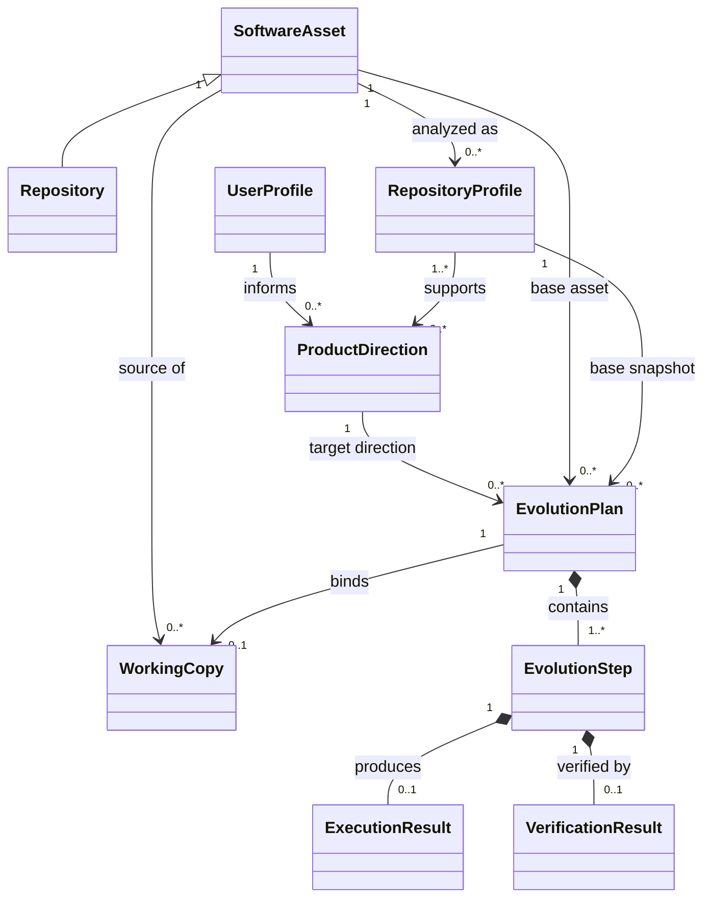
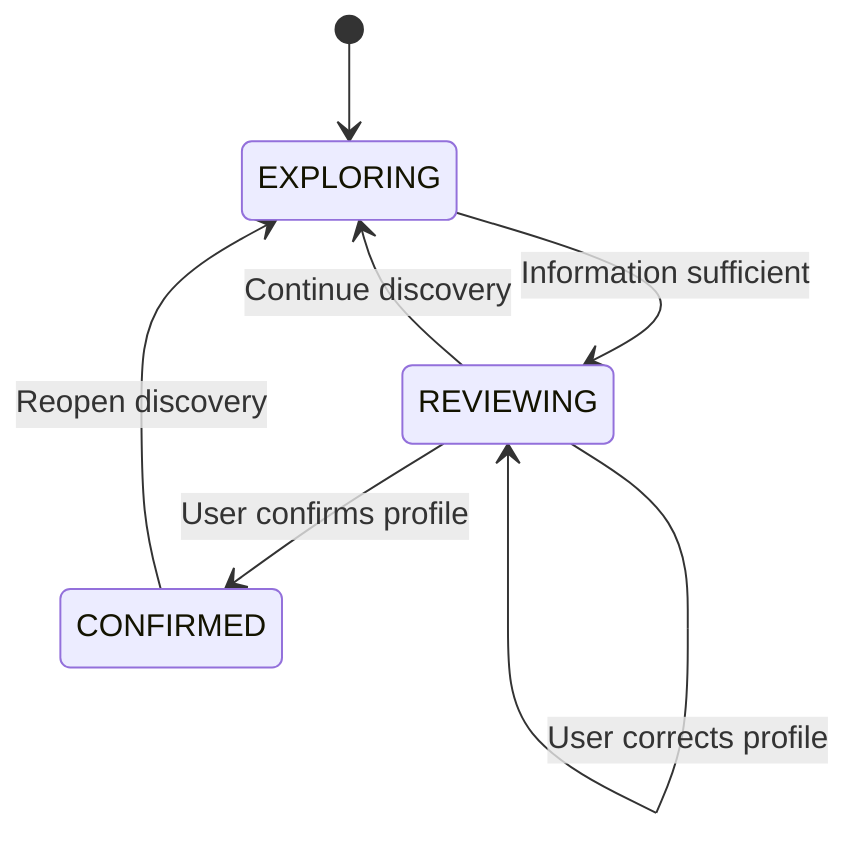
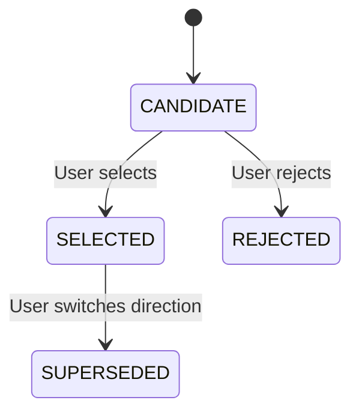
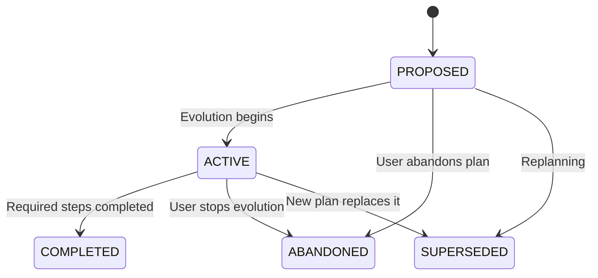
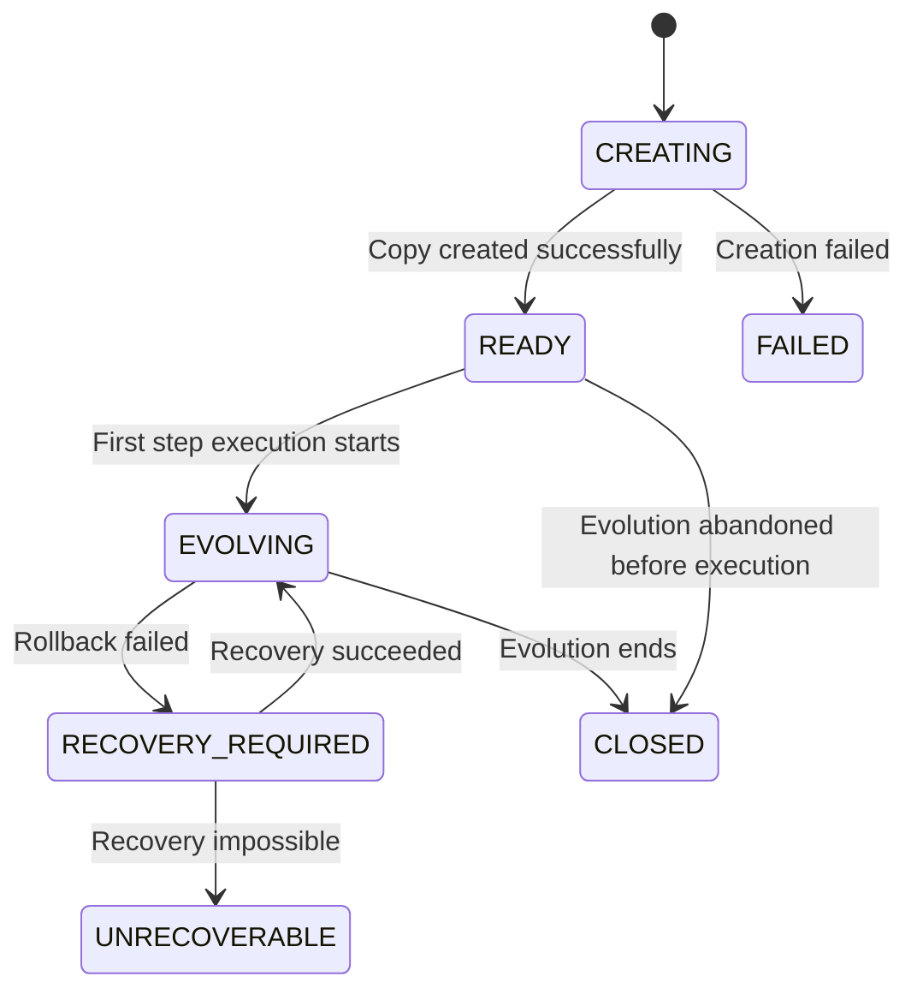
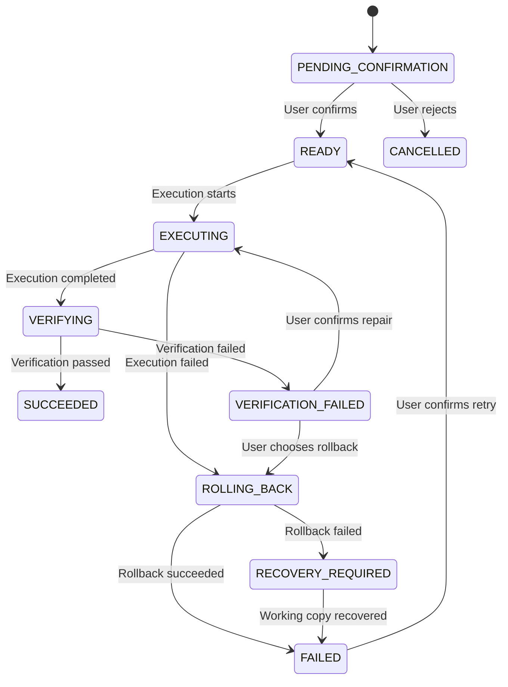

# DOMAIN_MODEL.md

> 本文档回答：DelveForge 内部有哪些核心业务概念，这些概念分别代表什么，以及它们之间如何协作。

**Status:** Stable
**Last Updated:** 2026-09-14

## 1. Domain Overview

DelveForge 所处理的核心领域是：

> 根据开发者自身的兴趣、真实行为、痛点、技术能力和项目目标，结合其可利用的软件资产，发现具有个人相关性且可实施的产品方向，并将选定方向逐步转化为可验证的软件演化过程。

在该领域中，系统首先通过与用户交互形成 `User Profile`，描述用户当前值得用于项目发现的信息。

同时，系统分析当前可利用的 `Software Asset`。MVP 中仅支持本地 Git Repository，并基于分析结果形成结构化的 `Repository Profile`。

随后，系统结合 `User Profile` 与一个或多个 `Repository Profile`，生成多个候选 `Product Direction`。每个 Product Direction 都应能够说明其需求来源、与用户的匹配关系、可利用的软件资产以及预计改造成本和风险。

当用户选择一个 Product Direction 后，系统选择或确认合适的 Software Asset 作为演化基础，并根据其 Current State 与目标产品的 Target State 生成 `Evolution Plan`。

原始 Software Asset 原则上作为分析和复用来源，不直接承载 DelveForge 的演化修改。进入实际演化阶段时，系统基于选定 Software Asset 的确定状态创建独立的 `Working Copy`，后续 Evolution Step 对代码产生的修改均限制在该 Working Copy 中。

Evolution Plan 由多个可独立执行和验证的 `Evolution Step` 组成。用户确认某个 Evolution Step 后，系统才允许在 Working Copy 中执行对应的软件修改，并产生 `Execution Result`。

执行完成后进入验证流程，通过 Build、Test、Diff 或其他验证手段形成 `Verification Result`，用于判断该步骤是否达到预期目标以及是否明显破坏已有能力。

因此，领域的核心关系可以概括为：

```
User Profile
        +
Repository Profile
        ↓
Product Direction
        ↓
User Selection
        ↓
Evolution Plan
        ↓
Working Copy
        ↓
Evolution Step
        ↓
Execution
        ↓
Execution Result
        ↓
Verification Result
```

其中，Software Asset / Repository 代表可分析和利用的原始软件资产；Working Copy 代表某次演化过程中实际允许被修改的隔离副本。

当前领域模型关注“项目发现与项目演化”本身。

LLM Provider、Prompt 调用、Workspace Gateway、文件系统、Git 命令、Shell、Build Tool、Controller、数据库等均属于领域能力的实现方式，不属于核心领域概念。

---

## 2. Ubiquitous Language

| Term                           | Definition                                                   | NOT                                                          |
| ------------------------------ | ------------------------------------------------------------ | ------------------------------------------------------------ |
| **User Profile**               | 系统通过用户探索形成的结构化用户信息，用于描述与项目发现相关的兴趣、真实行为、痛点、技术能力、项目目标和重要约束 | 不是完整个人档案，也不是未经整理的聊天记录                   |
| **Software Asset**             | 可以作为新产品起点、能力来源或复用对象的软件资产。MVP 中仅支持本地 Git Repository，未来可扩展到由用户指定或系统发现的其他软件资产 | 不等同于任意文件，也不意味着该资产一定适合被修改或复用       |
| **Repository**                 | Software Asset 的一种具体形式，表示一个可分析的代码仓库。MVP 中仅处理本地 Git Repository | 不等同于 Repository Profile，也不代表 Evolution 直接修改的工作副本 |
| **Repository Profile**         | 系统分析 Repository 后形成的结构化描述，包括项目用途、主要模块、技术栈、核心能力、可复用资产和明显限制等 | 不是 Repository 本身，也不是完整源码副本                     |
| **Working Copy**               | 基于选定 Software Asset 的确定状态创建、专门用于某次项目演化的可写软件副本 | 不是原始 Software Asset，也不是 Workspace 技术组件           |
| **Product Direction**          | 系统根据 User Profile 与 Repository Profile 发现的候选产品方向，用于表达“这个用户可以基于哪些已有能力演化出什么产品，以及为什么值得考虑” | 不是完整需求文档，也不是 Evolution Plan                      |
| **Evidence**                   | 支撑 User Profile、Repository Profile、Product Direction、Evolution Plan 等关键判断的可追溯领域依据 | 不是模型生成的一段无法追溯来源的解释                         |
| **Selected Product Direction** | 用户明确选择并准备进一步规划的 Product Direction，即 Product Direction 进入 Selected 状态后的业务称呼 | 不是新的独立领域对象，也不代表系统已经开始修改代码           |
| **Evolution Plan**             | 描述选定 Software Asset 如何从 Current State 逐步演化到目标 Product Direction 所对应 Target State 的整体计划 | 不是一次性代码生成结果，也不是单个开发任务                   |
| **Current State**              | 生成 Evolution Plan 时，相关 Software Asset 已经具备的能力、结构和限制 | 不是对整个 Repository Profile 的简单复制                     |
| **Target State**               | Selected Product Direction 对应的目标产品状态，用于与 Current State 比较并发现演化差距 | 不代表产品最终形态永远不会继续变化                           |
| **Evolution Step**             | Evolution Plan 中一个范围受限、能够独立执行并验证的增量改造步骤 | 不是整个 Evolution Plan，也不应代表一次无限范围的大规模重构  |
| **Execution**                  | 在用户确认 Evolution Step 后，在对应 Working Copy 上执行实际软件改造的领域行为 | 不代表系统可以自主执行未确认的其他步骤                       |
| **Candidate State**            | 某个 Evolution Step 的一次 Execution 完整结束后、尚未通过 Verification 的 Working Copy 暂定软件状态。Verification Failure 后可以暂时保留，以供继续修复或用户选择回滚 | 不是 Evolution Step 的状态机状态，不是已验证的软件状态，也不能作为后续 Evolution Step 的执行基线 |
| **Execution Result**           | 一次 Evolution Step 执行后形成的结构化结果，用于描述实际发生的修改及执行过程中产生的问题 | 不等同于 Verification Result，也不意味着该步骤已经验证成功   |
| **Verification Result**        | Evolution Step 执行后，通过 Build、Test、Diff 或其他验证手段产生的结果，用于判断本次改造是否满足预定义验证要求 | 不等同于“代码成功写入”，也不等同于 Execution Result          |

---

## 3. Core Concepts

### 3.1 User Profile

**Definition**

`User Profile` 是系统通过用户探索形成的结构化领域对象，用于描述当前与项目发现相关的用户信息。

它并不试图完整描述一个人，而只保留能够影响 Product Direction 发现与 Evolution Planning 的信息。

当前 MVP 面向单用户本地使用场景，因此领域模型暂不引入独立的 User Entity，也不通过 `userId` 建立多用户归属关系。

**Responsibilities**

- 表达用户的兴趣与长期关注方向。
- 表达能够形成真实软件需求的行为与痛点。
- 表达用户当前已有的技术能力。
- 表达用户希望通过项目达到的目标。
- 记录会影响项目方向选择的重要约束。
- 为 Product Direction 的生成提供用户侧依据。
- 允许用户查看、纠正和更新。

**Does NOT**

- 不保存未经整理的完整聊天记录。
- 不作为通用个人档案。
- 不负责生成 Product Direction。
- 不描述 Repository 已有能力。
- 不因为 LLM 的一次推断就自动把不确定信息视为事实。

**Important Fields**

| Field                   | Meaning                                                  |
| ----------------------- | -------------------------------------------------------- |
| `id`                    | User Profile 的唯一标识                                  |
| `revision`              | 当前 Profile 版本，用于追溯某次分析所依据的 Profile 状态 |
| `interests`             | 与项目发现相关的兴趣与关注领域                           |
| `behaviors`             | 用户真实存在的行为和使用场景                             |
| `painPoints`            | 当前希望解决的问题或不满意之处                           |
| `technicalCapabilities` | 用户当前具备的开发与技术能力                             |
| `projectGoals`          | 希望通过项目实现的个人、学习、使用或求职目标             |
| `constraints`           | 时间、技术、复杂度、资源等重要限制                       |
| `evidence`              | 支撑 Profile 中重要判断的信息来源                        |
| `status`                | 当前 Profile 是否仍在探索、等待确认或已经确认            |

> Important Fields 只记录当前已经确定具有领域意义的信息，不代表最终 Java 对象或数据库表的完整字段集合。

### 3.2 Software Asset

**Definition**

`Software Asset` 是能够作为目标产品起点、能力来源或复用对象的软件资产。

它是领域中的抽象概念，用于避免项目发现和演化过程绑定到某一种具体资产形式或来源。

MVP 中目前仅支持本地 Git Repository 作为 Software Asset 的具体形式。

**Responsibilities**

- 表示一个可以被分析和评估的软件资产。
- 记录资产的来源及其基本身份信息。
- 记录系统当前是否有权读取和利用该资产。
- 记录与复用相关的许可证、授权或其他限制。
- 作为 Repository Profile、Product Direction 和 Evolution Plan 的资产依据。
- 为未来不同类型和来源的软件资产提供统一领域语义。

**Does NOT**

- 不等同于 Repository Profile。
- 不负责解释资产内部已有能力。
- 不意味着该资产一定适合作为某个 Product Direction 的基础。
- 不意味着系统天然拥有复用或二次开发权限。
- 原则上不直接作为 Evolution Execution 的修改目标。
- 不负责执行代码修改。

**Important Fields**

| Field                | Meaning                                          |
| -------------------- | ------------------------------------------------ |
| `id`                 | Software Asset 的唯一标识                        |
| `type`               | 软件资产类型；MVP 中为 Git Repository            |
| `source`             | 资产来源，例如用户指定或未来由系统发现           |
| `location`           | 能够定位该资产的引用；具体表现形式由资产类型决定 |
| `readPermission`     | 当前是否允许系统读取和分析该资产                 |
| `licenseInfo`        | 已知的软件许可证信息                             |
| `usageAuthorization` | 当前是否确认允许复用或二次开发                   |

#### Repository

`Repository` 是 Software Asset 的一种具体形式，代表一个可分析的代码仓库。

MVP 中 DelveForge 仅处理本地 Git Repository。

Repository 负责表示实际的软件资产，而系统对 Repository 的领域理解由 `Repository Profile` 表达。

Repository 在项目发现阶段原则上作为源软件资产使用，不直接承载后续 Evolution Step 的代码修改。

### 3.3 Repository Profile

**Definition**

`Repository Profile` 是系统分析 Repository 后形成的结构化领域对象，用于表达系统在某个确定 Repository 状态下对该软件资产的理解。

它是 Repository 在项目发现与项目演化领域中的语义表示，而不是源码本身的复制。

**Responsibilities**

- 描述 Repository 当前解决的问题或主要用途。
- 一个 Repository 在不同软件状态下重新分析时，可以产生新的 Repository Profile；已有 Profile 保留其原始分析语义，不随源 Repository 自动更新。
- 描述主要技术栈和模块结构。
- 描述当前已经具备的核心能力。
- 标识可以直接复用或进一步演化的软件能力。
- 记录明显的技术限制、结构问题或演化风险。
- 为 Product Direction 发现提供资产侧依据。
- 为 Evolution Plan 提供 Current State 的重要信息来源。
- 保留分析时所基于的 Repository 状态，以支持后续追溯。

**Does NOT**

- 不等同于 Repository 本身。
- 不保存完整源码副本。
- 不直接决定 Repository 应该演化成什么产品。
- 不执行任何代码修改。
- 不随源 Repository 的后续变化自动更新；Repository 状态发生变化并需要重新分析时，应形成新的 Repository Profile。

**Important Fields**

| Field              | Meaning                                         |
| ------------------ | ----------------------------------------------- |
| `id`               | Repository Profile 的唯一标识                   |
| `assetId`          | 对应的 Software Asset                           |
| `purpose`          | 当前项目主要用途                                |
| `techStack`        | 主要技术栈                                      |
| `modules`          | 主要业务或技术模块                              |
| `capabilities`     | 当前已经具备的核心能力                          |
| `reusableAssets`   | 具有直接复用或演化价值的能力、模块或实现        |
| `limitations`      | 当前项目的重要限制                              |
| `risks`            | 对后续演化可能产生影响的技术风险                |
| `analyzedRevision` | 生成该 Profile 时所分析的 Repository 版本或快照 |
| `evidence`         | 支撑 Profile 判断的代码、配置或结构依据         |

`analyzedRevision` 用于保证 Repository Profile 可以追溯到产生该分析结果时的软件状态。其具体实现可以是 Git Commit、快照标识或其他能够稳定定位代码状态的机制。

`Repository Profile` 与 `User Profile` 的版本语义不同：

```text
User Profile
= 同一个 Entity 持续更新
= revision 随重要内容变化

Repository Profile
= 某个 Repository 状态的一次分析快照
= Repository 变化并重新分析时创建新的 Repository Profile
```

### 3.4 Working Copy

**Definition**

`Working Copy` 是基于选定 Software Asset 的确定状态创建、专门用于某次 Evolution 的可写软件副本。

它将“用于分析和复用的原始软件资产”与“允许 Agent 实际修改的软件环境”分离。

**Responsibilities**

- 记录本次 Working Copy 来源于哪个 Software Asset。
- 记录创建 Working Copy 时所对应的源代码状态。
- 作为 Evolution Step 实际代码修改的唯一目标。
- 随项目演化保存当前工作状态。
- 为 Build、Test、Diff 等验证提供实际代码环境。
- 防止 Evolution 过程无意修改原始 Software Asset。
- 保留当前领域认可的最近可信稳定软件状态，作为后续 Evolution Step 的执行基线和失败回滚点。
- 如果 Execution 失败，系统应在保留必要的 Execution Result、错误信息和 Diff 后，将 Working Copy 恢复到本 Step 的 `baselineRevision`。
- 如果 Verification 失败，Working Copy 默认保留当前 Candidate State，且 `lastVerifiedRevision` 保持不变。此时不得执行后续 Evolution Step；用户可以选择继续修复当前 Step，或显式回滚到 `baselineRevision`。

**Does NOT**

- 不等同于原始 Software Asset。
- 不负责发现 Product Direction。
- 不负责生成 Evolution Plan。
- 不等同于 Workspace Gateway 或文件系统。
- 不允许脱离对应 Evolution 流程进行无限制修改。

**Important Fields**

| Field                  | Meaning                                                      |
| ---------------------- | ------------------------------------------------------------ |
| `id`                   | Working Copy 的唯一标识                                      |
| `sourceAssetId`        | 创建该 Working Copy 所依据的 Software Asset                  |
| `sourceRevision`       | 创建时所基于的源软件状态                                     |
| `location`             | 当前 Working Copy 的可定位位置                               |
| `currentRevision`      | Working Copy 当前实际软件状态                                |
| `lastVerifiedRevision` | 当前领域认可的最近可信稳定软件状态。Working Copy 创建时初始化为 sourceRevision；进入 Evolution 后，仅能由成功的 Evolution Step Verification 推进 |
| `status`               | Working Copy 当前生命周期状态                                |

**Clues**

- `lastVerifiedRevision` 是 Evolution Execution 的安全边界。
- Working Copy 创建时，sourceRevision 作为本次 Evolution 的初始可信基线，并初始化为 lastVerifiedRevision。
- 这里的初始化不表示 sourceRevision 曾经经历过 Evolution Step Verification，而表示系统明确选择并认可该 Source Revision 作为本次 Evolution 的起始稳定状态。
- 进入 Evolution 后，lastVerifiedRevision 只有在 Evolution Step Verification 成功后才能推进。
- `Candidate State` 是对 Working Copy 暂定软件状态的领域称呼，而不是独立 Entity。
- 每个 Evolution Step 开始执行前，其代码基线必须对应当前 `lastVerifiedRevision`。
- 当 Evolution Step 的一次 Execution 完整结束后，当前 Working Copy 成为该 Step 的 Candidate State，并进入 Verification。
- 如果 Verification 通过，当前软件状态成为新的 `lastVerifiedRevision`。
- 如果 Verification 失败，Candidate State 默认继续保留，`lastVerifiedRevision` 保持不变。此时当前 Candidate State 不得作为后续 Evolution Step 的执行基线。
- 如果用户选择继续修复，则仍然在当前 Evolution Step 内基于 Candidate State 修改，并重新进行 Verification。
- 如果用户选择放弃当前 Candidate State，则 Working Copy 回滚到该 Step 的 `baselineRevision`。
- 如果 Execution 本身未可靠完成，则当前修改不构成合法 Candidate State，系统在保留必要诊断信息后自动回滚到 `baselineRevision`。
- Working Copy 的具体实现方式，例如 Git Clone、Git Worktree、独立目录复制或其他隔离机制，以及具体回滚机制，例如 Git Reset、Git Restore、临时 Commit、Snapshot 或其他机制，属于 Workspace / Infrastructure 实现，不由领域模型规定。
- Working Copy 成功创建并确认其 sourceRevision 与 Evolution Plan 的 Planning Basis 一致后：
  currentRevision = sourceRevision
  lastVerifiedRevision = sourceRevision
- 这里的 sourceRevision 构成本次 Evolution 的初始可信基线。
  该初始化只发生一次；此后 lastVerifiedRevision 只有在 Evolution Step Verification 成功后才能更新。

### 3.5 Product Direction

**Definition**

`Product Direction` 是系统结合 User Profile 与一个或多个 Repository Profile 后发现的候选产品方向。

它描述：

> 针对当前用户，可以基于哪些已有软件能力，演化出什么产品，以及为什么这个方向值得考虑。

Product Direction 是“值得做什么”的候选答案，而不是“具体应该怎么改代码”的实施计划。

**Responsibilities**

- 描述候选产品希望解决的问题或满足的需求。
- 说明该方向与用户兴趣、行为、痛点和目标之间的关系。
- 指出可以利用的 Software Asset。
- 说明相较现有项目的主要产品差异。
- 说明相关技术价值和个人化价值。
- 给出大致复杂度和主要风险。
- 保存支持该推荐的 Evidence。
- 保持对生成该方向时所使用 User Profile 与 Repository Profile 的追溯。
- 允许用户进行选择或放弃。

**Does NOT**

- 不等同于完整 Product Requirement Document。
- 不负责描述具体代码修改步骤。
- 不意味着用户已经接受该方向。
- 不因为系统认为其匹配度最高就可以自动进入执行阶段。
- 不直接修改 Software Asset 或 Working Copy。

**Important Fields**

| Field                  | Meaning                                  |
| ---------------------- | ---------------------------------------- |
| `id`                   | Product Direction 的唯一标识             |
| `userProfileId`        | 生成该方向所依据的 User Profile          |
| `userProfileRevision`  | 生成该方向时所依据的 User Profile 版本   |
| `repositoryProfileIds` | 生成该方向所依据的 Repository Profile    |
| `title`                | 方向的简短名称                           |
| `problem`              | 希望解决的核心问题或需求                 |
| `targetProduct`        | 候选产品的大致目标形态                   |
| `userFit`              | 与 User Profile 的主要匹配点             |
| `candidateAssetIds`    | 可以用于实现该方向的 Software Asset      |
| `differentiation`      | 与原项目或常见方案相比的主要差异         |
| `technicalValue`       | 可以体现或获得的技术价值                 |
| `estimatedComplexity`  | 对整体演化成本的粗粒度判断               |
| `risks`                | 当前已知主要风险                         |
| `evidence`             | 支撑该 Product Direction 的领域依据      |
| `status`               | Candidate、Selected、Rejected 等当前状态 |

这里的 `userProfileId` 表示 Product Direction 对其分析输入的领域追溯关系，并不是多用户系统中的账户归属 `userId`。

### 3.6 Evidence

**Definition**

`Evidence` 是支撑领域判断的可追溯依据。

它用于回答：

> 系统为什么得出这个结论？

Evidence 可以来自用户明确提供的信息、Repository 中可定位的事实，也可以表示系统基于已有事实形成但尚未完全确认的推断。

**Responsibilities**

- 记录重要判断的来源。
- 将 User Profile 中的重要结论与用户真实输入建立联系。
- 将 Repository Profile 中的重要结论与实际代码或配置建立联系。
- 将 Product Direction 与用户经历及软件资产能力建立可追溯联系。
- 将 Evolution Plan 中的重要决策与其分析依据建立联系。
- 区分已有事实、用户确认信息和系统推断。
- 为用户检查和纠正系统判断提供依据。

**Does NOT**

- 不等同于 LLM 的自然语言解释。
- 不意味着每条 Evidence 都一定正确。
- 不应由无法定位依据的模型输出凭空产生。
- 不负责决定 Product Direction 是否应该被选择。

**Important Fields**

| Field        | Meaning                                      |
| ------------ | -------------------------------------------- |
| `sourceType` | Evidence 来自用户输入、Repository 或其他来源 |
| `sourceRef`  | 能够追溯原始依据的引用                       |
| `claim`      | 当前 Evidence 所支撑的事实或判断             |
| `confidence` | 对推断型 Evidence 的可信程度或确定性         |
| `confirmed`  | 是否已经经过用户或其他可靠方式确认           |

Evidence 当前不要求拥有独立身份，其是否需要独立持久化和生命周期将在后续根据实际需求重新评估。

### 3.7 Evolution Plan

**Definition**

`Evolution Plan` 是在用户选择 Product Direction 后，描述选定 Software Asset 如何从 `Current State` 逐步演化到 `Target State` 的整体计划。

它负责把：

```
“这个方向值得做”
```

进一步转化为：

```
“应该如何逐步做到”
```

Evolution Plan 的分析基础来自选定 Product Direction、相关 Repository Profile 以及对应 Software Asset 的确定状态。

**Responsibilities**

- 明确本次演化所对应的 Selected Product Direction。
- 明确用于演化的 Base Software Asset。
- 明确规划所依据的 Repository Profile。
- 描述 Current State。
- 描述 Target State。
- 分析 Current State 与 Target State 之间的差距。
- 识别可以直接复用的能力。
- 识别需要删除、替换或修改的能力。
- 识别需要新增的能力。
- 将整体演化过程拆分成多个 Evolution Step。
- 描述主要风险和阶段性验证方式。
- 保持规划依据的可追溯性。
- 在进入执行阶段后关联实际使用的 Working Copy。

**Does NOT**

- 不代表代码已经发生修改。
- 不允许绕过用户确认直接执行所有 Evolution Step。
- 不等同于一次大规模代码生成请求。
- 不要求在生成时确定所有低层实现细节。
- 不保证在其分析基础发生明显变化后仍然完全有效。

**Important Fields**

| Field                     | Meaning                               |
| ------------------------- | ------------------------------------- |
| `id`                      | Evolution Plan 的唯一标识             |
| `productDirectionId`      | 对应的 Selected Product Direction     |
| `baseAssetId`             | 本次演化所基于的 Software Asset       |
| `baseRepositoryProfileId` | 生成该计划所依据的 Repository Profile |
| `workingCopyId`           | 进入实际执行阶段后绑定的 Working Copy |
| `currentState`            | 当前已有能力、结构和限制              |
| `targetState`             | 希望达到的目标产品状态                |
| `reusableCapabilities`    | 可以直接保留和复用的能力              |
| `changes`                 | 需要删除、修改、替换或新增的主要能力  |
| `steps`                   | 按顺序组织的 Evolution Step           |
| `risks`                   | 当前已知的重要演化风险                |
| `evidence`                | 支撑重要规划判断的依据                |
| `status`                  | 当前计划的生命周期状态                |

`workingCopyId` 在 Evolution Plan 生成时可以尚未存在；当计划进入实际执行阶段并创建 Working Copy 后再建立关联。

### 3.8 Evolution Step

**Definition**

`Evolution Step` 是 Evolution Plan 中一个范围明确、可以独立执行并验证的增量改造单元。

它是 DelveForge 从“规划”进入“实际代码演化”的最小领域执行单位。

**Responsibilities**

- 描述本步骤希望达到的明确目标。
- 限定本步骤允许影响的改造范围。
- 描述计划执行的主要变化。
- 描述完成该步骤所需要满足的前置条件。
- 定义本步骤的验证要求。
- 在执行前接受用户确认。
- 只在所属 Evolution Plan 关联的 Working Copy 上执行。
- 保存 Execution Result 和 Verification Result。

**Does NOT**

- 不代表整个 Evolution Plan。
- 不应包含无限范围或无法独立验证的大规模改造。
- 未经过用户确认时不得自动执行。
- 不以“代码已经写入”为完成标准。
- 不允许隐式执行其他尚未确认的 Evolution Step。
- 不直接修改原始 Software Asset。

**Important Fields**

| Field                  | Meaning                                                      |
| ---------------------- | ------------------------------------------------------------ |
| `id`                   | Evolution Step 的唯一标识                                    |
| `planId`               | 所属 Evolution Plan                                          |
| `goal`                 | 本步骤需要实现的明确目标                                     |
| `scope`                | 本步骤允许修改的业务或代码范围                               |
| `plannedChanges`       | 预计执行的主要变化                                           |
| `preconditions`        | 执行该步骤前必须满足的条件                                   |
| `verificationCriteria` | 判断该步骤是否成功的标准                                     |
| `status`               | 当前步骤的生命周期状态                                       |
| `executionResult`      | 实际执行产生的结果                                           |
| `verificationResult`   | 对本次执行的验证结果                                         |
| `baselineRevision`     | 本 Step 开始执行时 Working Copy 对应的稳定软件状态，用于验证执行基线和失败回滚 |

`baselineRevision` 在 Step 实际开始执行时确定，原则上应等于当时 Working Copy 的 `lastVerifiedRevision`。

### 3.9 Execution Result

**Definition**

`Execution Result` 是一次 Evolution Step 执行结束后形成的结构化结果，用于描述本次执行实际对 Working Copy 做了什么，以及执行过程中是否出现技术性问题。

它回答的是：

> 本次执行实际发生了什么？

而不是：

> 本次 Evolution Step 是否满足业务目标？

后一个问题由 Verification Result 回答。

**Responsibilities**

- 记录本次执行实际产生的代码或配置变化。
- 记录受到影响的文件或范围。
- 记录执行过程中产生的警告和错误。
- 为后续 Verification 提供实际执行结果。
- 为用户展示本次 Agent 实际修改了什么提供依据。

**Does NOT**

- 不判断 Evolution Step 是否最终成功。
- 不等同于 Verification Result。
- 不因为文件已经成功写入就认为 Step 已完成。
- 不负责决定是否继续执行后续 Evolution Step。

**Important Fields**

| Field           | Meaning                              |
| --------------- | ------------------------------------ |
| `changes`       | 本次实际产生的主要修改               |
| `affectedPaths` | 本次修改影响的文件或代码范围         |
| `warnings`      | 执行过程中出现但未阻止执行完成的问题 |
| `errors`        | 执行过程中发生的错误                 |
| `executedAt`    | 本次执行发生的时间                   |

当前 MVP 中 Execution Result 作为 Evolution Step 的 Value Object，不要求拥有独立身份。

如果未来需要保存同一 Evolution Step 的多次执行历史，再重新评估是否需要引入独立的 Execution Attempt / Execution Result Entity。

### 3.10 Verification Result

**Definition**

`Verification Result` 是 Evolution Step 执行后，对本次改造结果进行验证所形成的结构化结果。

它用于回答：

> 本次 Evolution Step 是否真正完成，以及是否明显破坏已有项目？

**Responsibilities**

- 记录执行了哪些验证手段。
- 记录 Build、Test、Diff 或其他验证结果。
- 判断 Evolution Step 是否满足预先定义的验证标准。
- 记录失败原因和未通过项目。
- 为 Evolution Step 最终状态提供依据。
- 为用户决定下一步操作提供信息。

**Does NOT**

- 不等同于代码修改成功。
- 不意味着一次 Build 成功就必然满足整个 Evolution Step。
- 不负责决定后续 Product Direction。
- 不负责自动执行下一个 Evolution Step。

**Important Fields**

| Field        | Meaning                              |
| ------------ | ------------------------------------ |
| `checks`     | 本次执行的验证项                     |
| `passed`     | 是否满足该 Evolution Step 的验证标准 |
| `failures`   | 未通过的验证项及原因                 |
| `summary`    | 对整体验证结果的结构化总结           |
| `verifiedAt` | 本次验证发生的时间                   |

当前 MVP 暂不要求 Verification Result 拥有独立身份。它首先作为某次 Evolution Step 执行后产生的结果值存在；如果未来需要保存多次独立验证历史，再重新评估是否将其建模为拥有独立生命周期的 Entity。

---

## 4. Entity / Value Object

本节用于区分核心领域对象中：

- 哪些概念依赖自身身份和生命周期进行识别；
- 哪些概念主要由其内部值决定含义。

这里描述的是领域语义，而不是规定具体 Java 类必须使用某种框架注解，也不等同于数据库中的 Entity 或 Table。

### 4.1 Entities

Entity 的核心特征是：

> 即使其内部属性发生变化，系统仍然认为它是同一个领域对象。

当前模型中以下概念建模为 Entity。

| Entity                 | Identity              | Why                                                          |
| ---------------------- | --------------------- | ------------------------------------------------------------ |
| **User Profile**       | `UserProfileId`       | Profile 会经历探索、修正、确认等状态变化，但仍然是同一份用户画像 |
| **Software Asset**     | `SoftwareAssetId`     | 软件资产拥有稳定身份，其位置、授权状态或其他属性可能变化     |
| **Repository Profile** | `RepositoryProfileId` | 某次 Repository 分析结果需要被 Product Direction 和 Evolution Plan 明确引用和追溯 |
| **Working Copy**       | `WorkingCopyId`       | Working Copy 在整个 Evolution 过程中持续存在，并随着代码修改不断改变自身状态 |
| **Product Direction**  | `ProductDirectionId`  | 候选方向会经历 Candidate、Selected、Rejected 等状态变化，但仍然是同一个方向 |
| **Evolution Plan**     | `EvolutionPlanId`     | Plan 拥有独立生命周期，并组织多个 Evolution Step             |
| **Evolution Step**     | `EvolutionStepId`     | Step 会经历等待确认、执行、验证、成功或失败等状态，但身份保持不变 |

`Repository` 当前作为 Software Asset 的具体形式存在，MVP 暂不额外为其建立一套与 Software Asset 分离的领域身份模型。

### 4.2 Value Objects

Value Object 的核心特征是：

> 系统主要关心“它包含什么值”，而不是“它是哪一个对象”。

当 Value Object 的内容发生变化时，更自然的领域语义通常是用一个新的值替代旧值，而不是追踪该对象本身的独立生命周期。

当前模型中以下概念建模为 Value Object。

| Value Object            | Meaning                                                      |
| ----------------------- | ------------------------------------------------------------ |
| **Evidence**            | 描述支撑某项领域判断的来源、Claim、可信程度和确认状态        |
| **Current State**       | 描述生成 Evolution Plan 时 Software Asset 当前已经具备的能力、结构和限制 |
| **Target State**        | 描述本次 Evolution 希望达到的目标产品状态                    |
| **Execution Result**    | 描述一次 Evolution Step 实际执行产生的修改和执行结果         |
| **Verification Result** | 描述一次执行完成后的验证结果                                 |

其中 `Evidence` 与 `Verification Result` 当前按照 MVP 的实际需求优先作为 Value Object 建模。

如果未来出现以下需求：

```
需要独立查询某条 Evidence
需要长期维护 Evidence 自身生命周期
需要保存同一 Evolution Step 的多次 Verification 历史
需要单独引用和操作某次 Verification Result
```

则可以重新评估是否将对应概念提升为 Entity。

### 4.3 Current Modeling Rule

当前领域模型遵循以下原则：

```text
有稳定身份并需要追踪生命周期
        ↓
      Entity

只关心其内容和值
        ↓
   Value Object
```

是否属于 Entity 或 Value Object 由领域语义决定，而不是由以下实现细节决定：

```text
是否需要数据库表
是否使用 JPA @Entity
是否包含多个字段
是否由 LLM 生成
是否拥有一个 Java Class
```

当前分类作为 DelveForge MVP 的稳定领域建模结果。

后续如果新的业务需求、状态模型、持久化需求或实际实现过程暴露出新的领域语义，可以通过后续版本继续调整，而不代表当前模型仍处于未确定状态。

---

## 5. Relationship Model

本节描述核心领域概念之间的业务关系。

这里关注的是领域语义上的关联，而不是数据库外键、ORM Mapping 或模块调用关系。



### 5.1 Software Asset → Repository Profile

一个 `Software Asset` 可以随着其软件状态变化而产生多个 `Repository Profile`。

```text
Software Asset A
    │
    ├── Repository Profile P1
    │      analyzedRevision = abc123
    │
    ├── Repository Profile P2
    │      analyzedRevision = def456
    │
    └── Repository Profile P3
           analyzedRevision = ghi789
```

每个 Repository Profile：

- 只描述一个确定的软件资产状态；
- 保留对应 `assetId`；
- 保留对应 `analyzedRevision`；
- 不随源 Software Asset 后续变化自动修改。

因此：

> Software Asset 表示“这是哪个软件资产”，Repository Profile 表示“系统在某个确定状态下如何理解这个资产”。

### 5.2 User Profile + Repository Profile → Product Direction

一个 `Product Direction` 必须能够追溯到生成它时使用的：

```text
一个确定版本的 User Profile
        +
一个或多个 Repository Profile
```

即：

```text
User Profile P1 @ revision 5
                \
                 \
                  → Product Direction D1
                 /
Repository Profile R1
Repository Profile R2
```

一个 User Profile 可以参与生成多个 Product Direction。

一个 Repository Profile 也可以为多个 Product Direction 提供软件资产侧依据。

Product Direction 保存这些关系的目的不是表示对象所有权，而是保证推荐可以回答：

> 这个方向是根据哪些用户信息和哪些软件资产分析结果产生的？

### 5.3 Product Direction → Evolution Plan

只有进入 `Selected` 状态的 Product Direction 才可以作为 Evolution Plan 的目标方向。

一个 Product Direction 在尚未被选择时可以不存在任何 Evolution Plan。

当前模型允许同一个 Selected Product Direction 在后续重新规划时产生新的 Evolution Plan：

```text
Product Direction D1
        │
        ├── Evolution Plan P1
        │
        └── Evolution Plan P2
```

这样可以保留历史计划，而不要求新的规划覆盖旧计划。

MVP 可以只支持一个当前有效的 Evolution Plan，但领域模型不将二者强制设计成永久的一对一关系。

### 5.4 Evolution Plan → Base Software Asset

Product Direction 可以参考多个候选 Software Asset，但进入 Evolution Planning 后，必须明确本次演化所选择的 `Base Software Asset`。

因此：

```text
Product Direction
candidate assets:
A
B
C

        ↓ User / System chooses

Evolution Plan
baseAsset = B
```

Evolution Plan 同时记录：

```text
baseAssetId
baseRepositoryProfileId
```

分别表示：

- 实际准备作为演化起点的软件资产；
- 规划时所依据的该资产分析结果。

两者不能互相替代。

### 5.5 Evolution Plan → Working Copy

Evolution Plan 在规划阶段可以暂时不存在 Working Copy。

```text
Evolution Plan
status = PROPOSED
workingCopyId = none
```

当用户决定进入实际演化阶段后：

```text
Base Software Asset
        ↓
create isolated copy
        ↓
Working Copy
        ↓
bind
        ↓
Evolution Plan
```

当前模型中：

> 一个 Evolution Plan 最多绑定一个 Working Copy。

Working Copy 一旦绑定，所属 Evolution Step 的实际代码修改都必须发生在该 Working Copy 内，而不能直接修改 Base Software Asset。

### 5.6 Evolution Plan → Evolution Step

一个 Evolution Plan 由一个或多个 Evolution Step 组成。

```text
Evolution Plan
    │
    ├── Step 1
    ├── Step 2
    ├── Step 3
    └── ...
```

Evolution Step 的存在依赖其所属 Evolution Plan。

因此当前将二者建模为较强的组成关系：

```text
Evolution Plan
    contains
Evolution Step
```

Step 不应该脱离 Plan 独立表达一个任意 Coding Task。

每个 Step 必须能够追溯：

```text
Evolution Step
      ↓
Evolution Plan
      ↓
Selected Product Direction
      ↓
User Profile + Repository Profile
```

从而保证一次具体代码修改最终仍能解释其产品来源。

### 5.7 Evolution Step → Execution Result → Verification Result

Evolution Step 在用户确认并执行之前：

```text
executionResult = none
verificationResult = none
```

执行完成后形成：

```text
Evolution Step
      ↓
Execution Result
```

Execution Result 表达：

> 实际做了什么。

随后通过 Verification：

```text
Evolution Step
      ↓
Verification Result
```

Verification Result 表达：

> 实际修改是否满足该 Step 预先定义的成功条件。

因此：

```text
Execution Result
        ≠
Verification Result
```

代码被成功修改，只代表 Execution 已经产生结果，并不意味着 Evolution Step 已经成功完成。

### 5.8 Evidence Relationships

`Evidence` 当前作为 Value Object，不拥有独立生命周期，因此不在主 Entity Relationship 图中将其画成独立节点。

Evidence 可以嵌入：

```text
User Profile
Repository Profile
Product Direction
Evolution Plan
```

用于记录相关领域判断的来源。

其基本作用链可以理解为：

```text
Original Source
      ↓
Evidence
      ↓
Domain Claim
```

例如：

```text
用户输入：
“我经常自己找图片做头像”
        ↓
Evidence
        ↓
User Profile.behaviors

Repository:
pom.xml contains Spring Boot dependency
        ↓
Evidence
        ↓
Repository Profile.techStack

User Profile behavior
        +
Repository capability
        ↓
Evidence
        ↓
Product Direction recommendation
```

Evidence 本身不决定领域结论，而负责让关键结论可以向原始依据追溯。

### 5.9 Relationship Summary

整个领域关系可以概括为两个连续阶段。

首先是项目方向发现：

```
User Profile @ Revision
        +
Repository Profile
        ↓
Product Direction
        ↓
User Selection
        ↓
Selected Product Direction
```

随后进入项目演化：

```
Selected Product Direction
        │
        │ defines Target State
        │
        ├──────────────────────┐
        │                      │
        ↘                     │
           ──────→       Evolution Plan
        ↗                     │
defines Current State          │
        ↑                      │
Repository Profile             │
        +                      │
defines Base Asset             │
        ↑                      │
Software Asset─────────────────┘
                ↓
          Working Copy
                ↓
         Evolution Steps
                ↓
           Execution
                ↓
       Execution Result
                ↓
         Verification
                ↓
      Verification Result
```

因此，Evolution Plan 并不是单独由 Repository Profile 或 Software Asset 产生。

其核心输入分别承担不同职责：

```
Selected Product Direction
→ 定义“要演化成什么”

Repository Profile
→ 定义“当前软件状态是什么”

Software Asset
→ 定义“实际以哪个软件资产作为演化基础”
```

三者共同形成：

```
Current State
      +
Target State
      +
Base Software Asset
      ↓
Evolution Plan
```

其中 User Profile 不直接作为 Evolution Plan 的当前输入。

用户兴趣、行为、痛点、技术目标等信息首先参与 Product Direction 的发现，并通过 Selected Product Direction 间接影响后续 Evolution Plan。

如果未来 Evolution Planning 本身需要根据用户技术能力、时间约束等信息进行个性化拆分，再重新评估是否需要让 Evolution Plan 直接引用特定版本的 User Profile。

领域中的两条主要追溯链为：

```
Discovery Trace

User Profile @ Revision
        +
Repository Profile
        ↓
Product Direction
```

以及：

```
Evolution Trace

Selected Product Direction
        +
Base Repository Profile
        +
Base Software Asset
        ↓
Evolution Plan
        ↓
Working Copy
        ↓
Evolution Step
        ↓
Execution Result
        ↓
Verification Result
```

因此，一次具体代码修改最终既能够追溯到：

- 为什么选择这个产品方向；
- 该方向基于什么用户信息；
- 当时分析的是哪个 Repository 状态；
- 最终选择哪个 Software Asset 作为演化起点。

---

## 6. State Model

并非所有领域对象都需要状态机。

当前只对存在明确生命周期，并且状态转换会影响系统允许执行哪些行为的核心 Entity 建模。

MVP 重点关注：

```
User Profile
Product Direction
Evolution Plan
Working Copy
Evolution Step
```

`Software Asset` 当前主要表示已有软件资产，不定义复杂生命周期。

`Repository Profile` 是针对确定 Repository 状态产生的分析快照，生成后原则上不随源 Repository 更新，因此当前也不定义状态机。

### 6.1 User Profile State

User Profile 在探索过程中不断通过用户输入、系统分析和用户纠正进行更新。



#### States

| State       | Meaning                                           |
| ----------- | ------------------------------------------------- |
| `EXPLORING` | 系统仍在收集、分析或补充与项目发现相关的用户信息  |
| `REVIEWING` | 当前 Profile 已形成可供用户检查的结构化版本       |
| `CONFIRMED` | 用户明确确认当前 Profile 可以作为项目方向发现依据 |

#### Important Rules

- User Profile 中影响项目发现的重要信息发生变化时，`revision` 必须增加。
- 用户在 REVIEWING 阶段纠正 Profile 后，仍然可以保持 REVIEWING，但产生新的 revision。
- CONFIRMED 并不意味着 User Profile 永久冻结。
- 用户重新开始探索后，可以从 CONFIRMED 回到 EXPLORING。
- 已经生成的 Product Direction 仍然保留其原始 `userProfileRevision`，不会因为 Profile 后续更新而改变分析历史。

#### Revision 触发规则

`revision` 定位的是某个确定版本的 User Profile 领域状态，因此它同时覆盖两类内容：

```text
六个内容区      interests / behaviors / painPoints /
                technicalCapabilities / projectGoals / constraints

Evidence 集合   Aggregate 内支撑当前判断的依据
```

具体规则：

- 六个内容区中任一区的内容发生实际变化时，`revision` 必须增加。
- 记录一条与集合中已有 Evidence 完整值不同的 Evidence 时，`revision` 必须增加。
- 记录一条与集合中已有 Evidence 完整值相同的 Evidence 时，集合与 `revision` 都不变。
- Evidence 的完整值不同即视为不同依据；不按 `sourceRef` 合并、替换或覆盖已有条目。

因此：

```text
UserProfileId + revision
        ↓
确定的结构化内容
+
确定的判断依据集合
```

选择该口径的原因：

```text
Evidence 记录“为什么形成当前判断”。
即使六个内容区没有变化，判断依据本身发生变化也值得保留为不同版本。
让 UserProfileId + revision 同时定位结构化内容与判断依据，
比另行建立一套 Evidence 历史机制更直接。
```

Evidence 的修改与其余 Profile 内容适用相同的状态约束：

```text
EXPLORING / REVIEWING   允许
CONFIRMED               不允许直接修改
```

当前不定义 Evidence 的纠正、撤销与确认流程，也不定义历史 Profile 状态的持久化
实现方式；§10.3 只规定其必须满足的可追溯语义。

### 6.2 Product Direction State

Product Direction 生成后首先作为候选方向存在。



#### States

| State        | Meaning                                       |
| ------------ | --------------------------------------------- |
| `CANDIDATE`  | 系统生成、等待用户判断的候选产品方向          |
| `SELECTED`   | 用户明确选择该方向继续进入 Evolution Planning |
| `REJECTED`   | 用户明确不选择该方向                          |
| `SUPERSEDED` | 该方向曾经被选择，但之后用户切换到其他方向    |

#### Important Rules

- 只有 `SELECTED` Product Direction 可以生成新的 Evolution Plan。
- 系统不能因为某个方向评分最高而自行将其从 CANDIDATE 变为 SELECTED。
- Product Direction 的选择必须来自用户明确行为。
- REJECTED Direction 不进入 Evolution Planning。
- SUPERSEDED 主要用于保留历史追溯，已经基于该 Direction 创建的历史 Evolution Plan 不因此消失。

### 6.3 Evolution Plan State

Evolution Plan 在 Product Direction 被选择后生成。

当前 MVP 不要求用户对整个 Plan 做一次总确认；真正具有写代码权限意义的确认发生在具体 Evolution Step 上。



#### States

| State        | Meaning                                                      |
| ------------ | ------------------------------------------------------------ |
| `PROPOSED`   | Evolution Plan 已生成，但尚未进入实际代码演化                |
| `ACTIVE`     | Plan 已进入实际执行阶段，并允许逐个确认和执行 Evolution Step |
| `COMPLETED`  | 当前 Plan 要求完成的 Evolution Step 已达到完成条件           |
| `ABANDONED`  | 用户主动停止继续执行该 Plan                                  |
| `SUPERSEDED` | 因重新规划产生新 Evolution Plan，当前 Plan 被新计划替代      |

#### Important Rules

- 创建 Evolution Plan 不代表系统已经获得代码修改权限。
- 从 PROPOSED 进入 ACTIVE 前必须已经确定 Base Software Asset。
- 实际执行 Evolution Step 前必须存在可用的 Working Copy。
- 一个 SUPERSEDED Plan 只作为历史记录存在，不应继续执行新的 Step。
- Evolution Plan 是否 COMPLETED 由其所要求的 Evolution Step 完成情况决定，而不是简单由“代码修改过”决定。

### 6.4 Working Copy State

Working Copy 是实际承载软件演化的隔离代码副本。



#### States

| State               | Meaning                                                      |
| ------------------- | ------------------------------------------------------------ |
| `CREATING`          | 正在根据 Base Software Asset 创建隔离工作副本                |
| `READY`             | Working Copy 已创建，并处于本次 Evolution 的初始可信稳定状态 |
| `FAILED`            | Working Copy 创建失败，不能用于 Evolution                    |
| `EVOLVING`          | Working Copy 正在承载 Evolution Plan 的实际演化              |
| `RECOVERY_REQUIRED` | 当前 Evolution Step 的 Rollback 已失败，Working Copy 尚未恢复到该 Step 的 baselineRevision，必须先完成 Recovery |
| `CLOSED`            | 对应 Evolution 已结束，不再接受新的代码修改                  |
| `UNRECOVERABLE`     | 无法恢复到当前 Evolution Step 的 baselineRevision，因而不能继续当前 Evolution Plan 的 Evolution Execution |

#### Important Rules

- Evolution Step 只能修改 READY 或 EVOLVING 状态的 Working Copy。
- Evolution Step 首次开始执行前，Working Copy 必须具有明确的 `lastVerifiedRevision`，并将其记录为该 Step 的 `baselineRevision`。
- Execution 失败时，系统必须先保存 Execution Result、错误信息和当前 Diff，再自动尝试将 Working Copy 恢复到该 Step 的 `baselineRevision`。
- Verification 失败时，Working Copy 保留当前 Candidate State，`currentRevision` 可以与 `lastVerifiedRevision` 不同，但不得更新 `lastVerifiedRevision`。
- Working Copy 存在未通过 Verification 的 Candidate State 时，不得执行任何后续 Evolution Step。
- Verification 失败后，用户可以选择继续修复当前 Evolution Step，或显式回滚到该 Step 的 `baselineRevision`。
- 如果需要执行的回滚失败，Working Copy 必须进入 `RECOVERY_REQUIRED`，并禁止继续执行任何 Evolution Step，直到恢复完成。
- Step 成功通过 Verification 后，当前软件状态成为新的 `lastVerifiedRevision`。
- Working Copy 一旦 CLOSED，不再接受新的 Evolution 修改。
- Working Copy 的任何修改均不得反向影响原始 Software Asset。
- `RECOVERY_REQUIRED` 表示当前 Evolution Step 的 Rollback 已失败，而不是 Rollback 正在进行。
- Working Copy 进入 `RECOVERY_REQUIRED` 后，所有新的 Evolution Execution、Repair 和 Retry 必须暂停。
- Recovery Success 的唯一标准是 Working Copy 已精确恢复到当前 Evolution Step 的 `baselineRevision`。
- 如果 Working Copy 精确恢复到 `baselineRevision`，则可以退出 `RECOVERY_REQUIRED`，当前 Evolution Step 进入 `FAILED`，并等待用户决定是否 Retry。
- 如果无法精确恢复到当前 Step 的 `baselineRevision`，则 Working Copy 进入 `UNRECOVERABLE`。
- 即使能够定位其他可靠 Verified Revision，只要无法恢复当前 Step 的 `baselineRevision`，也不得继续当前 Plan 的原执行路径。
- `UNRECOVERABLE` Working Copy 永远不得继续执行新的 Evolution Step。
- Working Copy 一旦进入 `UNRECOVERABLE`，当前 Evolution Plan 不得继续处于可执行状态；用户必须终止当前 Plan，或未来基于可靠的软件状态重新分析、规划并创建新的 Working Copy。

### 6.5 Evolution Step State

Evolution Step 是执行阶段状态约束最严格的领域对象。



#### States

| State                  | Meaning                                                      |
| ---------------------- | ------------------------------------------------------------ |
| `PENDING_CONFIRMATION` | Step 已存在于 Evolution Plan 中，但尚未获得执行授权          |
| `READY`                | 用户已经明确确认，并满足进入执行前的授权条件                 |
| `EXECUTING`            | 系统正在 Working Copy 中执行本次改造；也可以表示用户确认后对当前 Candidate State 继续进行同一 Step 内的修复 |
| `VERIFYING`            | 当前一次 Execution 已完整结束，正在根据预定义标准验证 Candidate State |
| `VERIFICATION_FAILED`  | Execution 已完整结束，但当前 Candidate State 未满足 Verification Criteria；该状态被暂时保留，等待用户选择继续修复或回滚 |
| `ROLLING_BACK`         | Execution 失败，或 Verification 失败后用户明确选择回滚，系统正在恢复到该 Step 的 baselineRevision |
| `SUCCEEDED`            | Verification Result 满足本 Step 的成功标准，当前软件状态成为新的已验证状态 |
| `FAILED`               | 当前 Step 未成功，并且 Working Copy 已安全恢复到 baselineRevision |
| `RECOVERY_REQUIRED`    | 当前 Step 的 Rollback 已失败，Working Copy 尚未恢复到该 Step 的 `baselineRevision`，必须先完成 Recovery |
| `CANCELLED`            | 用户在执行前明确不执行该 Step                                |

#### State Transition Rules

| Current                | Event                | Next                  | Conditions                                                   |
| ---------------------- | -------------------- | --------------------- | ------------------------------------------------------------ |
| `PENDING_CONFIRMATION` | User Confirm         | `READY`               | 用户明确确认当前 Step                                        |
| `PENDING_CONFIRMATION` | User Reject          | `CANCELLED`           | 用户明确取消当前 Step                                        |
| `READY`                | Start Execution      | `EXECUTING`           | Working Copy 可用，Preconditions 满足，并记录 baselineRevision |
| `EXECUTING`            | Execution Complete   | `VERIFYING`           | 当前一次执行完整结束，并已产生 Execution Result              |
| `EXECUTING`            | Execution Failure    | `ROLLING_BACK`        | 已保存错误信息、Execution Result 与当前 Diff                 |
| `VERIFYING`            | Verification Pass    | `SUCCEEDED`           | Verification Criteria 全部满足                               |
| `VERIFYING`            | Verification Fail    | `VERIFICATION_FAILED` | 已保存 Verification Result；当前 Candidate State 暂时保留    |
| `VERIFICATION_FAILED`  | User Confirm Repair  | `EXECUTING`           | 用户明确允许继续修复当前 Step；继续基于当前 Candidate State 修改，原 baselineRevision 保持不变 |
| `VERIFICATION_FAILED`  | User Choose Rollback | `ROLLING_BACK`        | 用户明确放弃当前 Candidate State 并选择恢复 baselineRevision |
| `ROLLING_BACK`         | Rollback Success     | `FAILED`              | Working Copy 已恢复到 baselineRevision                       |
| `ROLLING_BACK`         | Rollback Failure     | `RECOVERY_REQUIRED`   | Conditions: Rollback 未能将 Working Copy 恢复到当前 Step 的 baselineRevision |
| `RECOVERY_REQUIRED`    | Recovery Complete    | `FAILED`              | Working Copy 已恢复到 baselineRevision                       |
| `FAILED`               | User Confirm Retry   | `READY`               | Working Copy 已回到安全基线，且用户重新授权完整重试该 Step   |

#### Important Rules

- PENDING_CONFIRMATION 状态不得修改代码。
- 用户确认是从规划进入代码执行的强制边界。
- Evolution Step 首次进入 EXECUTING 前必须记录 baselineRevision；同一 Step 内后续 Repair 不重新设置该 baseline。
- Execution 成功不意味着 Step 成功。
- 只有 Verification 通过后，Step 才能进入 SUCCEEDED。
- Execution Failure 表示本次执行过程本身没有可靠完成，必须保存诊断信息后自动回滚到 baselineRevision。
- Verification Failure 表示 Execution 已完整完成，但 Candidate State 尚未满足成功标准，因此默认保留 Candidate State，不自动回滚。
- VERIFICATION_FAILED 状态不得执行后续 Evolution Step。
- 用户可以在 VERIFICATION_FAILED 状态选择继续修复当前 Candidate State，或者回滚到 baselineRevision。
- 在 VERIFICATION_FAILED → EXECUTING 的 Repair 流程中，所有修改仍属于当前同一个 Evolution Step。
- Verification 通过后，Working Copy 当前状态才能成为新的 lastVerifiedRevision。
- 如果执行回滚但回滚失败，必须进入 RECOVERY_REQUIRED，并禁止执行后续 Step。
- FAILED 表示代码已经安全恢复到 baselineRevision；重新完整执行该 Step 仍然需要用户确认。
- 一个 Step 的失败、验证失败或恢复失败都不得隐式触发下一个 Step。

#### Supplementary Instruction

#####  1. Candidate State 与 Evolution Step State 是两个不同维度：

```text
Working Copy software state
        ≠
Evolution Step lifecycle state
```

例如：

```text
Working Copy
currentRevision = revision-B
lastVerifiedRevision = revision-A

Evolution Step
status = VERIFICATION_FAILED
```

表示 revision-B 是当前保留的 Candidate State，但 revision-A 仍然是最后一个可信的软件状态。

只有当 Verification 通过后：

```text
currentRevision = revision-B
lastVerifiedRevision = revision-B

Evolution Step
status = SUCCEEDED
```

Candidate State 才被提升为新的 Verified State。

Execution 未完整结束时产生的中间代码不属于 Candidate State。

##### 2. RECOVERY_REQUIRED 的含义：

当前 Step 的 Rollback 已失败，并因 Working Copy 尚未恢复到该 Step 的 `baselineRevision` 而被阻塞。

它不是“正在执行 Rollback”的状态。

真正的自动回滚过程由：

```text
ROLLING_BACK
```

表示。

如果 Working Copy 恢复成功：

```text
RECOVERY_REQUIRED
        ↓
FAILED
```

此时 `FAILED` 表示：

> 当前 Step 本身没有成功，但 Working Copy 已安全恢复，可以在用户重新授权后 Retry。

如果 Working Copy 最终进入：

```text
UNRECOVERABLE
```

则当前 Step 不再继续推进状态机，并保持 `RECOVERY_REQUIRED` 作为失败现场的历史状态。

此时当前 Evolution Plan 不得继续执行后续 Step。

### 6.6 Lifecycle Overview

核心生命周期可以概括为：

```text
User Profile
EXPLORING
    ↓
REVIEWING
    ↓
CONFIRMED
    ↓
generate
Product Direction
CANDIDATE
    ↓ User Selection
SELECTED
    ↓
generate
Evolution Plan
    ↓
PROPOSED
    ↓
ACTIVE
    ↓
┌────────────────────────────────────┐
│ Evolution Step 1                   │
│                                    │
│ PENDING_CONFIRMATION               │
│        ↓ User Confirmation         │
│ READY                              │
│        ↓                           │
│ EXECUTING                          │
│        ↓                           │
│ VERIFYING                          │
│        ↓                           │
│ SUCCEEDED                          │
└────────────────────────────────────┘
                 ↓
           Next Required Step
                 ↓
                ...
                 ↓
┌────────────────────────────────────┐
│ Final Required Evolution Step      │
│        ↓                           │
│ SUCCEEDED                          │
└────────────────────────────────────┘
                 ↓
      All required steps succeeded
                 ↓
Evolution Plan
COMPLETED
                 ↓
Working Copy
CLOSED
```

因此，单个 Evolution Step 的 `SUCCEEDED` 只表示：

> 当前这一小步已经成功完成并通过验证。

它并不意味着整个 Evolution Plan 已经完成。

在当前 MVP 中，一个 Evolution Plan 只有在其所有必需 Evolution Step 均进入 `SUCCEEDED` 状态后，才可以从：

```text
ACTIVE
   ↓
COMPLETED
```

如果某个必需 Step 处于：

```text
FAILED
CANCELLED
RECOVERY_REQUIRED
VERIFICATION_FAILED
PENDING_CONFIRMATION
READY
EXECUTING
VERIFYING
ROLLING_BACK
```

则 Evolution Plan 均不得进入 COMPLETED。

当前 MVP 默认 Evolution Plan 中的所有 Step 都是必需 Step。

如果未来需要支持 Optional Step，再为 Evolution Step 显式引入 Required / Optional 语义。

真正允许代码修改发生的边界仍然是：

```text
Evolution Step
PENDING_CONFIRMATION
        ↓
   User Confirm
        ↓
      READY
        ↓
    EXECUTING
```

而每个 Step 对 Working Copy 的安全推进遵循：

```text
Last Verified Revision
        ↓
      Execute
        ↓
 Candidate State
        ↓
      Verify
      /     \
   Pass     Fail
    ↓         ↓
New Verified  VERIFICATION_FAILED
Revision          ↓
              User Choice
              /        \
           Repair     Rollback
             ↓           ↓
        Candidate'   baselineRevision
             ↓
          Verify again
```

因此，Evolution Execution 的核心原则是：

> 每一个 Evolution Step 都只能将 Working Copy 从当前可信稳定软件状态推进到下一个经过 Verification 的可信稳定软件状态；
> 任何失败都不得把后续演化建立在未经验证或只完成一部分的代码状态之上。

---

## 7. Business Rules / Invariants

本节定义 DelveForge 核心领域中必须始终成立的业务约束。

Invariant 描述的是系统无论采用何种 Controller、数据库、LLM Provider、Workspace 或 Git 实现，都不得破坏的领域规则。

这些规则应在后续实现中尽可能转化为领域校验和自动化测试。

### 7.1 Discovery Invariants

| ID        | Invariant                                                    |
| --------- | ------------------------------------------------------------ |
| `INV-D01` | 用于生成 Product Direction 的 User Profile 必须能够追溯到确定的 `UserProfileId + revision`。 |
| `INV-D02` | 已生成 Product Direction 所记录的 `userProfileRevision` 不得因为 User Profile 后续更新而自动改变。 |
| `INV-D03` | Repository Profile 必须绑定确定的 Software Asset 与 `analyzedRevision`。 |
| `INV-D04` | Repository Profile 一旦形成，其原始分析语义不得随源 Repository 后续变化而被覆盖；重新分析新的 Repository 状态应形成新的 Repository Profile。 |
| `INV-D05` | Product Direction 必须能够追溯到至少一个明确的 Repository Profile。 |
| `INV-D06` | Product Direction 中关于用户需求、匹配关系和可复用软件能力的关键判断必须具有可追溯 Evidence；不能仅依赖无法定位来源的模型描述。 |
| `INV-D07` | Product Direction 只能由用户明确选择后进入 `SELECTED`；系统不得自行替用户完成最终方向选择。 |
| `INV-D08` | 用于生成 Product Direction 的 User Profile 必须处于 `CONFIRMED` 状态，并明确使用其确定 revision。 |
| `INV-D09` | 当前 MVP 同一演化流程中最多只能存在一个当前 `SELECTED` Product Direction；用户切换方向时，原 Selected Product Direction 必须进入 `SUPERSEDED`。 |

### 7.2 Planning Invariants

| ID        | Invariant                                                    |
| --------- | ------------------------------------------------------------ |
| `INV-P01` | 只有状态为 `SELECTED` 的 Product Direction 可以作为新 Evolution Plan 的目标方向。 |
| `INV-P02` | Evolution Plan 必须明确一个 Base Software Asset。            |
| `INV-P03` | Evolution Plan 的 `baseRepositoryProfileId` 所对应 Repository Profile 必须属于该 Plan 的 `baseAssetId`。 |
| `INV-P04` | Evolution Plan 必须同时具有明确的 Current State 与 Target State。 |
| `INV-P05` | Current State 必须以 Base Repository Profile 为主要软件事实依据，Target State 必须来源于 Selected Product Direction。 |
| `INV-P06` | 每个 Evolution Step 必须属于且只能属于一个 Evolution Plan。  |
| `INV-P07` | Evolution Step 必须具有明确 Goal、Scope、Preconditions 与 Verification Criteria，不能以无限范围的“一次性完成整个项目改造”作为合法 Step。 |
| `INV-P08` | 如果 Evolution Plan 所对应的 Product Direction 已进入 `SUPERSEDED`，该 Plan 不得开始新的 Evolution Step；仍处于 `PROPOSED` 或 `ACTIVE` 的历史 Plan 必须先进入 `SUPERSEDED` 或 `ABANDONED`。 |
| `INV-E09` | 当前 MVP 中 Evolution Step 按 Evolution Plan 定义的顺序执行；一个 Step 只有在其所有前序 Required Evolution Step 均处于 `SUCCEEDED` 时才能开始 Execution。 |

### 7.3 Working Copy Invariants

| ID        | Invariant                                                    |
| --------- | ------------------------------------------------------------ |
| `INV-W01` | DelveForge 的 Evolution Execution 不得直接修改原始 Software Asset；所有代码修改必须发生在对应 Working Copy 中。 |
| `INV-W02` | Working Copy 必须能够追溯到创建它的 `sourceAssetId` 与 `sourceRevision`。 |
| `INV-W03` | Working Copy 绑定 Evolution Plan 时，其 Source Software Asset 必须与 Plan 的 Base Software Asset 一致。 |
| `INV-W04` | Evolution Step 首次进入 EXECUTING 前，Working Copy 必须存在明确的 `lastVerifiedRevision`。 |
| `INV-W05` | Step 的 `baselineRevision` 必须等于该 Step 首次执行时 Working Copy 的 `lastVerifiedRevision`。 |
| `INV-W06` | 同一 Evolution Step 内发生 Repair 时不得重新设置 `baselineRevision`。 |
| `INV-W07` | `lastVerifiedRevision` 只有在 Verification 成功后才能更新。  |
| `INV-W08` | Working Copy 处于 RECOVERY_REQUIRED、UNRECOVERABLE 或 CLOSED 时禁止执行新的代码修改。 |
| `INV-W09` | 当前 MVP 中，Working Copy 的 `sourceRevision` 必须等于 Evolution Plan 的 Base Repository Profile 所记录的 `analyzedRevision`。如果源 Software Asset 已发生变化，则必须重新分析并重新规划后才能创建用于该 Plan 的 Working Copy。 |

### 7.4 Evolution Step Execution Invariants

| ID        | Invariant                                                    |
| --------- | ------------------------------------------------------------ |
| `INV-E01` | Evolution Step 未经用户明确确认，不得进入实际代码执行。      |
| `INV-E02` | Step 开始执行时，其所属 Evolution Plan 必须处于 `ACTIVE`。   |
| `INV-E03` | Step 开始执行前必须满足其 Preconditions。                    |
| `INV-E04` | 同一 Working Copy 在同一时刻最多只能有一个 Evolution Step 处于 EXECUTING、VERIFYING、VERIFICATION_FAILED、ROLLING_BACK 或 RECOVERY_REQUIRED 相关流程中。 |
| `INV-E05` | Execution Failure 表示本次执行未可靠完成；系统必须先保存必要诊断信息，再恢复到该 Step 的 `baselineRevision`。 |
| `INV-E06` | Execution 未完整完成时产生的部分修改不得被视为 Candidate State。 |
| `INV-E07` | Execution 完整完成后形成 Candidate State，并且必须进入 Verification；代码写入成功本身不能令 Step 成功。 |
| `INV-E08` | Evolution Step 的首次 Execution、Verification Failure 后的 Repair、 以及 FAILED 后的 Retry，都必须具有对应的明确用户授权； 一次授权不得隐式覆盖后续 Repair 或 Retry。 |

### 7.5 Verification Invariants

| ID        | Invariant                                                    |
| --------- | ------------------------------------------------------------ |
| `INV-V01` | Evolution Step 只有在 Verification Criteria 满足后才能进入 `SUCCEEDED`。 |
| `INV-V02` | Verification Failure 后不得更新 Working Copy 的 `lastVerifiedRevision`。 |
| `INV-V03` | Verification Failure 后可以保留 Candidate State，但该 Candidate State 不得作为任何后续 Evolution Step 的执行基线。 |
| `INV-V04` | `VERIFICATION_FAILED` 状态下只能继续处理当前 Evolution Step，或回滚当前 Step；不得执行后续 Step。 |
| `INV-V05` | 用户选择 Repair 时，修改仍属于当前 Evolution Step，并继续使用原 `baselineRevision`。 |
| `INV-V06` | 用户选择 Rollback 时，Working Copy 必须恢复到当前 Step 的 `baselineRevision` 后，才能重新开始该 Step 或进行其他允许的操作。 |
| `INV-V07` | 如果回滚失败，Working Copy 必须进入 `RECOVERY_REQUIRED`，并禁止继续自动演化。 |
| `INV-V08` | Working Copy 进入 `RECOVERY_REQUIRED` 后，在恢复完成前禁止任何新的 Execution、Repair 或 Retry。 |
| `INV-V09` | 如果 Working Copy 无法精确恢复到当前 Evolution Step 的 `baselineRevision`，则必须标记为 `UNRECOVERABLE`，且不得继续用于当前 Evolution Plan 的执行。 |
| `INV-V10` | Working Copy 为 `UNRECOVERABLE` 时，当前 Evolution Plan 不得继续执行后续 Evolution Step。 |
| `INV-V11` | Evolution Step 从 `RECOVERY_REQUIRED` 恢复为 `FAILED` 的唯一前提是 Working Copy 已精确恢复到该 Step 的 `baselineRevision`；无法恢复到该 Revision 时，当前 Working Copy 必须进入 `UNRECOVERABLE`，当前 Plan 不得继续原执行路径。 |

### 7.6 Plan Completion Invariants

| ID        | Invariant                                                    |
| --------- | ------------------------------------------------------------ |
| `INV-C01` | 当前 MVP 中 Evolution Plan 的所有 Evolution Step 默认均为 Required Step。 |
| `INV-C02` | 只有所有 Required Evolution Step 均处于 `SUCCEEDED` 时，Evolution Plan 才能进入 `COMPLETED`。 |
| `INV-C03` | 任一 Required Step 处于非 `SUCCEEDED` 状态时，Evolution Plan 均不得进入 `COMPLETED`。 |
| `INV-C04` | Evolution Plan 进入 `COMPLETED` 后，不得继续执行新的 Evolution Step。 |
| `INV-C05` | Evolution Plan 完成或被终止后，对应 Working Copy 最终应退出可继续演化状态。 |

### 7.7 Asset Authorization Invariants

| ID        | Invariant                                                    |
| --------- | ------------------------------------------------------------ |
| `INV-A01` | Software Asset 只有在 `readPermission` 允许时才能进入 Repository Analysis。 |
| `INV-A02` | Software Asset 只有在 `AssetUsagePolicy` 判定允许 Evolution 时，才能作为实际 Evolution Base。 |
| `INV-A03` | 用户对 Evolution Step 的执行确认只表示 Action-level Authorization，不能替代 Software Asset 自身的 Usage Authorization 或 License 限制。 |
| `INV-A04` | 当 Software Asset 的 Usage Authorization、License 或其他资产级限制尚未满足 Evolution 要求时，系统不得绕过 AssetUsagePolicy 自动修改或复用该资产。 |

### 7.8 Safety Boundary Summary

整个 Evolution 的安全边界可以概括为：

```text
Verified Revision A
        ↓
User confirms Step
        ↓
baselineRevision = A
        ↓
Execution
   /           \
Complete      Failure
   ↓             ↓
Candidate B    Preserve Diagnostics
   ↓             ↓
Verification   Rollback A
 /       \
Pass     Fail
 ↓         ↓
Verified B   Candidate B retained
             ↓
          User Choice
          /        \
       Repair     Rollback
         ↓           ↓
 Candidate C          A
         ↓
 Verification
         ↓
       Pass
         ↓
    Verified C
```

无论经历多少次 Repair，一个 Evolution Step 对外认可的软件状态变化始终表现为：

```text
Verified State
      ↓
Evolution Step
      ↓
Verified State
```

未经 Verification 的任何中间状态都不能成为后续 Evolution Step 的可信基础。

---

## 8. Domain Operations

Domain Operation 表示 DelveForge 领域中具有明确业务意义的行为。

它描述：

> 系统在满足哪些领域条件时，可以执行什么业务动作，以及该动作会如何改变领域状态。

Domain Operation 不等同于 Controller Endpoint、Application Service 方法、LLM Prompt、Workspace Command 或数据库操作。

具体实现可以由 Application Layer 协调多个领域对象、AI 能力和 Workspace 能力共同完成，但必须遵守本领域模型已经定义的状态规则和 Invariants。

### 8.1 Explore User Profile

**Purpose**

通过与用户持续交互，发现和更新与项目发现相关的用户信息。

**Inputs**

```
Current User Profile
+
New User Input
+
Existing Evidence
```

**Preconditions**

- User Profile 应处于允许继续探索的状态。
- 新输入必须来自当前用户交互或其他允许的信息来源。

**Result**

```
Updated User Profile
+
New / Updated Evidence
```

**Domain Effects**

- 更新 interests、behaviors、painPoints、technicalCapabilities、projectGoals 或 constraints。
- 当影响项目发现的重要内容发生变化时增加 `revision`。
- 不确定推断不得自动视为用户确认事实。
- 当信息已经足够供用户检查时，可以从 `EXPLORING` 进入 `REVIEWING`。

### 8.2 Review / Confirm User Profile

**Purpose**

允许用户检查系统形成的 User Profile，并对其中的信息进行纠正或确认。

**Preconditions**

- User Profile 已经形成可供检查的结构化内容。

**Possible Results**

```
User Corrects
        ↓
Update Profile
        ↓
revision + 1
```

或：

```
User Confirms
        ↓
User Profile = CONFIRMED
```

**Domain Effects**

- 用户纠正 Profile 时，应同步调整对应 Evidence 或确认状态。
- 用户确认只确认当前 revision。
- 后续重新探索可以产生新的 revision，不影响历史 Product Direction 的追溯。

### 8.3 Analyze Repository

**Purpose**

分析一个可访问的 Repository，并形成针对其确定软件状态的 Repository Profile。

**Inputs**

```
Software Asset
+
Repository Revision
```

**Preconditions**

- Software Asset 类型必须是当前系统支持分析的类型。
- MVP 中必须为可访问的本地 Git Repository。
- 系统必须具备读取该资产所需权限。
- 必须能够确定本次分析对应的软件状态。

**Result**

```
Repository Profile
```

**Domain Effects**

- 创建新的 Repository Profile。
- 保存 `assetId`。
- 保存 `analyzedRevision`。
- 提取并组织 purpose、techStack、modules、capabilities、reusableAssets、limitations 和 risks。
- 为关键分析结论建立 Evidence。

Repository Analysis 不修改源 Repository。

同一 Repository 在不同 Revision 下重新分析时，应产生新的 Repository Profile，而不是覆盖已有 Profile。

### 8.4 Generate Product Directions

**Purpose**

根据当前用户信息和可利用的软件资产分析结果发现候选 Product Direction。

**Inputs**

```
Confirmed User Profile @ Revision
        +
One or More Repository Profiles
```

**Preconditions**

- User Profile 必须处于 CONFIRMED 状态。
- 必须使用一个明确的 User Profile revision。
- Repository Profile 必须可以追溯到确定 Software Asset 与 Revision。

**Result**

```
Product Direction 1
Product Direction 2
Product Direction 3
...
```

**Domain Effects**

每个生成的 Product Direction：

- 初始状态为 `CANDIDATE`；
- 保存 `userProfileId`；
- 保存 `userProfileRevision`；
- 保存相关 `repositoryProfileIds`；
- 标识可利用的 Candidate Software Assets；
- 保存支持推荐理由的 Evidence；
- 给出问题、目标产品、匹配关系、差异化、技术价值、复杂度和风险。

系统可以对不同 Product Direction 给出推荐理由或排序，但不得替用户完成最终选择。

### 8.5 Select Product Direction

**Purpose**

由用户明确选择一个 Product Direction 作为后续 Evolution Planning 的目标方向。

**Input**

```
Candidate Product Direction
```

**Preconditions**

- Product Direction 当前必须处于 `CANDIDATE`。
- 选择行为必须来自用户明确操作。

**Result**

```
Product Direction
CANDIDATE → SELECTED
```

**Domain Effects**

- 当前 Product Direction 成为 Selected Product Direction。
- 允许系统基于该方向进入 Evolution Planning。

如果用户从已经选择的方向切换到其他方向，原 Selected Product Direction 必须进入 `SUPERSEDED`，但已有历史数据不得因此被删除。

如果原 Product Direction 已经存在 `PROPOSED` 或 `ACTIVE` Evolution Plan，则这些 Plan 在继续新的 Evolution Execution 前必须进入 `SUPERSEDED` 或 `ABANDONED`。

### 8.6 Generate Evolution Plan

**Purpose**

根据 Selected Product Direction 和选定的软件资产状态，形成从 Current State 到 Target State 的增量演化计划。

**Inputs**

```
Selected Product Direction
        +
Base Software Asset
        +
Base Repository Profile
```

**Preconditions**

- Product Direction 必须处于 `SELECTED`。
- Base Software Asset 必须是该 Product Direction 可使用的软件资产之一。
- Base Repository Profile 必须属于 Base Software Asset。
- Base Repository Profile 必须能够表示规划所依据的确定软件状态。
- Base Software Asset 必须通过 AssetUsagePolicy 对 Evolution Base 用途的授权判断。

**Result**

```
Evolution Plan
```

初始状态：

```
PROPOSED
```

**Domain Effects**

Evolution Plan 应形成：

```
Current State
Target State
Gap
Reusable Capabilities
Required Changes
Evolution Steps
Risks
Evidence
```

其中：

```
Selected Product Direction
→ Target State

Base Repository Profile
→ Current State

Base Software Asset
→ Evolution Base
```

每个 Evolution Step 必须具有明确：

```
Goal
Scope
Planned Changes
Preconditions
Verification Criteria
```

### 8.7 Prepare Working Copy

**Purpose**

为某个 Evolution Plan 创建独立、可写且与原始 Software Asset 隔离的演化环境。

**Inputs**

```
Evolution Plan
+
Base Software Asset
+
Source Revision
```

**Preconditions**


- Evolution Plan 必须处于 `PROPOSED`。
- Evolution Plan 当前不得已经绑定其他 Working Copy。
- Base Software Asset 与 Evolution Plan 中记录的 `baseAssetId` 一致。
- 当前 MVP 中，Source Revision 必须与 Base Repository Profile 的 `analyzedRevision` 完全一致。
- 如果 Base Software Asset 当前状态已经偏离该 `analyzedRevision`，则不得继续基于旧 Planning Basis 创建 Working Copy；系统应重新 Analyze Repository，并在需要时重新生成 Evolution Plan。

**Result**

```
Working Copy
```

**Domain Effects**

Working Copy：

- 保存 `sourceAssetId`；
- 保存 `sourceRevision`；
- 初始化 `currentRevision`；
- 初始化 `lastVerifiedRevision`；
- 成功创建后进入 `READY`；
- 与对应 Evolution Plan 建立绑定。
- 保证currentRevision = sourceRevision， lastVerifiedRevision = sourceRevision，其中 `sourceRevision` 是本次 Evolution 的初始可信基线。

原始 Software Asset 不得因该操作发生代码修改。

### 8.8 Activate Evolution Plan

**Purpose**

使一个已经具备实际执行条件的 Evolution Plan 进入执行阶段。

**Preconditions**

- Evolution Plan 当前处于 `PROPOSED`。
- 已经确定 Base Software Asset。
- 已经存在可用 Working Copy。
- Working Copy 与 Plan 的 Base Software Asset 一致。
- Base Software Asset 必须仍然通过 AssetUsagePolicy 对 Evolution 用途的授权判断。

**Result**

```
Evolution Plan
PROPOSED → ACTIVE
```

进入 ACTIVE 并不意味着所有 Evolution Step 已经获得执行授权。

每个 Step 仍然必须分别经过用户确认。

### 8.9 Confirm Evolution Step

**Purpose**

由用户明确授权一个具体 Evolution Step 可以进入实际执行。

**Input**

```
Evolution Step
```

**Preconditions**

- Step 所属 Evolution Plan 必须处于 `ACTIVE`。
- Step 当前必须处于 `PENDING_CONFIRMATION`。
- Working Copy 必须可用。
- 不得存在阻止当前 Step 开始的未解决前置问题。

**Result**

```
Evolution Step
PENDING_CONFIRMATION → READY
```

**Domain Effects**

用户确认只针对当前 Evolution Step。

该确认：

```
允许当前 Step 执行
```

但不代表：

```
允许后续 Step 自动执行
```

### 8.10 Execute Evolution Step

**Purpose**

根据已确认 Evolution Step 的目标和范围，对 Working Copy 进行实际软件修改。

**Inputs**

```
Evolution Step
+
Working Copy
```

**Preconditions**

- Step 必须处于 `READY`。
- 当前 Step 的所有前序 Required Evolution Step 必须已经处于 `SUCCEEDED`。
- Evolution Plan 必须处于 `ACTIVE`。
- Working Copy 必须处于允许执行修改的状态。
- Step Preconditions 必须全部满足。
- 当前不得存在其他正在占用同一 Working Copy 的 Evolution Step。
- Working Copy 必须具有明确 `lastVerifiedRevision`。

**Before Execution**

首次执行当前 Step 时：

```
baselineRevision = WorkingCopy.lastVerifiedRevision
```

同一 Step 内后续 Repair 不重新设置该值。

**Possible Results**

成功完整执行：

```
READY
 ↓
EXECUTING
 ↓
Candidate State
 ↓
VERIFYING
```

执行失败：

```
EXECUTING
 ↓
Preserve Diagnostics
 ↓
ROLLING_BACK
 ↓
baselineRevision
```

**Domain Effects**

Execution 应产生 Execution Result，记录实际修改、影响范围、Warning 和 Error。

Execution 完整结束后产生 Candidate State。

只有完整结束的 Execution 才能够进入 Verification。

### 8.11 Verify Evolution Step

**Purpose**

检查 Candidate State 是否满足当前 Evolution Step 预先定义的 Verification Criteria。

**Inputs**

```
Evolution Step
+
Candidate State
+
Verification Criteria
```

**Preconditions**

- Step 必须处于 `VERIFYING`。
- 当前必须存在由完整 Execution 产生的 Candidate State。

**Result**

生成：

```
Verification Result
```

#### Verification Passed

```
VERIFYING
    ↓
SUCCEEDED
```

并：

```
WorkingCopy.lastVerifiedRevision
=
WorkingCopy.currentRevision
```

当前 Candidate State 成为新的 Verified State。

#### Verification Failed

```
VERIFYING
    ↓
VERIFICATION_FAILED
```

此时：

```
currentRevision
!=
lastVerifiedRevision
```

Candidate State 默认保留。

不得执行后续 Evolution Step。

### 8.12 Repair Candidate State

**Purpose**

在 Verification Failure 后继续修复当前 Evolution Step 所产生的 Candidate State。

**Inputs**

```
Evolution Step
+
Current Candidate State
+
Verification Result
```

**Preconditions**

- Step 必须处于 `VERIFICATION_FAILED`。
- 用户必须明确确认继续 Repair。
- Candidate State 仍然存在。
- Working Copy 未进入 `RECOVERY_REQUIRED`。

**Result**

```
VERIFICATION_FAILED
        ↓
EXECUTING
        ↓
New Candidate State
        ↓
VERIFYING
```

**Domain Effects**

- Repair 仍属于原 Evolution Step。
- 不创建新的 Evolution Step。
- 不重新设置 `baselineRevision`。
- 原 Verification Failure 可以作为本次 Repair 的诊断依据。
- Repair 完成后必须重新执行 Verification。

Repair 不能绕过 Verification 直接将 Step 标记为 SUCCEEDED。

### 8.13 Rollback Evolution Step

**Purpose**

放弃当前 Step 的未验证修改，并将 Working Copy 恢复到该 Step 开始前的 Verified State。

**Trigger**

Rollback 可以由两种情况触发：

```
Execution Failure
→ System Initiated Rollback
```

或者：

```
Verification Failure
+
User Chooses Rollback
→ User Initiated Rollback
```

**Target**

```
EvolutionStep.baselineRevision
```

**Successful Result**

```
Working Copy
currentRevision = baselineRevision
```

并：

```
Evolution Step
→ FAILED
```

此时可以等待用户重新确认完整 Retry。

**Rollback Failure**

```
Evolution Step
→ RECOVERY_REQUIRED
```

同时 Working Copy 进入不可继续自动演化的恢复状态。

在恢复完成前：

```
No New Evolution Step
No Repair
No Automatic Evolution
```

### 8.14 Retry Evolution Step

**Purpose**

在 Step 已经失败并且 Working Copy 已安全恢复后，重新执行完整 Evolution Step。

**Preconditions**

- Evolution Step 当前处于 `FAILED`。
- Working Copy 已恢复到原 `baselineRevision`。
- 用户明确确认 Retry。

**Result**

```
FAILED
  ↓ User Confirm Retry
READY
```

Retry 与 Repair 不同：

```
Repair
= 保留 Verification Failed 的 Candidate State
= 在已有代码基础上继续修

Retry
= Candidate State 已放弃
= 已回滚 baselineRevision
= 从稳定基线重新完整执行 Step
```

### 8.15 Recover Working Copy

**Purpose**

在 Rollback 失败后，尝试将 Working Copy 精确恢复到当前 Evolution Step 的可信执行基线。

**Preconditions**

- Working Copy 处于 `RECOVERY_REQUIRED`。
- 当前 Evolution Step 处于 `RECOVERY_REQUIRED`。
- 必须已知当前 Step 的 `baselineRevision`。

**Recovery Success**

只有当 Working Copy 被精确恢复到：

```
WorkingCopy.currentRevision
=
EvolutionStep.baselineRevision
```

时，Recovery 才视为成功。

随后：

```
WorkingCopy
RECOVERY_REQUIRED → EVOLVING

EvolutionStep
RECOVERY_REQUIRED → FAILED
```

此时用户可以重新确认 Retry。

**Recovery Failure**

如果系统无法将 Working Copy 精确恢复到当前 Step 的 `baselineRevision`，则对于当前 Evolution Plan，该 Working Copy 视为不可恢复：

```
WorkingCopy
RECOVERY_REQUIRED → UNRECOVERABLE
```

此时：

- 当前 Evolution Step 保持 `RECOVERY_REQUIRED`；
- 不得执行任何后续 Evolution Step；
- 当前 Evolution Plan 不得继续执行；
- 用户应终止当前 Plan，或基于可靠的软件状态重新分析、规划并创建新的 Working Copy。

即使系统能够定位其他可靠 Verified Revision，只要无法恢复当前 Step 的 `baselineRevision`，也不得继续当前 Step 的 Retry 流程。

其他可靠 Revision 可以作为未来重新规划或创建新演化环境的参考，但不改变当前 Working Copy 对当前 Plan 的 `UNRECOVERABLE` 结果。

具体采用 Git Reset、重新 Checkout、重新创建 Working Copy 或其他恢复机制属于 Workspace / Infrastructure 实现。

### 8.16 Complete Evolution Plan

**Purpose**

当所有 Required Evolution Step 都完成后结束当前 Evolution Plan。

**Preconditions**

当前 MVP 中：

```
Every Evolution Step
status = SUCCEEDED
```

**Result**

```
Evolution Plan
ACTIVE → COMPLETED
```

随后对应 Working Copy：

```
EVOLVING → CLOSED
```

**Domain Effects**

- Plan 不再允许执行新的 Evolution Step。
- 最终 Working Copy 保留最终 Verified State。
- Evolution Plan 的完整追溯关系仍然保留。

### 8.17 Abandon / Supersede Evolution Plan

Evolution Plan 不一定必须执行到 COMPLETED。

用户可以主动停止当前 Plan：

```
PROPOSED / ACTIVE
        ↓
ABANDONED
```

或者系统在重新规划后，用新 Plan 替代旧 Plan：

```
PROPOSED / ACTIVE
        ↓
SUPERSEDED
```

进入 ABANDONED 或 SUPERSEDED 后：

- 不得继续执行新的 Evolution Step；
- 对应 Working Copy 不得继续自动演化；
- 已完成的历史 Step、Execution Result 和 Verification Result 保留；
- 不删除原 Product Direction、Repository Profile 或 Evidence；
- 保留完整追溯信息。

### 8.18 Domain Operation Flow

DelveForge MVP 的核心 Domain Operations 可以概括为：

```
Explore User
      ↓
Confirm User Profile
      ↓
Analyze Repository
      ↓
Generate Product Directions
      ↓
Select Product Direction
      ↓
Generate Evolution Plan
      ↓
Prepare Working Copy
      ↓
Activate Evolution Plan
      ↓
Confirm Evolution Step
      ↓
Execute Evolution Step
      │
      ├── Execution Failure
      │       ↓
      │   Preserve Diagnostics
      │       ↓
      │   Automatic Rollback
      │
      └── Execution Complete
              ↓
        Candidate State
              ↓
      Verify Evolution Step
           /        \
        Pass        Fail
         ↓            ↓
   Step SUCCEEDED   VERIFICATION_FAILED
         ↓
   More Required Steps?
       /           \
     Yes            No
      ↓              ↓
Confirm Next Step   Complete Evolution Plan
```

#### Execution Failure Branch

```
Execute Evolution Step
      ↓
Execution Failure
      ↓
Preserve Diagnostics
      ↓
Automatic Rollback
   /                \
Success             Failure
   ↓                   ↓
FAILED        RECOVERY_REQUIRED
   ↓                   ↓
Retry               Recovery
   ↓               /        \
READY           Success   Impossible
   ↓               ↓          ↓
Execute Again    FAILED   UNRECOVERABLE
                    ↓
                  Retry
                    ↓
                  READY
                    ↓
               Execute Again
```

#### Verification Failure Branch

```
Verify Evolution Step
      ↓
VERIFICATION_FAILED
      │
      ├── Repair
      │      ↓
      │  Execute Again
      │      ↓
      │  Candidate State
      │      ↓
      │  Verify Again
      │
      └── Rollback
             ↓
      Rollback Attempt
         /           \
      Success       Failure
         ↓             ↓
      FAILED    RECOVERY_REQUIRED
         ↓             ↓
       Retry        Recovery
         ↓         /        \
       READY    Success   Impossible
         ↓         ↓          ↓
   Execute Again  FAILED  UNRECOVERABLE
                     ↓
                   Retry
                     ↓
                   READY
                     ↓
                Execute Again
```

这里存在两个性质不同的失败语义：

```
Execution Failure
→ Execution 本身没有可靠完成
→ 自动回滚

Verification Failure
→ Execution 已完整完成
→ Candidate State 暂时保留
→ 用户选择 Repair 或 Rollback
```

只有 Evolution Step 最终进入 `SUCCEEDED` 后，才允许继续下一个 Required Step。
只有所有 Required Step 都进入 `SUCCEEDED` 后，Evolution Plan 才能进入 `COMPLETED`。

这些 Domain Operations 共同构成 DelveForge 从：

```
User Need
+
Software Asset
```

到：

```
Selected Product Direction
```

再到：

```
Verified Software Evolution
```

的核心领域闭环。

Rollback 无论由：

```text
Execution Failure
```

还是：

```text
Verification Failure + User Chooses Rollback
```

触发，都存在成功和失败两种结果：

```text
Rollback Evolution Step
        │
        ├── Success
        │      ↓
        │    FAILED
        │      ↓
        │    Retry
        │
        └── Failure
               ↓
        RECOVERY_REQUIRED
               ↓
        Recover Working Copy
           /           \
       Success       Impossible
          ↓              ↓
       FAILED       UNRECOVERABLE
          ↓              ↓
        Retry       Current Plan
                    cannot continue
```

因此 Verification Failure 的完整分支应理解为：

```text
VERIFICATION_FAILED
      /          \
   Repair       Rollback
     ↓             │
 Execute           ├── Success → FAILED → Retry
     ↓             │
 Verify            └── Failure → RECOVERY_REQUIRED
                                    ↓
                                  Recovery
                                  /      \
                              Success   Impossible
                                ↓           ↓
                              FAILED   UNRECOVERABLE
```

---

## 9. Domain Events

Domain Event 表示：

> 在 DelveForge 领域中已经发生，并且值得被领域其他部分感知、记录或追溯的重要业务事实。

Domain Event 描述的是“已经发生了什么”，因此通常使用过去时命名。

例如：

```
SelectProductDirection
```

表示一个待执行的业务动作，而：

```
ProductDirectionSelected
```

表示“某个 Product Direction 已经被用户选择”这一已经发生的领域事实。

Domain Event 不等同于：

```
Controller Request
Application Command
LLM Response
Database Update
Message Queue Message
```

领域模型定义事件的业务语义，但不规定事件必须通过 Kafka、RabbitMQ 或其他消息系统传播。

MVP 采用 Modular Monolith，因此 Domain Event 可以首先作为进程内领域事件和可追溯记录存在；未来是否演化为异步事件由架构需求决定。

同时：

> 并非每一次字段修改和状态转换都需要产生 Domain Event。

只有对业务流程、用户授权、安全边界、跨模块协作或历史追溯有明显价值的变化才建模为 Domain Event。

### 9.1 UserProfileConfirmed

**Meaning**

用户已经确认某个确定 revision 的 User Profile 可以作为 Product Discovery 的用户侧依据。

**Produced By**

```
Review / Confirm User Profile
```

**Triggered When**

```
User Profile
REVIEWING → CONFIRMED
```

**Important Data**

```
userProfileId
userProfileRevision
confirmedAt
```

**Business Significance**

该事件建立了一个稳定的用户侧分析基线：

```
User Profile @ Revision
        ↓
Product Direction Discovery
```

后续 User Profile 即使继续修改，也不能改变此次确认所对应 revision 的历史语义。

### 9.2 RepositoryProfileCreated

**Meaning**

系统已经针对 Software Asset 的一个确定软件状态完成 Repository Analysis，并形成新的 Repository Profile。

**Produced By**

```
Analyze Repository
```

**Important Data**

```
repositoryProfileId
assetId
analyzedRevision
createdAt
```

**Business Significance**

它表示：

> 系统已经形成了一份可以用于 Product Discovery 或 Evolution Planning 的软件资产分析快照。

RepositoryProfileCreated 不意味着该资产一定适合某个 Product Direction，也不意味着系统已经准备修改代码。

### 9.3 ProductDirectionSelected

**Meaning**

用户已经明确选择一个 Candidate Product Direction 作为后续 Evolution Planning 的目标方向。

**Produced By**

```
Select Product Direction
```

**Triggered When**

```
Product Direction
CANDIDATE → SELECTED
```

**Important Data**

```
productDirectionId
userProfileId
userProfileRevision
repositoryProfileIds
selectedAt
```

**Business Significance**

这是 DelveForge 从：

```
Project Discovery
```

进入：

```
Project Evolution Planning
```

的重要领域边界。

该事件尤其需要保留用户选择事实，因为系统不得自行完成这一决策。

### 9.4 EvolutionPlanActivated

**Meaning**

Evolution Plan 已经具备实际演化条件，并正式进入可以逐步执行 Evolution Step 的阶段。

**Produced By**

```
Activate Evolution Plan
```

**Triggered When**

```
Evolution Plan
PROPOSED → ACTIVE
```

**Important Data**

```
planId
productDirectionId
baseAssetId
baseRepositoryProfileId
workingCopyId
activatedAt
```

**Business Significance**

该事件表示 Planning 阶段已经结束，系统拥有：

```
Selected Product Direction
+
Base Software Asset
+
Base Repository Profile
+
Working Copy
+
Evolution Steps
```

但该事件本身：

```
≠ 用户授权所有 Step 执行
```

实际代码修改仍然需要用户逐个确认 Evolution Step。

### 9.5 EvolutionStepConfirmed

**Meaning**

用户已经明确授权某个 Evolution Step 可以进入执行准备状态。

**Produced By**

```
Confirm Evolution Step
```

**Triggered When**

```
Evolution Step
PENDING_CONFIRMATION → READY
```

**Important Data**

```
stepId
planId
workingCopyId
confirmedAt
```

**Business Significance**

这是 DelveForge 最重要的 Human-in-the-loop 安全事件之一。

它记录：

> 用户确实授权了哪个具体 Evolution Step。

该授权只针对当前 Step，不传播给后续 Step。

因此：

```
EvolutionStepConfirmed(Step 1)

≠

EvolutionStepConfirmed(Step 2)
```

每一个需要实际修改代码的 Evolution Step 都必须拥有自己的确认事实。

### 9.6 EvolutionStepVerificationFailed

**Meaning**

某个 Evolution Step 的 Execution 已完整结束，但当前 Candidate State 未通过 Verification Criteria。

**Produced By**

```
Verify Evolution Step
```

**Triggered When**

```
VERIFYING
    ↓
VERIFICATION_FAILED
```

**Important Data**

```
stepId
planId
workingCopyId
baselineRevision
candidateRevision
verificationResult
failedAt
```

**Business Significance**

该事件表示 Working Copy 当前进入一种特殊情况：

```
currentRevision
!=
lastVerifiedRevision
```

即：

```
Candidate State exists
but
Candidate State is not trusted yet
```

此时：

- 不得进入后续 Evolution Step；
- 不得更新 `lastVerifiedRevision`；
- 用户只能选择 Repair 当前 Step 或 Rollback。

因此该事件是一个重要的安全边界事件。

### 9.7 EvolutionStepSucceeded

**Meaning**

某个 Evolution Step 已完成 Execution，并通过所有必要 Verification Criteria。

**Produced By**

```
Verify Evolution Step
```

**Triggered When**

```
VERIFYING
    ↓
SUCCEEDED
```

**Important Data**

```
stepId
planId
workingCopyId
baselineRevision
verifiedRevision
verificationResult
succeededAt
```

**Business Significance**

该事件表示：

```
Candidate State
      ↓
Verification Passed
      ↓
Verified State
```

并允许：

```
WorkingCopy.lastVerifiedRevision
=
verifiedRevision
```

只有该事件发生以后，新的软件状态才可以成为后续 Evolution Step 的可信执行基线。

### 9.8 EvolutionPlanCompleted

**Meaning**

Evolution Plan 中所有 Required Evolution Step 均已经成功完成。

**Produced By**

```
Complete Evolution Plan
```

**Triggered When**

```
Evolution Plan
ACTIVE → COMPLETED
```

**Important Data**

```
planId
productDirectionId
workingCopyId
finalVerifiedRevision
completedAt
```

**Business Significance**

该事件代表当前 Evolution Plan 的领域闭环完成：

```
Current State
      ↓
Evolution Plan
      ↓
Verified Incremental Changes
      ↓
Target State
```

随后对应 Working Copy 不再接受新的 Evolution Step。

该事件不意味着：

```
整个产品永远开发完成
```

它只表示：

> 当前 Evolution Plan 所定义的演化目标已经完成。

用户未来仍然可以产生新的 Product Direction 或新的 Evolution Plan，继续演化软件。

### 9.9 Safety / Audit Events

除上述核心 Domain Events 外，一些异常执行过程虽然未必需要驱动新的业务流程，但对于安全追溯具有明显价值。

MVP 可以将以下事件作为 Audit-Oriented Domain Events 保留：

| Event                              | Meaning                                                      |
| ---------------------------------- | ------------------------------------------------------------ |
| `EvolutionStepExecutionFailed`     | Evolution Step 的 Execution 未可靠完成，并准备进入自动回滚   |
| `EvolutionStepRolledBack`          | Working Copy 已成功恢复到当前 Step 的 `baselineRevision`     |
| `EvolutionStepRepairConfirmed`     | 用户明确授权继续修改 Verification Failed 的 Candidate State  |
| `EvolutionStepRetryConfirmed`      | 用户明确授权在 Working Copy 已恢复到当前 Step 的 baselineRevision 后，重新完整执行该 Step |
| `WorkingCopyRecoveryRequired`      | 当前 Evolution Step 的 Rollback 失败，   Working Copy 已进入需要额外 Recovery 的状态 |
| `EvolutionPlanAbandoned`           | 用户主动停止当前 Evolution Plan                              |
| `EvolutionPlanSuperseded`          | 当前 Plan 因重新规划而被新的 Plan 替代                       |
| `WorkingCopyRecovered`             | Working Copy 已从 RECOVERY_REQUIRED 精确恢复到当前 Step 的 baselineRevision |
| `WorkingCopyDeclaredUnrecoverable` | Working Copy 已确认无法恢复到当前 Evolution Step 的 `baselineRevision`，因此不得继续当前 Evolution Plan 的执行 |

这些事件首先服务于：

```
Traceability
Safety Audit
Failure Diagnosis
Future Recovery
```

而不意味着 MVP 必须为每个事件实现复杂的异步 Event Handler。

### 9.10 Event Causality

Domain Operation 与 Domain Event 的关系可以理解为：

```
Command / User Intent
        ↓
Domain Operation
        ↓
Validate Invariants
        ↓
Change Domain State
        ↓
Domain Event
```

例如：

```
User selects Direction
        ↓
Select Product Direction
        ↓
CANDIDATE → SELECTED
        ↓
ProductDirectionSelected
```

以及：

```
User confirms Step
        ↓
Confirm Evolution Step
        ↓
PENDING_CONFIRMATION → READY
        ↓
EvolutionStepConfirmed
```

在 Evolution Execution 中，事件因果关系需要区分 Execution Failure 与 Verification Failure。

一次 Evolution Step 执行可能首先出现两种结果：

```
Execute Evolution Step
        │
        ├── Execution Complete
        │        ↓
        │   Candidate State
        │        ↓
        │   Verify Evolution Step
        │        │
        │        ├── Verification Pass
        │        │        ↓
        │        │ EvolutionStepSucceeded
        │        │
        │        └── Verification Fail
        │                 ↓
        │      EvolutionStepVerificationFailed
        │
        └── Execution Failure
                 ↓
       EvolutionStepExecutionFailed
                 ↓
          Automatic Rollback
              /         \
          Success       Failure
             ↓             ↓
EvolutionStepRolledBack   WorkingCopyRecoveryRequired
```

因此：

```
EvolutionStepSucceeded
```

与：

```
EvolutionStepVerificationFailed
```

是 Verification 的两个互斥结果事件，不存在：

```
EvolutionStepSucceeded
        ↓
EvolutionStepVerificationFailed
```

这样的因果关系。

同样：

```
EvolutionStepExecutionFailed
```

表示 Execution 本身未可靠完成，因此不会形成合法 Candidate State，也不会进入 Verification。

Domain Event 只能描述已经确定发生的领域事实。

例如：

```
EvolutionStepSucceeded
```

意味着该 Step 已经通过 Verification；

```
EvolutionStepVerificationFailed
```

意味着 Verification 已经确认当前 Candidate State 未满足成功条件；

```
EvolutionStepExecutionFailed
```

意味着本次 Execution 已经确定未可靠完成。

这些事件描述的都是已经发生的事实，而不是待执行的请求或 Command。

### 9.11 Event Trace

DelveForge 的主要领域事件可以形成一条正常业务时间线：

```
UserProfileConfirmed
        +
RepositoryProfileCreated
        ↓
ProductDirectionSelected
        ↓
EvolutionPlanActivated
        ↓
EvolutionStepConfirmed
        ↓
EvolutionStepSucceeded
        ↓
EvolutionStepConfirmed
        ↓
EvolutionStepSucceeded
        ↓
       ...
        ↓
EvolutionPlanCompleted
```

其中 Evolution Step 存在两类性质不同的失败路径。

#### Execution Failure

如果 Execution 本身未可靠完成：

```
EvolutionStepConfirmed
        ↓
Execute Evolution Step
        ↓
Execution Failure
        ↓
EvolutionStepExecutionFailed
        ↓
Automatic Rollback
      /             \
   Success          Failure
      ↓                ↓
EvolutionStepRolledBack
      ↓          WorkingCopyRecoveryRequired
User chooses Retry          ↓
      ↓               Recovery Attempt
EvolutionStepRetryConfirmed /             \
      ↓              Success          Cannot Restore
Execute Again           ↓              baselineRevision
                  WorkingCopyRecovered       ↓
                         ↓        WorkingCopyDeclaredUnrecoverable
                  User chooses Retry
                         ↓
              EvolutionStepRetryConfirmed
                         ↓
                    Execute Again
```

其中 Recovery Success 必须表示：

```
WorkingCopy.currentRevision
=
EvolutionStep.baselineRevision
```

如果无法精确恢复到该 `baselineRevision`，则 Working Copy 对当前 Evolution Plan 进入 `UNRECOVERABLE`。

Execution Failure 不产生合法 Candidate State，因此不会进入 Verification。

#### Verification Failure

如果 Execution 已完整完成，但 Verification 未通过：

```
EvolutionStepConfirmed
        ↓
Execute Evolution Step
        ↓
Candidate State
        ↓
Verify Evolution Step
        ↓
EvolutionStepVerificationFailed
        ↓
      User Choice
      /         \
   Repair       Rollback
     ↓             │
EvolutionStep      │
RepairConfirmed    │
     ↓             │
 Execute Again     │
     ↓             │
 Candidate'        │
     ↓             │
 Verify Again      │
     ↓             │
EvolutionStep      │
Succeeded          │
                   ↓
             Rollback Attempt
               /          \
            Success       Failure
               ↓             ↓
      EvolutionStepRolledBack
               ↓      WorkingCopyRecoveryRequired
        User chooses Retry       ↓
               ↓           Recovery Attempt
 EvolutionStepRetryConfirmed    /        \
               ↓           Success    Cannot Restore
          Execute Again       ↓       baselineRevision
                       WorkingCopyRecovered
                              ↓             ↓
                       User chooses Retry  WorkingCopyDeclaredUnrecoverable
                              ↓
                   EvolutionStepRetryConfirmed
                              ↓
                         Execute Again
```

两类失败的核心区别是：

```
Execution Failure
→ Execution 本身未可靠完成
→ 不存在合法 Candidate State
→ 自动 Rollback

Verification Failure
→ Execution 已完整完成
→ 已存在合法 Candidate State
→ Candidate State 默认保留
→ 用户选择 Repair 或 Rollback
```

而：

```
Repair
```

与：

```
Retry
```

都属于新的用户授权边界，因此分别产生：

```
EvolutionStepRepairConfirmed
EvolutionStepRetryConfirmed
```

Rollback Failure 则统一产生：

```
WorkingCopyRecoveryRequired
```

随后 Recovery 只有两个领域结果：

```
精确恢复 baselineRevision
        ↓
WorkingCopyRecovered
```

或：

```
无法恢复 baselineRevision
        ↓
WorkingCopyDeclaredUnrecoverable
```

因此 Domain Events 为 DelveForge 提供了一条可以回答：

> “系统什么时候、基于什么、经过谁的确认，把软件从什么状态演化到了什么状态；如果失败，又发生在 Execution 还是 Verification，以及最终如何恢复？”

的完整业务历史链。

### 9.12 Event Modeling Rules

当前 Domain Event 建模遵循以下原则：

1. Event 使用过去时，表达已经发生的领域事实。
2. Event 不负责执行新的业务行为。
3. Event 中只保存理解该事实和建立追溯关系所需的信息，不复制整个 Aggregate 或完整源码。
4. 用户授权、安全边界和重要生命周期变化优先建模为 Domain Event。
5. 普通字段更新不因为“使用了 DDD”就强制产生事件。
6. Domain Event 的存在不意味着必须引入消息队列。
7. MVP 可以首先使用同步进程内事件与持久化 Audit Record；未来如果模块拆分或出现异步需求，再考虑外部消息机制。
8. Domain Event 一旦产生，其历史事实不得因为后续 Entity 状态变化而被重写。

---

## 10. Persistence Semantics

本节描述 DelveForge 领域对象在持久化层面必须保留的业务语义。

这里回答的是：

> 哪些领域信息必须被长期保存、哪些历史不能被覆盖，以及哪些信息必须能够在后续重新追溯。

本节不直接规定：

```text
MySQL Table
JPA Mapping
JSON Column
MongoDB Document
Filesystem Layout
Git Storage Strategy
```

这些属于后续实现设计。

领域模型只规定持久化后必须满足的业务语义。

### 10.1 Persistence Goals

DelveForge 的持久化首先服务于以下目标：

```text
Current State Recovery
+
Historical Traceability
+
Human Authorization Audit
+
Software Evolution Safety
```

系统必须能够回答：

```text
当前正在进行什么？
为什么会产生这个 Product Direction？
它基于哪个 User Profile revision？
分析的是哪个 Repository revision？
哪个 Plan 被执行？
用户确认了哪个 Step？
代码从哪个 Verified Revision 开始修改？
Execution / Verification 最终发生了什么？
如果失败，是否成功恢复？
```

因此持久化不仅保存“当前状态”，还必须保留影响历史解释能力的关键快照和事件。

### 10.2 Persisted Entities

当前以下 Entity 具有明确的持久化需求：

| Entity                 | Persistence Requirement                                      |
| ---------------------- | ------------------------------------------------------------ |
| **User Profile**       | 保存当前状态，并能够恢复历史上被 Product Direction 引用的 revision |
| **Software Asset**     | 保存身份、来源、定位信息、权限与授权相关元数据               |
| **Repository Profile** | 作为分析快照长期保存，不因源 Repository 后续变化而覆盖       |
| **Product Direction**  | 保存推荐内容、分析来源、状态及其 User / Repository Profile 追溯关系 |
| **Evolution Plan**     | 保存规划内容、状态、Base Asset、Planning Basis 以及 Working Copy 关联 |
| **Evolution Step**     | 保存 Step 定义、状态、baselineRevision 以及当前 Execution / Verification 结果 |
| **Working Copy**       | 保存领域元数据、来源 Revision、当前 Revision、最后 Verified Revision 与生命周期状态 |

持久化 Entity 并不意味着这些对象必须：

```text
一张 Entity 对应一张数据库表
```

具体存储结构由后续 Data Model 决定。

### 10.3 User Profile Revision History

User Profile 是一个持续更新的 Entity：

```text
User Profile P1

revision 1
revision 2
revision 3
revision 4
...
```

而 Product Direction 会记录：

```text
userProfileId
+
userProfileRevision
```

例如：

```text
Product Direction D1
        ↓
User Profile P1 @ revision 3
```

因此，仅仅保存：

```text
UserProfile.revision = 7
```

是不够的。

如果 revision 1～6 的内容已经被覆盖，那么：

```text
ProductDirection.userProfileRevision = 3
```

就失去了真正的追溯能力。

因此：

> 被领域对象引用过的 User Profile revision 必须能够重新获取其当时的内容。

这里的「内容」按 §6.1 的 revision 口径理解：既包括六个内容区，也包括该 revision
对应的 Evidence 集合。因此历史状态的恢复必须同时还原当时的判断依据，
而不能只还原结构化内容、再去读取当前最新的 Evidence。

具体实现可以采用：

```text
Revision Snapshot
Version History
Append-only Change History
Event Reconstruction
```

领域模型不规定采用哪一种实现。

但必须满足：

```text
UserProfileId + Revision
        ↓
Recover exact historical profile state
```

这是 Product Direction 可解释性的基础。

### 10.4 Repository Profile Snapshot Persistence

Repository Profile 本身已经具有 Snapshot 语义。

因此：

```text
Repository A @ abc123
        ↓
Repository Profile P1
```

以及：

```text
Repository A @ def456
        ↓
Repository Profile P2
```

必须作为两个不同的历史分析结果存在。

P2 的创建不得：

```text
overwrite P1
```

因为历史 Product Direction 或 Evolution Plan 可能仍然引用：

```text
Repository Profile P1
```

Repository Profile 的持久化规则因此是：

```text
Create new snapshot
rather than
mutate old snapshot according to source changes
```

Repository Profile 中原始分析语义和 `analyzedRevision` 必须始终保持一致。

### 10.5 Product Direction Persistence

Product Direction 必须持久化：

```text
Recommendation Content
+
User Profile Basis
+
Repository Profile Basis
+
Candidate Assets
+
Evidence
+
Status
```

其中：

```text
userProfileId
userProfileRevision
repositoryProfileIds
```

构成其核心分析来源。

Product Direction 后续从：

```text
CANDIDATE
→ SELECTED
→ SUPERSEDED
```

发生状态变化时，不得因此丢失最初生成该方向时的分析依据。

历史 Product Direction 即使被：

```text
REJECTED
SUPERSEDED
```

也应保留。

### 10.6 Evolution Plan Persistence

Evolution Plan 是一个需要长期追溯的领域对象。

必须保留：

```text
Selected Product Direction
Base Software Asset
Base Repository Profile
Current State
Target State
Reusable Capabilities
Required Changes
Evolution Steps
Risks
Evidence
Status
Working Copy Reference
```

如果重新规划产生：

```text
Plan P1
↓
Plan P2
```

P2 不得覆盖 P1。

应形成：

```text
Product Direction D1
        │
        ├── Plan P1  SUPERSEDED
        │
        └── Plan P2  ACTIVE
```

从而能够解释历史 Evolution Step 当时是依据哪个 Plan 执行的。

### 10.7 Evolution Step Persistence

Evolution Step 的持久化必须至少能够恢复：

```text
Step Definition
+
Lifecycle State
+
baselineRevision
+
Current Execution Result
+
Current Verification Result
```

Step Definition 包括：

```text
goal
scope
plannedChanges
preconditions
verificationCriteria
```

这样即使应用进程重新启动，仍然能够知道：

```text
这个 Step 原本准备做什么
用户是否已经确认
执行到了什么状态
执行前稳定基线是什么
最近一次执行和验证发生了什么
```

当前 MVP 中：

```text
Execution Result
Verification Result
```

仍作为 Value Object 附着于 Evolution Step。

因此 Step 可以直接保存当前有效的 Execution Result 与 Verification Result。

如果未来需要完整保留：

```text
Execution Attempt 1
Verification Attempt 1

Execution Attempt 2
Verification Attempt 2

Execution Attempt 3
Verification Attempt 3
```

则应重新评估引入：

```text
Execution Attempt Entity
```

而不是不断扩展 Evolution Step 本身。

### 10.8 Value Object Persistence

当前主要 Value Object 包括：

```text
Evidence
Current State
Target State
Execution Result
Verification Result
```

Value Object 是否：

```text
Embedded
Separate Table
JSON
Document
```

属于实现选择。

领域模型只要求：

> Value Object 的内容必须随着所属领域对象一起保持完整业务语义。

例如：

```text
Evolution Plan
    │
    ├── Current State
    └── Target State
```

Plan 被重新加载后，必须仍然能够恢复当时的 Current State 与 Target State。

不能重新读取最新 Repository 后再动态计算旧 Plan 的 Current State，否则会破坏历史语义。

### 10.9 Evidence Persistence

Evidence 是 DelveForge 可解释性的核心基础。

对于以下历史对象：

```text
Repository Profile
Product Direction
Evolution Plan
```

其 Evidence 不应因为源信息后续变化而自动覆盖。

例如：

```text
Product Direction D1
generated from
User Profile revision 3
```

则 D1 保存的 Evidence 应持续表达：

```text
为什么 revision 3
+
当时的 Repository Profile
```

会支持该方向。

后续：

```text
User Profile revision 7
```

不应偷偷改变 D1 的历史推荐依据。

### 10.10 Working Copy Persistence Boundary

Working Copy 具有两类信息。

第一类是领域元数据：

```text
WorkingCopyId
sourceAssetId
sourceRevision
location
currentRevision
lastVerifiedRevision
status
```

这些信息需要进入持久化领域状态。

第二类是真实代码内容：

```text
Source Files
Generated Files
Git Objects
Build Outputs
Temporary Files
```

这些内容原则上由：

```text
Workspace
Filesystem
Git
```

管理，而不是要求保存进领域数据库。

因此：

```text
Persistence Store
        ↓
Working Copy metadata

Filesystem / Git
        ↓
Actual Working Copy content
```

领域模型通过：

```text
location
revision
status
```

建立两者之间的联系。

### 10.11 Working Copy Historical States

Working Copy 不要求为每一个中间文件状态建立领域 Entity。

领域只重点识别：

```text
sourceRevision
baselineRevision
currentRevision
lastVerifiedRevision
```

其中：

```text
lastVerifiedRevision
```

表示领域认可的最近稳定状态。

```text
currentRevision
```

表示当前 Working Copy 实际状态。

因此可能出现：

```text
currentRevision == lastVerifiedRevision
```

表示当前代码处于 Verified State。

也可能出现：

```text
currentRevision != lastVerifiedRevision
```

表示存在尚未通过 Verification 的 Candidate State 或异常软件状态。

具体 Revision 如何实现由 Git / Workspace 决定。

### 10.12 UNRECOVERABLE Persistence

Working Copy 一旦进入：

```text
UNRECOVERABLE
```

该状态不得通过删除数据库记录的方式“解决”。

系统应保留：

```text
WorkingCopyId
PlanId
last known currentRevision
lastVerifiedRevision
failure / recovery audit information
status = UNRECOVERABLE
```

这样才能回答：

> 为什么这个 Evolution Plan 最终无法继续？

对应 Evolution Plan 后续即使进入：

```text
ABANDONED
```

或：

```text
SUPERSEDED
```

旧 Working Copy 的失败历史仍然保留。

### 10.13 Domain Event / Audit Persistence

第 9 节定义的重要 Domain Event 应以不可覆盖的历史记录保留。

例如：

```text
ProductDirectionSelected
EvolutionPlanActivated
EvolutionStepConfirmed
EvolutionStepExecutionFailed
EvolutionStepVerificationFailed
EvolutionStepRepairConfirmed
EvolutionStepRetryConfirmed
EvolutionStepSucceeded
EvolutionStepRolledBack
WorkingCopyRecoveryRequired
WorkingCopyRecovered
WorkingCopyDeclaredUnrecoverable
EvolutionPlanCompleted
```

事件记录应具有：

```text
eventType
occurredAt
relevant entity identifiers
minimum business payload
```

具体字段由后续设计确定。

事件历史原则上遵循：

```text
Append
not
Rewrite
```

后续 Entity 状态变化不得修改已经发生的历史事件。

### 10.14 Domain Events Are Not Event Sourcing

保留 Domain Event 不意味着 DelveForge 必须采用 Event Sourcing。

当前 MVP 可以采用：

```text
Entity Current State
        +
Append-only Audit Events
```

即：

```text
Database / Persistence Store
├── Current Domain State
└── Historical Audit Records
```

Entity 当前状态仍然直接持久化。

Domain Event 主要承担：

```text
Traceability
Audit
Diagnostics
Future Integration
```

而不是要求：

```text
Replay every event
→ rebuild entire system state
```

未来如果确实出现 Event Sourcing 需求，再单独评估。

### 10.15 Persistence Consistency

一次重要领域状态转换与其对应的历史事实不能长期出现矛盾。

例如：

```text
Evolution Step.status = SUCCEEDED
```

却不存在能够解释其成功的 Verification 信息，是不完整的领域状态。

同样：

```text
Working Copy.status = UNRECOVERABLE
```

却完全没有任何 Recovery Failure 记录，也会削弱追溯能力。

因此持久化设计必须保证核心 Entity State 与相关 Result / Audit Fact 之间具有一致性。

具体通过：

```text
Database Transaction
Outbox
Transactional Event Handling
```

或其他方式实现，属于后续架构与实现设计。

### 10.16 Historical Retention Rules

以下历史信息不得因为产生了“更新版本”而直接覆盖：

```text
Referenced User Profile Revision
Repository Profile Snapshot
Historical Product Direction
Historical Evolution Plan
Completed / Failed Evolution Step History
Important Domain / Audit Events
UNRECOVERABLE Working Copy Metadata
```

它们共同构成 DelveForge 的业务追溯链：

```text
User Profile @ Revision
        +
Repository Profile @ analyzedRevision
        ↓
Product Direction
        ↓
Evolution Plan
        ↓
Working Copy
        ↓
Evolution Step
        ↓
Execution / Verification
        ↓
Domain Events
```

只要某个历史对象仍然被这条链上的其他对象引用，就不能因为出现新版本而失去其原始业务语义。

### 10.17 Persistence Boundary Summary

DelveForge 的持久化边界可以概括为：

```text
                 Persistent Domain State
                          │
        ┌─────────────────┼─────────────────┐
        │                 │                 │
        ↓                 ↓                 ↓
    Entities          Snapshots         Audit Events
        │                 │                 │
        │                 │                 │
 User Profile      User Profile Rev.    Step Confirmed
 Software Asset    Repository Profile   Execution Failed
 Product Direction Current / Target     Verification Failed
 Evolution Plan    Evidence             Step Succeeded
 Evolution Step                         Recovery Events
 Working Copy                           Plan Completed
        │
        ↓
 Working Copy Metadata
        │
        │ references
        ↓
────────────────────────────────────────────
          External Software State
────────────────────────────────────────────
        │
        ↓
 Filesystem / Git Working Copy
 Source Repository
 Build / Test Artifacts
```

领域持久化负责：

```text
Identity
Business State
Historical Meaning
Traceability
```

而 Workspace / Git / Filesystem 负责：

```text
Actual Source Code
Repository Operations
Physical Checkpoints
Build / Test Execution
```

两者通过稳定的 Identity、Location 与 Revision 建立联系，但不应互相混淆。

---

## 11. Aggregate Boundaries

本节定义 DelveForge 中哪些领域对象应当共同构成一个一致性边界，以及哪些 Entity 应作为 Aggregate Root 对外承担领域操作入口。

Aggregate 主要回答：

> 哪些领域对象在一次业务修改中必须共同保持一致？

以及：

> 外部代码应该通过哪个对象修改这一组领域状态？

Aggregate 不等同于：

```
Database Table
Java Package
Application Module
Controller
Transaction Script
```

一个 Aggregate 内可以包含：

```
Aggregate Root
+
Child Entities
+
Value Objects
```

外部领域对象原则上只通过 Aggregate Root 与该 Aggregate 发生修改关系。

### 11.1 Aggregate Design Principles

当前 Aggregate 划分遵循以下原则。

#### 1. Strong Consistency Together

如果多个对象之间存在必须立即成立的 Invariant，则优先考虑放入同一 Aggregate。

例如：

```
Evolution Plan
+
Evolution Steps
```

存在以下规则：

```
所有 Required Step SUCCEEDED
        ↓
Plan 才能 COMPLETED
```

因此 Plan 必须能够可靠判断其内部 Step 状态。

#### 2. Reference Other Aggregates by Identity

不同 Aggregate 之间原则上通过稳定 Identity 建立关系。

例如：

```
Product Direction
→ userProfileId + revision
→ repositoryProfileIds
```

而不是把完整 User Profile 和 Repository Profile 作为内部对象直接持有。

#### 3. Do Not Build One Giant Aggregate

以下完整追溯链：

```
User Profile
    ↓
Product Direction
    ↓
Evolution Plan
    ↓
Evolution Step
    ↓
Working Copy
```

不代表它们属于同一个 Aggregate。

它表达的是：

```
Traceability
```

而不是：

```
Ownership
```

如果全部放入一个 Aggregate：

```
UserProfile
    contains
ProductDirections
    contains
EvolutionPlans
    contains
WorkingCopy
    contains
EvolutionSteps
```

会导致：

- Aggregate 过大；
- 无关状态变化互相影响；
- 每次修改需要加载大量历史对象；
- 并发和恢复变得困难；
- 模块职责边界变得模糊。

因此当前模型采用多个小型 Aggregate，通过 Identity 和 Domain Event 建立协作关系。

### 11.2 Aggregate Overview

当前领域模型初步划分为：

```
┌─────────────────────────┐
│ User Profile Aggregate  │
│                         │
│ Root: UserProfile       │
│ └── Evidence            │
└─────────────────────────┘


┌──────────────────────────┐
│ Software Asset Aggregate │
│                          │
│ Root: SoftwareAsset      │
│ Concrete Type: Repository│
│ Contains: none           │
└──────────────────────────┘


┌────────────────────────────┐
│ Repository Profile Aggregate│
│                             │
│ Root: RepositoryProfile     │
│ └── Evidence                │
└────────────────────────────┘


┌─────────────────────────────┐
│ Product Direction Aggregate │
│                             │
│ Root: ProductDirection      │
│ └── Evidence                │
└─────────────────────────────┘


┌──────────────────────────────────┐
│ Evolution Plan Aggregate         │
│                                  │
│ Root: EvolutionPlan              │
│ ├── CurrentState                 │
│ ├── TargetState                  │
│ ├── Evidence                     │
│ └── EvolutionStep Entity         │
│       ├── ExecutionResult        │
│       └── VerificationResult     │
└──────────────────────────────────┘


┌──────────────────────────┐
│ Working Copy Aggregate   │
│                          │
│ Root: WorkingCopy        │
└──────────────────────────┘
```

因此当前主要 Aggregate Root 为：

```
UserProfile
SoftwareAsset
RepositoryProfile
ProductDirection
EvolutionPlan
WorkingCopy
```

`EvolutionStep` 是 Entity，但当前不作为独立 Aggregate Root。

### 11.3 User Profile Aggregate

**Aggregate Root**

```
UserProfile
```

**Contains**

```
UserProfile
└── Evidence
```

User Profile Aggregate 负责维护：

```
Profile Content
Profile Status
Current Revision
Evidence
```

并保证：

- 重要 Profile 内容变化时 revision 正确增加；
- Profile 只能按照合法状态转换进行变化；
- 用户确认的是确定的 Profile revision；
- 不确定推断不能无依据升级为已确认事实。

历史 User Profile Revision Snapshot 是 Persistence Semantics 的要求，但当前不因此建模成独立 Domain Aggregate。

也就是说：

```
UserProfile revision history
```

首先是 User Profile Aggregate 的历史持久化表示，而不是一组可以独立修改的 UserProfileSnapshot Aggregate。

### 11.4 Software Asset Aggregate

**Aggregate Root**

```text
SoftwareAsset
```

**Concrete Type**

当前 MVP 中：

```text
Repository
```

是 Software Asset 的具体形式。

这里表示的是类型关系：

```text
Repository
is a
SoftwareAsset
```

而不是：

```text
SoftwareAsset
contains
Repository
```

**Contains**

当前无额外 Child Entity 或 Value Object。

```text
SoftwareAsset
└── no child domain objects in current MVP
```

**References**

当前 Software Asset Aggregate 不需要通过领域 Identity 持有其他 Aggregate。

其他 Aggregate 可以通过：

```text
SoftwareAssetId
```

引用它。

**Main Responsibilities**

Software Asset Aggregate 负责维护：

```text
Asset Identity
Asset Type
Source
Location
Read Permission
License Information
Usage Authorization
```

并保证：

- Software Asset 始终具有稳定身份；
- 资产读取和分析前必须满足相应权限要求；
- 资产被用于复用或二次开发前，必须能够表达当前 Usage Authorization；
- Repository 等具体资产形式不改变 Software Asset 的统一领域语义。

Software Asset 不拥有 Repository Profile。

关系：

```text
SoftwareAsset
        ↓ analyzed as
RepositoryProfile
```

属于跨 Aggregate 关系，而不是组成关系。

例如：

```text
SoftwareAsset A
    ├── RepositoryProfile P1
    ├── RepositoryProfile P2
    └── RepositoryProfile P3
```

这里并不表示 P1、P2、P3 被 SoftwareAsset Aggregate 包含。

真正的关系是：

```text
RepositoryProfile P1
    → assetId = A

RepositoryProfile P2
    → assetId = A

RepositoryProfile P3
    → assetId = A
```

因此：

```text
SoftwareAsset Aggregate
```

主要回答：

> “这是哪个可利用的软件资产，以及当前是否允许读取和利用它？”

而：

```text
RepositoryProfile Aggregate
```

主要回答：

> “系统在某个确定 Revision 下如何理解这个软件资产？”

### 11.5 Repository Profile Aggregate

**Aggregate Root**

```
RepositoryProfile
```

**Contains**

```
RepositoryProfile
└── Evidence
```

Repository Profile 是一个 Analysis Snapshot Aggregate。

一旦形成，其核心分析语义原则上保持稳定：

```
assetId
analyzedRevision
purpose
techStack
modules
capabilities
reusableAssets
limitations
risks
evidence
```

新的 Repository 状态需要重新分析时：

```
Create New RepositoryProfile
```

而不是修改已有 Snapshot。

Repository Profile 通过：

```
assetId
```

引用 Software Asset Aggregate。

它不直接包含 Software Asset。

### 11.6 Product Direction Aggregate

**Aggregate Root**

```
ProductDirection
```

**Contains**

```
ProductDirection
└── Evidence
```

Product Direction 通过 Identity 引用其分析来源：

```
userProfileId
userProfileRevision
repositoryProfileIds
candidateAssetIds
```

因此：

```
ProductDirection
```

不拥有：

```
UserProfile
RepositoryProfile
SoftwareAsset
```

这些都是独立 Aggregate。

Product Direction Aggregate 主要负责：

- 保存方向本身的业务语义；
- 保存生成方向时的分析来源；
- 维护 CANDIDATE / SELECTED / REJECTED / SUPERSEDED 状态；
- 保证只有用户明确选择才能进入 SELECTED；
- 保持历史推荐依据不因上游对象变化而重写。

### 11.7 Evolution Plan Aggregate

当前 MVP 中，`EvolutionPlan` 是演化规划与 Step 生命周期的一致性边界。

**Aggregate Root**

```
EvolutionPlan
```

**Contains**

```
EvolutionPlan
├── CurrentState
├── TargetState
├── Evidence
└── EvolutionStep
      ├── ExecutionResult
      └── VerificationResult
```

其中：

```
EvolutionStep
```

虽然具有自己的 Identity 和生命周期，但仍然作为 EvolutionPlan Aggregate 内部 Entity。

原因是以下规则必须在 Plan 范围内保持一致：

```
每个 Step 只能属于一个 Plan
Step 是否可以进入执行
取决于所属 Plan 是否 ACTIVE
同一个 Plan / Working Copy
不能同时推进多个相互冲突的 Step
```

以及：

```
All Required Steps SUCCEEDED
        ↓
Plan COMPLETED
```

因此外部代码不应该直接绕过 EvolutionPlan 修改 EvolutionStep。

概念上应通过：

```
EvolutionPlan.confirmStep(stepId)
EvolutionPlan.markStepExecuting(stepId, ...)
EvolutionPlan.recordVerificationFailure(stepId, ...)
EvolutionPlan.markStepSucceeded(stepId, ...)
EvolutionPlan.complete()
```

这样的 Aggregate Root 语义进行。

这里的方法名称仅用于表达 Aggregate 行为，不规定最终 Java API。

### 11.8 Why Evolution Step Is Not an Aggregate Root

Evolution Step 具有：

```
EvolutionStepId
```

但拥有 Identity 并不意味着必须成为 Aggregate Root。

如果 Step 成为完全独立 Aggregate：

```
EvolutionStep 1
EvolutionStep 2
EvolutionStep 3
```

则 Plan 很难在一个明确的一致性边界中保证：

```
所有 Required Step 是否真的全部 SUCCEEDED
```

也更难保证：

```
同一 Evolution Plan
是否同时存在两个正在执行的 Step
```

当前 MVP 中 Step 数量预计有限，因此将 Step 保留在 EvolutionPlan Aggregate 内：

```
EvolutionPlan
    contains
EvolutionStep
```

在复杂度和一致性之间更合适。

未来如果：

```
一个 Plan 包含大量 Step
Step 需要独立并发执行
Step 拥有大量 Execution Attempt 历史
Step 需要独立查询与调度
```

则可以重新评估：

```
EvolutionStep
→ Independent Aggregate Root
```

当前 MVP 不提前引入该复杂度。

### 11.9 Working Copy Aggregate

**Aggregate Root**

```text
WorkingCopy
```

**Contains**

当前无额外 Child Entity 或 Value Object。

```text
WorkingCopy
└── no child domain objects in current MVP
```

Working Copy 本身就是一个拥有独立 Identity 与 Lifecycle 的 Aggregate Root。

**References**

Working Copy 通过：

```text
sourceAssetId
```

引用创建它的 Software Asset Aggregate。

另一方面：

```text
EvolutionPlan
```

通过：

```text
workingCopyId
```

引用 Working Copy Aggregate。

因此二者之间的关系是：

```text
EvolutionPlan
      │
      │ workingCopyId
      ↓
WorkingCopy
```

而不是：

```text
EvolutionPlan
contains
WorkingCopy
```

**Main Responsibilities**

Working Copy Aggregate 负责维护：

```text
sourceAssetId
sourceRevision
location
currentRevision
lastVerifiedRevision
status
```

并保证：

- 不可信的软件状态不得被提升为 Verified State；
- `lastVerifiedRevision` 只有在 Verification 成功后才能更新；
- Verification Failure 后可以保留 Candidate State，但该状态不得作为后续 Step 的执行基线；
- `RECOVERY_REQUIRED` 状态禁止新的 Execution、Repair 和 Retry；
- `UNRECOVERABLE` 状态禁止任何新的 Evolution 修改；
- `CLOSED` 状态禁止任何新的 Evolution 修改；
- Recovery 成功或失败必须产生合法的生命周期转换。

Working Copy 不拥有：

```text
EvolutionPlan
EvolutionStep
SoftwareAsset
```

这些均属于其他 Aggregate。

Working Copy 与真实代码环境之间存在：

```text
WorkingCopy Aggregate
        │
        │ location / revision
        ↓
Git / Filesystem / Workspace
```

的对应关系。

但：

```text
Git Repository
Filesystem Directory
Workspace Gateway
```

本身不属于 Working Copy Aggregate 内部的领域对象。

### 11.10 Why Working Copy Is Separate from Evolution Plan

将 Working Copy 放在独立 Aggregate 中主要有三个原因。

#### Reason 1 — Different Lifecycle

EvolutionPlan 关注：

```
Planning
Step Organization
Completion
```

WorkingCopy 关注：

```
Software State
Revision
Recovery
Isolation
```

二者生命周期相关，但并不相同。

例如：

```
EvolutionPlan = ACTIVE
```

时：

```
WorkingCopy
```

可能处于：

```
EVOLVING
RECOVERY_REQUIRED
UNRECOVERABLE
```

因此不应把二者强制设计成同一个状态对象。

#### Reason 2 — External Software State

Working Copy 的真实状态不仅存在于领域数据库，还存在于：

```
Git
Filesystem
Workspace
```

因此它天然存在比普通 Entity 更复杂的恢复和一致性问题。

把它作为独立 Aggregate 可以防止 EvolutionPlan Aggregate 被基础设施软件状态污染。

#### Reason 3 — Recovery Boundary

例如：

```
Evolution Step
        ↓
Rollback Failure
        ↓
WorkingCopy = RECOVERY_REQUIRED
```

此时：

```
EvolutionPlan
```

本身并没有“损坏”。

损坏的是当前演化环境。

因此：

```
WorkingCopy
```

应负责 Recovery / UNRECOVERABLE 语义，而：

```
EvolutionPlan
```

只负责禁止后续 Step 继续推进。

### 11.11 Cross-Aggregate References

当前主要跨 Aggregate 引用为：

```
RepositoryProfile
    → SoftwareAssetId
ProductDirection
    → UserProfileId + Revision
    → RepositoryProfileIds
    → CandidateAssetIds
EvolutionPlan
    → ProductDirectionId
    → BaseAssetId
    → BaseRepositoryProfileId
    → WorkingCopyId
WorkingCopy
    → SourceAssetId
```

这些关系应优先通过 Identity 表达。

不建议：

```
EvolutionPlan {
    ProductDirection fullObject;
    SoftwareAsset fullObject;
    RepositoryProfile fullObject;
    WorkingCopy fullObject;
}
```

因为这些对象属于其他 Aggregate。

### 11.12 Cross-Aggregate Consistency

并非所有 Invariant 都能由单个 Aggregate 独立验证。

例如：

```text
EvolutionPlan.baseAssetId
```

必须与：

```text
WorkingCopy.sourceAssetId
```

保持一致。

执行某个 Evolution Step 时，也需要同时满足：

```text
EvolutionPlan = ACTIVE
+
EvolutionStep = READY
+
WorkingCopy = READY / EVOLVING
```

这些条件跨越了：

```text
EvolutionPlan Aggregate
+
WorkingCopy Aggregate
```

因此：

> Aggregate 内部的强一致性由 Aggregate Root 自身维护；跨 Aggregate 的业务协调由 Application Layer / Use Case Orchestration 完成。

以执行一个 Evolution Step 为例：

```text
                    Application Layer
                           │
              load required aggregates
                           │
             ┌─────────────┴────────────────────────────────┐
             │                                              │
             ↓                                              ↓
   EvolutionPlan Aggregate                        WorkingCopy Aggregate
             │                                              │
             │ 判断：                                        │ 判断：
             │                                              │
             │ Plan 是否 ACTIVE                              │ Working Copy 是否可写
             │ Step 是否 READY                               │ 当前状态是否安全
             │ Plan / Step 自身能够判断的 Preconditions        │ Revision 是否满足要求
             │ 当前 Step 是否可推进                            │ 是否允许实际修改
             │                                               │
             └─────────────┬─────────────────────────────────┘
                           │
                 All conditions satisfied
                           ↓
                    Application Layer
                           ↓
                 coordinate Workspace
                           ↓
                modify actual code state
                           ↓
                 obtain execution result
                           ↓
                    Application Layer
             ┌─────────────┴─────────────┐
             │                           │
             ↓                           ↓
   EvolutionPlan Aggregate      WorkingCopy Aggregate
             │                           │
      更新 Step lifecycle          更新软件状态语义
      保存 ExecutionResult         currentRevision
      决定后续 Verification        recovery state 等
```

> 如果某项 Evolution Step Precondition 依赖其他 Aggregate 或 Workspace / Filesystem / Build Environment 等外部状态，则由 Application Layer 协调相应能力完成检查；EvolutionPlan Aggregate 只负责自己一致性边界内能够判断的领域条件。

这里三者职责分别是：

```text
Application Layer
= 协调多个 Aggregate 与外部能力完成 Use Case

Aggregate Root
= 判断和维护领域规则

Workspace
= 执行实际 Git / File / Build / Test 操作
```

Application Layer 可以负责：

```text
load EvolutionPlan
load WorkingCopy
invoke Workspace
save Aggregate changes
```

但不能绕过 Aggregate Root 直接执行：

```text
step.status = EXECUTING
workingCopy.status = EVOLVING
```

这类领域状态修改。

正确的语义应当是：

```text
Application Layer
      ↓ asks
EvolutionPlan Aggregate
      ↓
“当前 Step 是否允许进入 Execution？”
```

以及：

```text
Application Layer
      ↓ asks
WorkingCopy Aggregate
      ↓
“当前软件环境是否允许被修改？”
```

只有两个 Aggregate 各自的领域规则都满足后，Application Layer 才协调 Workspace 执行真正的软件修改。

### 11.13 External Side Effects Are Outside Aggregate Transactions

代码修改存在一个特殊问题：

```
Database State
        +
Git / Filesystem State
```

无法简单视为一个普通内存对象事务。

例如：

```
Step = EXECUTING
        ↓
Workspace modifies files
        ↓
Git operation fails
```

因此 Aggregate Boundary 不意味着：

> EvolutionPlan + WorkingCopy + Git Repository 必须处于一个 ACID Transaction 中。

领域模型要求的是：

```
Safe State Transition
+
Recoverability
+
Traceability
```

而不是假设数据库事务能够回滚文件系统。

这也是前面引入：

```
baselineRevision
lastVerifiedRevision
ROLLING_BACK
RECOVERY_REQUIRED
UNRECOVERABLE
```

这些领域语义的原因。

### 11.14 Aggregate and Domain Event Relationship

Aggregate Root 可以在重要状态变化后产生 Domain Event。

例如：

```
UserProfile
→ UserProfileConfirmed
ProductDirection
→ ProductDirectionSelected
EvolutionPlan
→ EvolutionStepConfirmed
→ EvolutionStepVerificationFailed
→ EvolutionStepSucceeded
→ EvolutionPlanCompleted
WorkingCopy
→ WorkingCopyRecoveryRequired
→ WorkingCopyRecovered
→ WorkingCopyDeclaredUnrecoverable
```

Domain Event 可以帮助其他 Aggregate 或 Application Layer 感知已经发生的事实。

但：

> Event 不允许其他对象绕过 Aggregate Root 直接修改 Aggregate 内部 Entity。

### 11.15 Aggregate Consistency Summary

当前 Aggregate Boundary 可以统一总结为：

| Aggregate                        | Aggregate Root      | Contains                                                     | Cross-Aggregate References                                   | Main Consistency Responsibility                              |
| -------------------------------- | ------------------- | ------------------------------------------------------------ | ------------------------------------------------------------ | ------------------------------------------------------------ |
| **User Profile Aggregate**       | `UserProfile`       | `Evidence`                                                   | 无                                                           | Profile 内容、revision、status 与用户确认的一致性            |
| **Software Asset Aggregate**     | `SoftwareAsset`     | 当前无 Child Entity / Value Object                           | 无                                                           | Asset Identity、Source、Permission、License、Usage Authorization |
| **Repository Profile Aggregate** | `RepositoryProfile` | `Evidence`                                                   | `SoftwareAssetId`                                            | 一个确定 Repository Revision 的不可覆盖分析快照              |
| **Product Direction Aggregate**  | `ProductDirection`  | `Evidence`                                                   | `UserProfileId + Revision`、`RepositoryProfileIds`、`CandidateAssetIds` | 推荐内容、分析依据与选择状态                                 |
| **Evolution Plan Aggregate**     | `EvolutionPlan`     | `CurrentState`、`TargetState`、`Evidence`、`EvolutionStep`；Step 内部包含 `ExecutionResult`、`VerificationResult` | `ProductDirectionId`、`BaseAssetId`、`BaseRepositoryProfileId`、`WorkingCopyId` | Plan 生命周期、Step 生命周期、执行顺序与 Plan 完成条件       |
| **Working Copy Aggregate**       | `WorkingCopy`       | 当前无 Child Entity / Value Object                           | `SourceAssetId`                                              | Revision、Verified State、Candidate State 与 Recovery Lifecycle |

它们之间的主要关系可以表示为：

```text
UserProfile Aggregate
        │
        │ UserProfileId + Revision
        │
        ├──────────────────────────────┐
        │                              │
        │                              ↓
        │                  ProductDirection Aggregate
        │                              ↑
        │                              │ RepositoryProfileIds
        │                              │
        │                  RepositoryProfile Aggregate
        │                              │
        │                              │ assetId
        │                              ↓
        │                   SoftwareAsset Aggregate
        │
        │
        │                  ProductDirectionId
        │                              │
        │                              ↓
        └───────────────────── EvolutionPlan Aggregate
                                      ↑       ↑
                                      │       │
                     BaseRepositoryProfileId │ BaseAssetId
                                      │       │
                         RepositoryProfile   SoftwareAsset
                                     
EvolutionPlan Aggregate
        │
        │ workingCopyId
        ↓
WorkingCopy Aggregate
        │
        │ sourceAssetId
        ↓
SoftwareAsset Aggregate
```

这里必须明确区分两类关系。

#### 1. Aggregate Internal Ownership

例如：

```text
EvolutionPlan
    └── EvolutionStep
```

表示：

> EvolutionStep 属于 EvolutionPlan Aggregate 内部。

因此外部代码不能绕过：

```text
EvolutionPlan
```

直接任意修改：

```text
EvolutionStep
```

的生命周期。

同样：

```text
EvolutionStep
├── ExecutionResult
└── VerificationResult
```

表示这些 Value Object 的生命周期由所在 Step / Plan Aggregate 控制。

#### 2. Cross-Aggregate Reference

例如：

```text
EvolutionPlan
    → workingCopyId
    → WorkingCopy Aggregate
```

表示：

> EvolutionPlan 只保存 WorkingCopy 的 Identity 引用。

WorkingCopy 仍然拥有：

```text
自己的生命周期
自己的 Revision
自己的 Recovery 状态
自己的领域规则
```

因此：

```text
contains
```

与：

```text
references by identity
```

必须严格区分。

当前 DelveForge Aggregate Boundary 的核心原则是：

> 必须共同维护强一致性的对象放在同一 Aggregate；只需要协作、追溯或读取其他领域状态的对象，通过 Identity 跨 Aggregate 引用。

业务流程可以跨越多个 Aggregate，但任何单个 Aggregate 的内部规则都应由其 Aggregate Root 维护。

---

## 12. Domain Services / Domain Policies

前面的 Aggregate Boundary 已经确定：

> 能够自然归属于某个 Aggregate 的领域行为，应优先由该 Aggregate Root 负责。

但 DelveForge 中仍然存在一些重要业务行为：

- 同时依赖多个 Aggregate；
- 不自然属于任何单一 Entity；
- 又明显不是单纯的技术编排。

这些行为可以建模为 `Domain Service` 或 `Domain Policy`。

### 12.1 Domain Service

Domain Service 表示：

> 一个具有明确领域意义，但无法自然归属于单个 Entity 或 Aggregate Root 的无状态领域行为。

Domain Service 通常：

```
没有独立 Identity
没有长期 Lifecycle
不保存业务状态
```

它接收领域对象或领域值作为输入，执行跨 Aggregate 的领域计算、组合或生成，并产生新的领域结果。

例如：

```
Confirmed UserProfile
+
RepositoryProfiles
        ↓
Product Direction Discovery
        ↓
Candidate ProductDirections
```

这里“发现 Product Direction”依赖多个独立 Aggregate，因此不适合把行为强行塞进：

```
UserProfile
```

或者：

```
RepositoryProfile
```

中。

### 12.2 Domain Policy

Domain Policy 表示：

> 一个具有领域含义的业务判断规则，用于决定某个行为是否允许、应该采用什么策略或应该如何处理某种业务情况。

例如：

```
Can this Software Asset
be used as an Evolution Base?
```

这个判断可能同时依赖：

```
readPermission
usageAuthorization
licenseInfo
assetType
```

因此可以形成一个明确的 Asset Usage Policy。

Domain Policy 通常是：

```
Decision Rule
```

而 Domain Service 更偏向：

```
Domain Behavior / Calculation
```

二者边界不需要过度形式化。

当前文档重点在于明确职责，而不是要求最终 Java 代码必须分别拥有：

```
xxxDomainService.java
xxxPolicy.java
```

### 12.3 Placement Rule

当出现新的领域行为时，按照以下顺序判断其归属。

#### Case 1 — 属于单个 Aggregate

如果行为只需要一个 Aggregate 自身状态就能够完成，并负责维护该 Aggregate 内部 Invariant，则应放入 Aggregate Root。

例如：

```
UserProfile.confirm()
ProductDirection.select()
EvolutionPlan.confirmStep(stepId)
EvolutionPlan.complete()
WorkingCopy.markRecovered(...)
```

这些行为不需要 Domain Service。

#### Case 2 — 属于跨 Aggregate 的领域判断

如果某个业务判断天然依赖多个 Aggregate，但仍然具有明确领域语义，则可以使用 Domain Policy。

例如：

```
EvolutionPlan
+
stepId
+
WorkingCopy
        ↓
Is Step Execution Allowed?
```

#### Case 3 — 属于跨 Aggregate 的领域生成或计算

如果一个领域结果需要结合多个 Aggregate 才能形成，并且这个生成过程本身就是核心业务，则可以使用 Domain Service。

例如：

```
UserProfile
+
RepositoryProfiles
        ↓
Discover Product Directions
```

以及：

```
Selected ProductDirection
+
SoftwareAsset
+
RepositoryProfile
        ↓
Generate Evolution Plan
```

#### Case 4 — 只是流程协调

如果行为主要负责：

```
load Aggregate
save Aggregate
call AI
call Workspace
start transaction
send response
```

则属于：

```
Application Layer
```

而不是 Domain Service。

#### Case 5 — 只是技术实现

如果行为属于：

```
Git
Filesystem
LLM Provider SDK
Shell
Build Tool
Database
```

则属于：

```
Infrastructure / Adapter
```

而不是领域模型。

### 12.4 Product Direction Discovery Service

当前第一个明确的 Domain Service 是：

```
ProductDirectionDiscoveryService
```

它表达的领域行为是：

> 根据一个确定版本的 Confirmed User Profile、一个或多个 Repository Profile，以及 AI Capability 产生的 Direction Proposal，校验、组合并形成符合 DelveForge 领域要求的候选 Product Direction。

#### Inputs

```
Confirmed UserProfile @ Revision
        +
RepositoryProfile 1..N
        +
Direction Proposal 1..N
```

其中：

```text
Direction Proposal
```

表示 AI Gateway 根据 User Profile 与 Repository Profiles 产生、但尚未被领域模型接受的结构化候选。

#### Preconditions

- User Profile 必须处于 `CONFIRMED`；
- 必须能够确定使用的 `UserProfileId + revision`；
- 至少存在一个 Repository Profile；
- 每个 Repository Profile 必须能够追溯到确定的 Software Asset 与 analyzedRevision。

#### Result

```
Candidate ProductDirections
```

每个结果必须满足：

```
status = CANDIDATE
userProfileId
userProfileRevision
repositoryProfileIds
candidateAssetIds
problem
targetProduct
userFit
differentiation
technicalValue
estimatedComplexity
risks
evidence
```

#### Responsibilities

Product Direction Discovery Service 负责：

- 综合用户侧与软件资产侧信息；
- 形成具有个人相关性的 Product Direction；
- 建立每个 Direction 与输入 Profile 的追溯关系；
- 保证关键推荐理由具有 Evidence；
- 识别可能作为 Evolution Base 的 Candidate Assets；
- 产生多个候选方向，而不是替用户完成最终选择。

它不负责：

```
select Product Direction
```

Product Direction 是否进入 `SELECTED`，仍然由：

```
ProductDirection Aggregate
+
explicit user action
```

决定。

### 12.5 Evolution Planning Service

第二个核心 Domain Service 是：

```
EvolutionPlanningService
```

它表达：

> 根据 Selected Product Direction、Base Software Asset、Base Repository Profile 与 AI Capability 产生的 Planning Proposal，校验、组合并形成合法的 Evolution Plan，将“值得做什么”转化为“如何从当前状态逐步演化过去”。

#### Inputs

```
Selected ProductDirection
        +
Base SoftwareAsset
        +
Base RepositoryProfile
        +
Planning Proposal
```

其中：

```text
Planning Proposal
```

表示 AI Gateway 根据规划输入形成、但尚未被领域模型接受的结构化规划候选。

#### Preconditions

- Product Direction 必须为 `SELECTED`；
- Base Software Asset 必须属于该 Direction 的 Candidate Assets；
- Base Repository Profile 必须属于该 Software Asset；
- Base Repository Profile 必须能够定位确定的 analyzedRevision；
- Software Asset 必须满足作为 Evolution Base 的使用条件。

#### Result

```
EvolutionPlan
status = PROPOSED
```

规划服务负责形成：

```
CurrentState
TargetState
Gap
ReusableCapabilities
RequiredChanges
EvolutionSteps
Risks
Evidence
```

其中：

```
RepositoryProfile
→ CurrentState

ProductDirection
→ TargetState

SoftwareAsset
→ Evolution Base
```

EvolutionPlanningService 不负责：

- 创建实际 Working Copy；
- 修改代码；
- 自动激活 Evolution Plan；
- 自动确认 Evolution Step；
- 执行 Workspace 操作。

这些属于后续 Application Flow。

### 12.6 Asset Usage Policy

当前需要明确建模一个：

```
AssetUsagePolicy
```

用于判断某个 Software Asset 当前允许承担什么角色。

Software Asset 可能分别被用于：

```
Analyze
Reference
Reuse
Evolution Base
```

不同用途所要求的权限并不完全相同。

#### Analysis

允许 Repository Analysis 至少需要：

```
readPermission = allowed
```

如果系统无权读取：

```
Analysis = denied
```

#### Evolution Base

Software Asset 被真正作为 Evolution Base 时，需要比单纯分析更严格。

至少需要考虑：

```
readPermission
usageAuthorization
licenseInfo
assetType
```

例如：

```
AssetUsagePolicy
        ↓
Can Analyze?
Can Reuse?
Can Evolve?
```

如果某个资产：

```
readPermission = allowed
```

但：

```
usageAuthorization = unclear
```

那么系统可以在权限允许的范围内进行分析，但：

> 不应直接进入代码复用或 Evolution Execution。

系统应要求进一步确认或根据许可证限制阻止该资产成为 Base Software Asset。

因此：

```
Readable
≠
Reusable
```

以及：

```
Analyzable
≠
Authorized Evolution Base
```

### 12.7 Plan Activation Policy

Evolution Plan 从：

```
PROPOSED
```

进入：

```
ACTIVE
```

虽然最终状态变化由 EvolutionPlan Aggregate Root 执行，但是否已经具备激活条件涉及多个 Aggregate。

因此可以概念上定义：

```
PlanActivationPolicy
```

#### Inputs

```
EvolutionPlan
+
WorkingCopy
+
Base SoftwareAsset
```

#### Required Conditions

至少需要满足：

```
EvolutionPlan.status = PROPOSED
EvolutionPlan.baseAssetId
=
SoftwareAsset.id

EvolutionPlan.workingCopyId
=
WorkingCopy.id

WorkingCopy.sourceAssetId
=
EvolutionPlan.baseAssetId
```

并且：

```
WorkingCopy.status = READY
```

以及：

```
AssetUsagePolicy
allows Evolution
```

只有这些跨 Aggregate 条件满足后：

```
EvolutionPlan
PROPOSED → ACTIVE
```

才允许发生。

PlanActivationPolicy 本身不修改 Plan。

真正的状态变化仍由：

```
EvolutionPlan Aggregate Root
```

完成。

### 12.8 Step Execution Policy

实际执行 Evolution Step 是当前最重要的跨 Aggregate 安全边界之一。

因此定义：

```
StepExecutionPolicy
```

用于回答：

> 当前这个 Evolution Step 是否允许开始执行？

#### Inputs

```
EvolutionPlan
+
stepId
+
WorkingCopy
```

> `EvolutionStep` 是 EvolutionPlan Aggregate 内部 Entity，因此 StepExecutionPolicy 不依赖一个脱离 EvolutionPlan Aggregate Root 独立加载的 EvolutionStep。Policy 应通过 `EvolutionPlan + stepId` 获取和判断当前 Step 的领域状态。

#### Required Conditions

至少需要满足：

```
EvolutionPlan.status = ACTIVE
EvolutionStep.status = READY
EvolutionPlan.workingCopyId
=
WorkingCopy.id
All preceding required Evolution Steps
=
SUCCEEDED
WorkingCopy.status
in
{ READY, EVOLVING }
WorkingCopy.lastVerifiedRevision
is known
```

同时必须不存在：

```
No conflicting Step is currently in execution / verification / recovery flow
+
All preceding Required Steps are SUCCEEDED
```

例如其他 Step 处于：

```
EXECUTING
VERIFYING
VERIFICATION_FAILED
ROLLING_BACK
RECOVERY_REQUIRED
```

则系统不得进入下一个 Evolution Step。

此外：

```
WorkingCopy.currentRevision
```

必须处于当前 Step 被允许使用的软件状态。

对于一个新的 Evolution Step：

```
current software state
=
lastVerifiedRevision
```

不能基于其他 Step 遗留的未验证 Candidate State 开始。

#### Result

Policy 产生的是领域判断：

```
Allowed
```

或者：

```
Denied
+
Domain Reason
```

例如：

```
DENIED:
Working Copy contains an unresolved Candidate State
```

或：

```
DENIED:
Evolution Plan is not ACTIVE
```

StepExecutionPolicy 不执行代码。

真正代码修改仍然由：

```
Application Layer
        ↓
Workspace
```

完成。

### 12.9 Repair / Retry Rules Do Not Need Separate Services

当前模型中：

```
Repair
Retry
Rollback
Recovery
```

虽然行为比较复杂，但暂时不需要分别创建：

```
RepairService
RetryService
RollbackDomainService
RecoveryDomainService
```

因为核心规则已经能够自然归属于：

```
EvolutionPlan Aggregate
+
WorkingCopy Aggregate
```

例如：

```
VERIFICATION_FAILED
→ User confirms Repair
→ EXECUTING
```

属于 Evolution Step 生命周期规则。

```
FAILED
→ User confirms Retry
→ READY
```

同样属于 Evolution Step 生命周期规则。

而：

```
RECOVERY_REQUIRED
→ EVOLVING / UNRECOVERABLE
```

属于 Working Copy Lifecycle。

因此当前继续由 Aggregate Root 维护更自然。

如果未来 Recovery 本身出现复杂策略，例如：

```
multiple recovery strategies
automatic strategy selection
recovery priority
checkpoint selection
```

再考虑引入：

```
RecoveryPolicy
```

当前 MVP 不提前增加该抽象。

### 12.10 Verification Does Not Need a Domain Service Yet

当前同样暂不定义：

```
VerificationDomainService
```

需要区分两个行为。

#### Execute Verification

真正运行：

```
Build
Test
Diff
Static Analysis
```

属于外部技术能力。

因此由：

```
Application Layer
        ↓
Workspace
```

协调执行。

#### Interpret Verification

判断：

```
VerificationResult
是否满足
EvolutionStep.verificationCriteria
```

属于 Evolution Step / EvolutionPlan Aggregate 的领域规则。

因此：

```
Run Verification
= Application + Workspace

Accept / Reject Verification Result
= Domain Aggregate
```

不需要为了“Verification”这个名字单独创建一个 Domain Service。

### 12.11 Repository Analysis Is Not a Pure Domain Service

Repository Analysis 本身具有很强的领域意义，但其执行过程依赖：

```
Read Files
Inspect Git
Parse Config
Analyze Structure
Possibly AI Reasoning
```

因此当前不把：

```
RepositoryAnalyzer
```

简单建模为一个纯 Domain Service。

更准确的协作关系是：

```
Application Layer
        ↓
Workspace
        ↓
collect repository facts
        ↓
AI / Analysis Capability
        ↓
structured analysis
        ↓
create RepositoryProfile Aggregate
```

Domain Model 负责保证最终形成的 Repository Profile：

```
has assetId
has analyzedRevision
has traceable Evidence
is treated as immutable snapshot
```

而不规定具体分析算法如何运行。

### 12.12 AI / LLM Boundary

DelveForge 的 Product Direction Discovery 与 Evolution Planning 都高度依赖 AI reasoning。

但：

```
LLM
≠
Domain Service
```

Domain Layer 不应该知道：

```
OpenAI
Anthropic
Gemini
Prompt Template
Model Name
Temperature
Provider SDK
```

这些属于 AI Gateway / Infrastructure。

例如 Product Direction Discovery 可以实现为：

```
Application Layer
        ↓
load UserProfile
load RepositoryProfiles
        ↓
AI Gateway
        ↓
generate structured proposals
        ↓
ProductDirectionDiscoveryService
        ↓
validate domain requirements
construct ProductDirections
        ↓
persist
```

其中：

```
AI Gateway
```

负责：

> “模型如何产生语义候选”。

而：

```
ProductDirectionDiscoveryService
```

负责：

> “什么样的结果才构成合法的 Product Direction”。

同样：

```
Application Layer
        ↓
AI Gateway
        ↓
planning proposal
        ↓
EvolutionPlanningService
        ↓
construct valid EvolutionPlan
```

这种划分能够保证：

> LLM 可以帮助产生领域内容，但不能绕过领域规则直接制造合法业务状态。

### 12.13 Workspace Boundary

Workspace 同样不是 Domain Service。

Workspace 负责提供：

```
Read File
Write File
Git Operation
Shell Command
Build
Test
Diff
```

等受控技术能力。

例如执行 Evolution Step：

```
Application Layer
        ↓
StepExecutionPolicy
        ↓
Allowed
        ↓
EvolutionPlan Aggregate
marks Step EXECUTING
        ↓
Workspace
modifies actual code
        ↓
Execution Result
        ↓
EvolutionPlan Aggregate
records result
        ↓
Verification Flow
```

因此：

```
Domain
→ decides whether an operation is allowed

Application
→ coordinates the use case

Workspace
→ performs the actual software operation
```

### 12.14 Domain Services Are Stateless

当前 Domain Service / Policy 本身不具有长期业务状态。

例如：

```
ProductDirectionDiscoveryService
EvolutionPlanningService
AssetUsagePolicy
PlanActivationPolicy
StepExecutionPolicy
```

都不需要拥有：

```
id
status
createdAt
lifecycle
```

它们也不是需要单独持久化的 Entity。

需要保存的是它们产生或影响的领域对象，例如：

```
ProductDirection
EvolutionPlan
Domain Event
```

而不是 Service 自身。

### 12.15 Current Service / Policy Summary

当前领域中的 Service / Policy 可以总结为：

| Domain Service / Policy            | Type           | Main Inputs                                                  | Main Result / Decision               |
| ---------------------------------- | -------------- | ------------------------------------------------------------ | ------------------------------------ |
| `ProductDirectionDiscoveryService` | Domain Service | Confirmed UserProfile + RepositoryProfiles + Direction Proposals | Candidate ProductDirections          |
| `EvolutionPlanningService`         | Domain Service | Selected ProductDirection + Base SoftwareAsset + Base RepositoryProfile + Planning Proposal | Proposed EvolutionPlan               |
| `AssetUsagePolicy`                 | Domain Policy  | SoftwareAsset + intended usage                               | 是否允许 Analyze / Reuse / Evolution |
| `PlanActivationPolicy`             | Domain Policy  | EvolutionPlan + WorkingCopy + SoftwareAsset                  | Plan 是否满足激活条件                |
| `StepExecutionPolicy`              | Domain Policy  | EvolutionPlan + stepId + WorkingCopy                         | Step 是否允许开始 Execution          |

当前明确不单独建模为 Domain Service 的行为包括：

```
User Profile confirmation
Product Direction selection
Evolution Step state transitions
Plan completion
Working Copy recovery state transition
Verification acceptance
```

这些行为能够自然归属于现有 Aggregate Root。

而以下能力也不是 Domain Service：

```
LLM invocation
Prompt execution
Git operation
Filesystem access
Build / Test execution
Database persistence
HTTP handling
```

它们属于 Application / Infrastructure 层。

### 12.16 Responsibility Summary

DelveForge 当前的业务职责可以最终归纳为：

```
Aggregate Root
        ↓
maintains local invariants
and lifecycle

Domain Service
        ↓
performs domain behavior
that naturally spans aggregates

Domain Policy
        ↓
makes domain decisions
that naturally span aggregates

Application Layer
        ↓
orchestrates aggregates,
domain services and external capabilities

Infrastructure / Adapter
        ↓
implements AI, Workspace,
Persistence and external technology
```

因此一个典型 Evolution Execution 的职责链是：

```
User Intent
    ↓
Application Layer
    ↓
load EvolutionPlan + WorkingCopy
    ↓
StepExecutionPolicy
    ↓
domain decision
    ↓
Aggregate Roots
authorize state transition
    ↓
Workspace
modifies actual software
    ↓
Execution / Verification Result
    ↓
Aggregate Roots
apply resulting domain state
    ↓
Persistence
```

核心原则是：

> Domain Service 和 Domain Policy 用来补充 Aggregate，而不是取代 Aggregate。

如果一个行为能够清楚地属于某个 Aggregate Root，就不应为了形式上的“DDD 完整”再额外创建一个 Domain Service。

---

## 13. End-to-End Domain Examples

本节通过几个典型业务场景验证前文定义的：

```
Aggregate
Domain Service
Domain Policy
Application Layer
AI Gateway
Workspace
Persistence
```

是否能够形成一致、可执行的领域流程。

这些 Example 用于解释领域对象之间如何协作，不规定最终 Controller、Java Method、数据库表或具体技术实现。

### 13.1 Example 1 — Generate Product Directions

用户已经完成 User Discovery，并确认当前 User Profile。

同时，系统已经分析一个或多个 Repository，并形成 Repository Profile。

当前状态：

```
UserProfile
status = CONFIRMED
revision = 5

RepositoryProfile R1
RepositoryProfile R2
```

用户希望系统基于这些信息发现适合自己的 Product Direction。

完整流程可以表示为：

```
User Request
    ↓
Application Layer
    ↓
load UserProfile @ revision 5
load RepositoryProfiles R1, R2
    ↓
validate required domain state
    ↓
AI Gateway
    ↓
generate semantic direction proposals
    ↓
ProductDirectionDiscoveryService
    ↓
validate / structure domain results
    ↓
Candidate ProductDirections
    ↓
Persistence
```

#### Application Layer Responsibilities

Application Layer 负责：

```
load UserProfile
load RepositoryProfiles
invoke AI capability
invoke ProductDirectionDiscoveryService
persist ProductDirections
return result
```

它负责整个 Use Case 的流程编排，但不自行定义：

> 什么样的内容才构成合法 Product Direction。

#### AI Gateway Responsibilities

AI Gateway 可以根据：

```
UserProfile
+
RepositoryProfiles
```

生成具有语义价值的候选方向，例如：

```
Problem
Target Product
User Fit
Differentiation
Reusable Capabilities
Risks
```

但 AI 输出此时仍然只是：

```
Direction Proposal
```

而不是自动成为合法：

```
ProductDirection Aggregate
```

#### Domain Service Responsibilities

`ProductDirectionDiscoveryService` 根据领域规则保证最终 Product Direction 至少具备：

```
userProfileId
userProfileRevision
repositoryProfileIds
candidateAssetIds
problem
targetProduct
userFit
differentiation
technicalValue
estimatedComplexity
risks
evidence
status = CANDIDATE
```

它同时保证关键推荐判断具有可追溯 Evidence。

最终形成：

```
ProductDirection D1
ProductDirection D2
ProductDirection D3
```

且全部初始为：

```
CANDIDATE
```

#### User Decision Boundary

即使系统认为：

```
D1
```

最适合用户，也不能自动执行：

```
CANDIDATE → SELECTED
```

真正的选择仍必须来自用户：

```
User selects D1
        ↓
ProductDirection Aggregate
        ↓
CANDIDATE → SELECTED
        ↓
ProductDirectionSelected
```

因此该流程体现：

```
AI
→ provides intelligence

Domain Service
→ forms valid domain results

Aggregate
→ protects lifecycle rules

User
→ makes final direction choice
```

### 13.2 Example 2 — Generate and Activate Evolution Plan

用户已经选择：

```
ProductDirection D1
status = SELECTED
```

并决定使用：

```
SoftwareAsset A
```

作为 Base Software Asset。

系统存在：

```
RepositoryProfile R1
assetId = A
analyzedRevision = revision-A
```

完整流程：

```
User Intent
    ↓
Application Layer
    ↓
load ProductDirection D1
load SoftwareAsset A
load RepositoryProfile R1
    ↓
AssetUsagePolicy
    ↓
Can A be used as Evolution Base?
    ↓
Allowed
    ↓
AI Gateway
    ↓
generate planning proposal
    ↓
EvolutionPlanningService
    ↓
EvolutionPlan P1
status = PROPOSED
    ↓
Persistence
```

其中：

```
ProductDirection D1
→ Target State

RepositoryProfile R1
→ Current State

SoftwareAsset A
→ Evolution Base
```

EvolutionPlanningService 负责将这些领域输入组合为合法：

```
EvolutionPlan
```

包括：

```
CurrentState
TargetState
ReusableCapabilities
RequiredChanges
EvolutionSteps
Risks
Evidence
```

但此时：

```
EvolutionPlan = PROPOSED
```

仍然不代表已经允许修改代码。

随后 Application Layer 准备实际演化环境：

```
EvolutionPlan P1
+
SoftwareAsset A
        ↓
Application Layer
        ↓
Workspace
        ↓
create isolated Working Copy
        ↓
WorkingCopy W1
status = READY
        ↓
bind W1 to P1
```

然后：

```
PlanActivationPolicy
```

判断：

```
P1.status = PROPOSED
W1.status = READY
P1.baseAssetId = A
W1.sourceAssetId = A
AssetUsagePolicy allows Evolution
```

如果全部满足：

```
PlanActivationPolicy
        ↓
Allowed
        ↓
EvolutionPlan Aggregate
        ↓
PROPOSED → ACTIVE
        ↓
EvolutionPlanActivated
```

此时 Plan 已经能够进入执行阶段。

但：

```
Plan ACTIVE
≠
all Steps authorized
```

每个 Evolution Step 仍然必须分别经过用户确认。

### 13.3 Example 3 — Execute Evolution Step Successfully

假设：

```
EvolutionPlan P1
status = ACTIVE

EvolutionStep S1
status = READY

WorkingCopy W1
status = READY
lastVerifiedRevision = revision-A
```

用户已经确认当前 Step。

Application Layer 开始执行 Use Case：

```
Execute Step S1
```

首先加载：

```
EvolutionPlan P1
+
WorkingCopy W1
```

然后调用：

```
StepExecutionPolicy
```

检查：

```
Plan ACTIVE?
Step READY?
Working Copy writable?
Working Copy belongs to Plan?
lastVerifiedRevision known?
No unresolved previous Step?
No unverified Candidate State?
```

如果结果为：

```
Allowed
```

则：

```
EvolutionPlan Aggregate
        ↓
baselineRevision = revision-A
        ↓
READY → EXECUTING
```

随后 Application Layer 调用 Workspace：

```
Workspace
        ↓
modify files
run required technical operations
collect actual changes
        ↓
ExecutionResult
```

Execution 完整完成后：

```
WorkingCopy.currentRevision = revision-B
```

此时：

```
revision-B
=
Candidate State
```

而：

```
lastVerifiedRevision
=
revision-A
```

保持不变。

Step 进入：

```
EXECUTING → VERIFYING
```

随后 Application Layer 再协调 Workspace 执行：

```
Build
Test
Diff
Other Verification
```

形成：

```
VerificationResult
```

领域模型再依据：

```
EvolutionStep.verificationCriteria
```

判断 Verification Result。

如果满足：

```
VERIFYING → SUCCEEDED
```

同时：

```
WorkingCopy.lastVerifiedRevision
=
revision-B
```

于是软件状态完成：

```
Verified revision-A
        ↓
Evolution Step S1
        ↓
Verified revision-B
```

并产生：

```
EvolutionStepSucceeded
```

此后才允许进入下一个 Required Evolution Step。

### 13.4 Example 4 — Verification Failure and Repair

仍假设：

```
baselineRevision = revision-A
```

Execution 完整结束：

```
revision-A
    ↓
Execution
    ↓
revision-B
```

但 Verification Failure：

```
Step
VERIFYING → VERIFICATION_FAILED
```

此时：

```
WorkingCopy.currentRevision
=
revision-B

WorkingCopy.lastVerifiedRevision
=
revision-A
```

因此：

```
revision-B
=
Candidate State

revision-A
=
Last Verified State
```

系统不得进入下一个 Evolution Step。

用户选择：

```
Repair
```

则：

```
VERIFICATION_FAILED
        ↓
EXECUTING
```

Repair 继续基于：

```
revision-B
```

修改，形成：

```
revision-C
```

但当前 Step 的：

```
baselineRevision
```

仍然是：

```
revision-A
```

不能重新设置。

Repair 完成后再次 Verification。

如果通过：

```
revision-C
        ↓
Verified
```

最终：

```
WorkingCopy.lastVerifiedRevision
=
revision-C

EvolutionStep.status
=
SUCCEEDED
```

整个 Step 对外仍然表现为：

```
Verified revision-A
        ↓
Evolution Step
        ↓
Verified revision-C
```

中间的：

```
revision-B
```

只是当前 Step 内部曾经存在的 Candidate State。

### 13.5 Example 5 — Execution Failure and Recovery

假设当前：

```
baselineRevision = revision-A
```

但 Execution 没有可靠完成：

```
EXECUTING
    ↓
Execution Failure
```

系统首先：

```
Preserve ExecutionResult
Preserve Error Information
Preserve Diff / Diagnostics
```

然后：

```
EvolutionStep
EXECUTING → ROLLING_BACK
```

Workspace 尝试恢复：

```
revision-A
```

#### Rollback Success

如果恢复成功：

```
WorkingCopy.currentRevision
=
revision-A
```

并：

```
EvolutionStep
ROLLING_BACK → FAILED
```

用户未来可以：

```
User confirms Retry
        ↓
FAILED → READY
```

然后重新完整执行该 Step。

#### Rollback Failure

如果 Workspace 无法安全恢复：

```
EvolutionStep
ROLLING_BACK → RECOVERY_REQUIRED
```

同时：

```
WorkingCopy
EVOLVING → RECOVERY_REQUIRED
```

此时：

```
No new Execution
No Repair
No Retry
No next Step
```

随后系统尝试 Recover Working Copy。

如果恢复成功，必须表示 Working Copy 已精确恢复到当前 Step 的：

```
baselineRevision = revision-A
```

因此：

```
WorkingCopy.currentRevision
=
revision-A

WorkingCopy
RECOVERY_REQUIRED → EVOLVING

EvolutionStep
RECOVERY_REQUIRED → FAILED
```

然后用户可以重新确认 Retry：

```
User confirms Retry
        ↓
FAILED → READY
        ↓
Execute Again
```

如果无法精确恢复到：

```
revision-A
```

则：

```
WorkingCopy
RECOVERY_REQUIRED → UNRECOVERABLE
```

此时：

```
Current Evolution Plan
cannot continue execution
```

即使系统能够找到其他可靠 Verified Revision，也不能直接继续当前 Step 或当前 Plan 的原执行路径。

用户必须终止当前 Plan，或者未来基于可靠的软件状态：

```
Reliable Software State
        ↓
Re-analyze / Re-plan
        ↓
New Evolution Plan
        ↓
New Working Copy
```

继续演化。

### 13.6 Example Responsibility Summary

以上场景体现的职责关系可以总结为：

```
User
→ expresses intent
→ makes required decisions
Controller / API
→ receives request
→ converts request into application input
Application Layer
→ coordinates the complete Use Case
Aggregate Root
→ maintains local state
→ makes sure lifecycle and local invariants
Domain Policy
→ judges cross-aggregate domain decisions
Domain Service
→ performs cross-aggregate domain calculation / generation
AI Gateway
→ provides semantic reasoning capability
Workspace
→ performs real Git / File / Shell / Build / Test operations
Persistence
→ loads and stores domain state
→ preserves required historical information
```

因此：

> Application Layer 决定“这个 Use Case 按什么顺序协调哪些能力”，Domain Layer 决定“业务上什么是合法的”，Infrastructure / Adapter 决定“技术上如何真正执行”。

---

## 14. Open Modeling Questions

当前 Domain Model 已经能够支持 DelveForge MVP 的核心业务流程。

但仍有一些问题没有必要在当前阶段提前完全确定。

这些问题应被明确记录，而不是通过过度设计提前假设答案。

### 14.1 User Profile Revision Storage

当前已经确定：

```
UserProfileId + Revision
```

必须能够恢复该 Revision 对应的完整历史 Profile。

但具体采用：

```
Full Revision Snapshot
Append-only Change History
Dedicated Version Table
Other Versioning Strategy
```

尚未决定。

该问题应在 Persistence / Data Model 设计阶段确定。

### 14.2 Execution Attempt History

当前：

```
ExecutionResult
VerificationResult
```

作为 EvolutionStep 内部 Value Object，只表达当前有效结果。

未来如果需要完整保存：

```
Attempt 1
Attempt 2
Attempt 3
...
```

以及：

```
Repair history
Retry history
Verification history
```

需要重新评估是否引入：

```
ExecutionAttempt Entity
```

甚至独立 Aggregate。

MVP 当前不提前引入。

### 14.3 Verification Strategy

当前 Evolution Step 使用：

```
verificationCriteria
```

并通过 Workspace 执行：

```
Build
Test
Diff
Other Checks
```

未来需要观察是否出现复杂业务规则，例如：

```
different verification strategy by project type
risk-based verification
required / optional checks
AI-assisted verification interpretation
```

如果 Verification Strategy 本身出现独立业务复杂度，再考虑引入：

```
VerificationPolicy
```

或其他领域抽象。

MVP 当前不需要。

### 14.4 Working Copy Implementation Boundary

领域已经确定 Working Copy 必须满足：

```
isolated
writable
traceable
recoverable
```

并必须保持以下领域语义：

```
sourceAssetId
sourceRevision
currentRevision
lastVerifiedRevision
baselineRevision
```

以及：

```
Original Software Asset
        ≠
Working Copy
```

当前 DelveForge MVP 的 Architecture 已经选择：

```
Independent Local Git Clone
```

作为 Working Copy 的默认技术实现。

其基本方式为：

```
Base Software Asset
        ↓
Independent Local Git Clone
        ↓
Checkout analyzedRevision
        ↓
Working Copy
```

并且当前 MVP 要求：

```
WorkingCopy.sourceRevision
=
RepositoryProfile.analyzedRevision
```

这一选择属于 Architecture / Workspace Implementation Decision，
而不是 Working Copy 的领域定义本身。

因此 Domain Model 不依赖：

```
Git Clone
Git Worktree
Filesystem Copy
Snapshot Mechanism
```

中的任何具体技术方案。

只要未来新的实现仍然能够保证：

```
Isolation
Traceability
Verified Revision Safety
Rollback / Recovery Semantics
Original Software Asset Protection
```

就可以在不改变 Working Copy 核心领域语义的情况下替换底层实现。

例如未来 Architecture 可能重新评估：

```
Git Worktree
Alternative Clone Strategy
Snapshot-based Workspace
Other Isolation Mechanism
```

是否比当前 Independent Local Git Clone 更合适。

如果发生这类长期 Working Copy Strategy 变化，
应作为 Architecture Decision 重新评估并记录 ADR，
而不是通过修改 Domain Model 来绑定新的技术实现。

因此当前需要保持的边界是：

> MVP 已经确定使用 Independent Local Git Clone；
> Domain Model 只规定 Working Copy 必须满足什么业务和安全语义，
> 不规定这些语义必须永远由 Git Clone 实现。

### 14.5 Recovery Strategy

当前领域只要求：

```
Rollback
Recovery
UNRECOVERABLE
```

具有明确安全语义。

未来如果出现：

```
multiple recovery strategies
checkpoint selection
automatic recovery priority
partial recovery
manual recovery assistance
```

则需要重新评估：

```
RecoveryPolicy
```

是否成为独立领域概念。

当前 MVP 只保留最小 Recovery Model。

### 14.6 Asset Authorization Model

当前 Software Asset 已经拥有：

```
readPermission
licenseInfo
usageAuthorization
```

并由：

```
AssetUsagePolicy
```

判断：

```
Analyze
Reuse
Evolution
```

未来如果支持：

```
GitHub Repository Discovery
Remote Repository
Third-party Software Assets
Team Assets
Commercial Assets
```

可能需要更细粒度的：

```
License Compatibility
Usage Scope
Modification Permission
Distribution Permission
```

领域模型。

当前 MVP 仅处理本地 Repository，因此暂不扩大该模型。

### 14.7 Software Asset Discovery

当前 MVP 中：

```
SoftwareAsset
```

由用户指定。

未来产品方向包含：

```
GitHub
Other Code Hosting Platforms
Local Repositories
Other Software Assets
```

的自动发现与筛选。

届时需要评估是否引入：

```
Asset Discovery
Asset Candidate
Asset Search Result
```

等新的领域概念。

当前 Repository Analysis 只要求接收已经确定的 Software Asset，因此该扩展不影响现有核心模型。

### 14.8 Evolution Step Aggregate Boundary

当前：

```
EvolutionStep
```

作为：

```
EvolutionPlan Aggregate
```

内部 Entity。

如果未来出现：

```
hundreds of Steps
parallel Step execution
independent Step scheduling
large Execution Attempt history
independent Step querying
```

可能需要重新评估：

```
EvolutionStep
→ independent Aggregate Root
```

当前 MVP 保持现有 Aggregate Boundary。

### 14.9 Multi-user Model

当前 DelveForge 是：

```
single-user
local MVP
```

因此没有独立：

```
User Entity
Account Entity
Ownership Model
```

未来如果出现：

```
multi-user
team collaboration
cloud synchronization
shared assets
shared plans
```

则需要重新引入：

```
User / Account
Ownership
Access Control
```

等领域概念。

当前不提前建模。

### 14.10 Domain Event Delivery

当前已经定义重要 Domain Event，并要求保留 Audit History。

但 MVP 尚未决定事件具体使用：

```
In-process Event
Database Audit Record
Transactional Outbox
Message Broker
```

中的哪种实现方式。

当前领域模型只要求：

```
important business facts
must be traceable
and must not be rewritten
```

事件传播技术由后续实现设计决定。

### 14.11 AI Proposal Representation

当前 AI Gateway 可以为：

```
Product Direction Discovery
Evolution Planning
Repository Analysis
```

提供结构化 Proposal。

但尚未决定这些 Proposal 是否需要显式建模为：

```
temporary DTO
application-level intermediate result
dedicated domain concept
```

当前倾向于：

> Proposal 在被领域规则接受前只是 Application / AI Boundary 的中间数据，不属于核心 Domain Entity。

只有通过领域校验后才形成：

```
RepositoryProfile
ProductDirection
EvolutionPlan
```

等合法领域对象。

### 14.12 Modeling Rule for Future Questions

未来出现新的需求时，不应直接增加 Entity、Aggregate、Domain Service 或 Policy。

应首先判断：

```
Is this a real domain concept?
```

然后继续判断：

```
Does it need identity?
Does it have lifecycle?
Does it own invariants?
Does it belong inside an existing Aggregate?
Is it only a cross-aggregate decision?
Is it only a cross-aggregate calculation?
Is it merely application orchestration?
Is it merely technical implementation?
```

只有当现有模型不能自然表达真实业务语义时，才新增领域概念。

因此当前 Open Modeling Questions 的原则是：

> 明确知道哪些事情还没有决定，但不因为“未来可能需要”就在 MVP 阶段提前增加复杂度。

### 14.13 Current Domain Model Status

当前 Domain Model 已经覆盖 DelveForge MVP 的主要业务语义：

```
User Discovery
        ↓
User Profile
        ↓
Repository Analysis
        ↓
Repository Profile
        ↓
Product Direction Discovery
        ↓
User Selection
        ↓
Evolution Planning
        ↓
Working Copy Preparation
        ↓
Incremental Evolution
        ↓
Execution
        ↓
Verification
        ↓
Repair / Retry / Rollback / Recovery
        ↓
Verified Software Evolution
```

并已经定义：

```
Ubiquitous Language
Core Entities
Value Objects
Relationships
Lifecycle States
Business Invariants
Domain Operations
Domain Events
Persistence Semantics
Aggregate Boundaries
Domain Services
Domain Policies
End-to-End Examples
```

当前剩余 Open Modeling Questions 均不阻止 MVP 核心领域模型成立。

这些问题应随着：

```
Application Design
Data Model Design
Workspace Design
AI Integration Design
MVP Implementation
```

逐步验证和收敛，而不是继续在 Domain Model 阶段无限扩展。