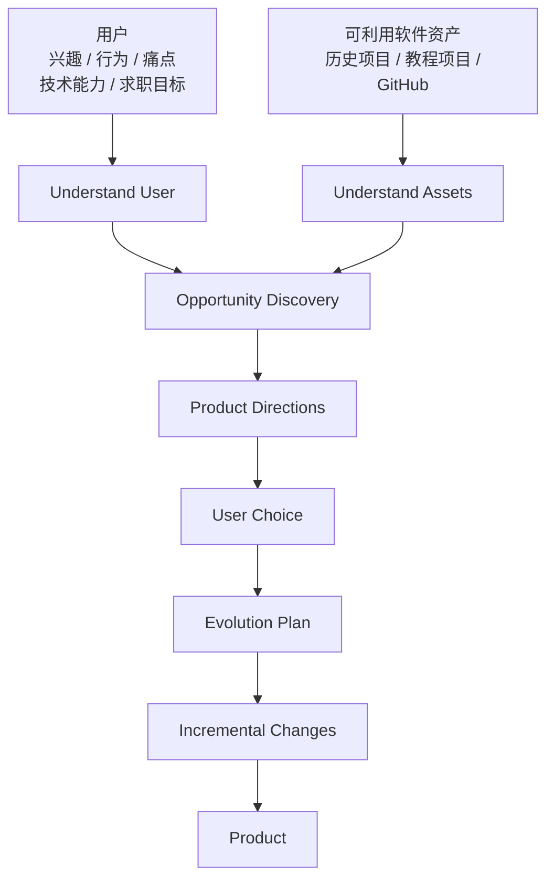

# PRODUCT.md

> 本文档回答：为什么做这个产品、给谁使用、解决什么问题，以及第一版到底做到哪里。

**Status:** Exploring
**Last Updated:** 2026-09-14

## 1. Product Vision

### 1.1 Current Definition

> 帮助有一定开发能力、但缺少项目方向的开发者，从个人兴趣、真实需求、技术能力与可利用软件资产出发，发现值得开发的项目，并尽可能利用已有项目作为起点，从而找到一条走向目标产品的可执行演化路径。

当前产品形态暂定：Personalized Project Discovery & Evolution Agent

解决核心问题：帮助用户找到一个自己真正想做的项目，将真实想法落地，并在满足个人需求的同时形成具有个人特征的项目。

### 1.2 Core Idea

当前认为产品的核心闭环是：



---

## 2. Problem Statement

### 2.1 Observed Problem

当前主要基于个人开发经历提出以下假设：

```text
开发者拥有：技术能力 + 教程 / 开源项目 / 历史代码
但缺少：个人需求 → 产品方向 → 可利用软件资产 → 改造路线 之间的连接。
```

以上问题**目前仍属于产品假设，尚未经过真实用户验证。**


### 2.2 Current Value Hypothesis

如果上述问题成立，那么系统可以通过：

```
用户兴趣 / 目标 / 痛点 / 真实行为
        +
用户技术能力
        +
可利用软件仓库能力
```

共同生成：

```
适合该用户的项目候选方向
```

并进一步降低：从“我想做这个”到“我已经找到合适的起点，并逐步把它演化成目标产品”之间的成本。

相比一次性向通用 LLM 描述兴趣和仓库，系统通过结构化 User Profile、Repository Profile 以及二者匹配，能够产生更具有个人相关性和可实施性的方向。

---

## 3. Target Users

### 3.1 Primary User

当前第一版暂定面向：

```
角色：
具有一定开发经验的学生开发者 / 初级开发者，
已经完成过至少一个教程项目、课程项目或开源项目，

目标：
认为这些项目缺少个人需求、真实场景或差异化，
希望基于可利用软件资产开发一个更具有个人意义的项目。
```

### 3.2 Non-Target Users

MVP 暂不面向：

- 完全没有编程基础的普通用户
- 企业级软件团队
- 希望完全无代码生成生产系统的用户

---

## 4. Core User Scenarios

### Scenario 1 — Discover User

```text
Given

用户拥有一定技术基础，但没有明确的项目创意。

When

用户向系统提供自己的兴趣、真实行为、痛点、技术背景

Then

系统根据用户答案，并自建用户画像 包括但不限于用户的：

- 兴趣爱好
- 当前目标、痛点
```


### Scenario 2 — Discover Repository

```text
Given

用户提供一个或多个可利用代码仓库。

When

系统探索可利用代码仓库结构和已有能力。

Then

系统形成代码仓库画像，包括但不限于：

- 项目技术栈
- 项目功能
- 项目模块构造
```


### Scenario 3 — Generate Product Directions And Choose

```
Given

系统已经形成并由用户确认一个 User Profile，
并理解一个或多个可利用软件仓库。

When

系统分析用户需求、技术能力、求职目标
与各可利用软件资产已有能力之间的潜在连接。

Then

系统生成多个 Product Direction，每个方向说明：

- 来源于用户的哪些兴趣 / 行为 / 痛点 / 目标
- 可利用的代码资产
- 相比原项目的主要差异
- 可体现的技术价值
- 大致改造成本
- 主要风险

用户从中选择一个目标方向。
```

### Scenario 4 — Generate Evolution Plan

```
Given

用户已经选择一个 Product Direction，
系统已经理解相关可利用软件资产。

When

系统选择或建议最合适的 Base Software Asset，
并分析 Current State → Target State 的差距。

Then

生成 Evolution Plan，包括：

- 当前状态
- 目标状态
- 可直接复用能力
- 需要删除 / 替换 / 修改的能力
- 新增能力
- 阶段划分
- 每阶段验证方式
- 主要技术风险
```

### Scenario 5 — 执行一次可验证改造

```
Given

系统已经生成 Evolution Plan，
并已经为本次演化准备独立的 Working Copy，
用户确认执行其中一个 Evolution Step。

When

系统执行该 Evolution Step。

Then

系统仅在与当前 Evolution Plan 绑定的 Working Copy 中修改相关代码，
不直接修改原始 Software Asset，

并通过构建、测试、Diff 或其他验证手段，
确认本次改造满足该 Evolution Step 的预定义验证要求，
且没有明显破坏已有项目能力。
```

## 5. MVP Scope

### P0

| 功能           | 验收标准                                                     |
| -------------- | ------------------------------------------------------------ |
| 探索用户       | 经过必要且有价值的交互后生成结构化 User Profile，至少包含兴趣 / 真实行为、当前痛点、技术能力、项目目标、重要约束；当信息足以支持 Product Direction Discovery 时停止无目的探索；用户能够查看、纠正并确认当前 Profile |
| 探索仓库       | 当前 Software Asset 主要以本地 Git Repository 形式输入，由此生成 `Repository Profile`，包含项目用途、主要模块、技术栈、核心能力、可复用资产和明显限制 |
| 项目方向生成   | 基于已确认的 User Profile 与 Repository Profile 生成 3–5 个明显不同的 Product Directions，每个方向说明需求来源、与用户的匹配点、可复用技术 / 项目资产、预计复杂度，供用户选择 |
| 生成改造方案   | 将选定的 Product Direction 转化为若干可独立验证的 Evolution Steps，并明确本次演化所基于的 Base Software Asset |
| 执行小规模改造 | 至少完成一个真实代码变更；修改仅发生在隔离的 Working Copy 中，不直接修改原始 Software Asset；并通过已有测试 / 新增测试 / 构建 / Diff / 人工验证之一证明本阶段目标完成 |

### P1 — MVP 后优先考虑

当前暂无。

MVP 完成第一轮真实验证后，
再根据用户反馈、实际开发过程和已验证的产品假设决定下一阶段优先能力，
避免在核心闭环尚未验证前提前扩大 Scope。

### P2 — Out of Scope

- 自动从 GitHub 搜索和筛选开源项目
- 从零生成完整项目
- 一次性自动完成整个项目演化
- 企业多人协作
- 云端代码托管
- 自动部署生产环境
- 项目商业价值预测
- 面向完全无编程能力的用户
- 长期自主运行的全自动 Coding Agent

---

## 6. MVP Validation

### 6.1 Hypotheses

#### H1 — Problem

具有一定开发能力的学习者确实存在：“有技术 / 有项目，但不知道做什么有个人特色项目” 的问题。

#### H2 — Discovery Value

相比直接让通用 LLM 生成项目创意，
结合用户长期兴趣、真实行为和可利用软件资产后，
系统能够产生用户认为更想真正开发的项目方向。

#### H3 — Evolution Value

在用户确定目标方向后，系统能够显著降低判断：

- 哪些代码可以复用
- 哪些代码需要修改
- 下一步先做什么

的认知成本。

#### H4 — Execution

系统生成的 Evolution Plan
至少可以成功指导完成一个可验证的代码改造。

### 6.2 Success Signals

- 用户看到推荐方向后明确认为：
  “这是我真的想做 / 会自己使用的东西。”
- 用户愿意选择其中一个方向继续开发。
- 用户认为推荐理由和自身真实经历有关，
  而不是通用项目推荐。
- 用户能够依据 Evolution Plan 开始实际开发，
  而无需重新自行分析整个仓库。
- 至少一个 Evolution Step 可以成功完成并验证。

---

## 7. Product Principles

### 7.1 Personal Before Generic

推荐必须能够追溯到用户的真实兴趣、行为、痛点或目标，
而不是生成泛化的软件项目列表。

### 7.2 Evolution Before Rewrite

优先寻找可利用软件资产与目标产品之间的演化路径，
而不是默认从零生成项目。

### 7.3 Evidence Before Recommendation

每个推荐方向都应该说明：
为什么适合该用户、依据是什么、哪些可利用软件资产能够支持。

### 7.4 Human Chooses Direction

系统负责发现和分析机会，
最终产品方向由用户确认。

### 7.5 Incremental & Verifiable

项目演化应拆成小规模、可验证的步骤，
而不是一次性大规模重构。