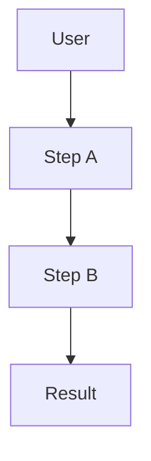
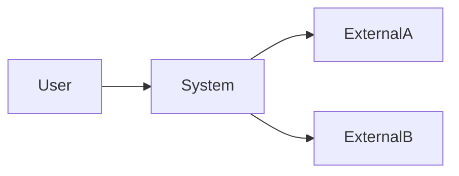
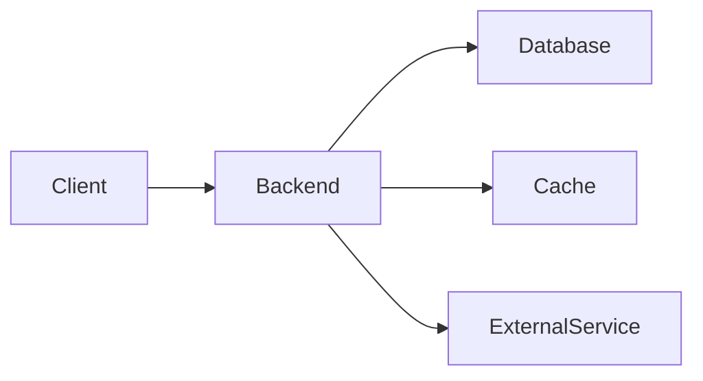
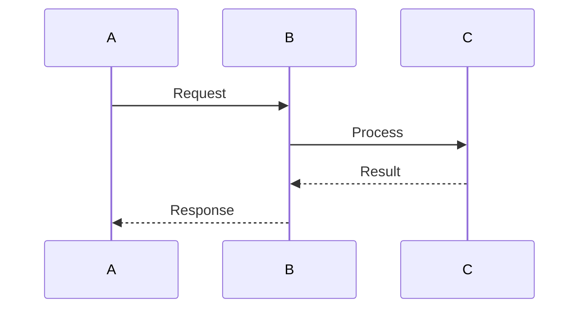
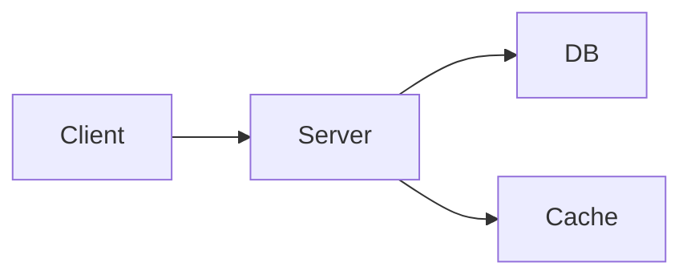
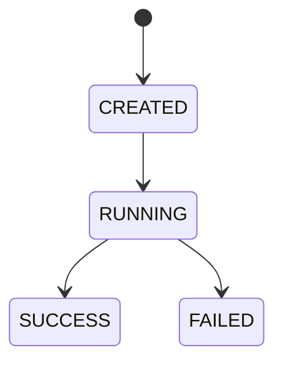

# 项目文档模板

建议目录：

```text
project/
├── README.md
├── AGENTS.md
│
├── docs/
│   ├── PRODUCT.md
│   ├── ARCHITECTURE.md
│   ├── DOMAIN_MODEL.md
│   ├── ROADMAP.md
│   └── decisions/
│       ├── 0001-xxx.md
│       ├── 0002-xxx.md
│       └── ...
│
└── src/
```

---

# PRODUCT.md

> 本文档回答：为什么做这个产品、给谁使用、解决什么问题，以及第一版到底做到哪里。

**Status:** Draft / Active / Stable  
**Last Updated:** YYYY-MM-DD

## 1. Product Vision

### 1.1 一句话定义

用一句话说明：

> 为【目标用户】提供一个【产品类型】，通过【核心能力】解决【核心问题】。

要求：

- 不描述代码实现
- 不堆技术名词
- 尽量一句话讲清楚

---

## 2. Problem Statement

### 2.1 当前问题

描述用户现在面临什么问题。

重点回答：

- 用户现在是怎么解决的？
- 哪里麻烦？
- 为什么值得解决？
- 当前方案最大的缺陷是什么？

### 2.2 为什么现在值得做

说明：

- 技术条件
- 用户需求
- 当前替代方案不足
- 项目本身的学习 / 商业 / 工程价值

---

## 3. Target Users

### 3.1 Primary User

核心用户是谁？

```text
角色：
背景：
目标：
当前痛点：
技术水平：
典型使用场景：
```

### 3.2 Secondary Users

如果存在其他用户，再说明。

第一版没有就直接写：

> 暂无。

---

## 4. Core User Scenarios

不要写所有功能，只写最重要的几个完整场景。

### Scenario 1

```text
Given:
用户当前处于什么状态

When:
用户执行什么操作

Then:
系统应该产生什么结果
```

### Scenario 2

```text
Given:
...

When:
...

Then:
...
```

---

## 5. Goals

项目第一阶段必须实现的目标。

### G1 — [目标名称]

说明：

> 系统应该能够……

成功标准：

- [ ] 可观察指标 1
- [ ] 可观察指标 2
- [ ] 可验证结果

### G2 — [目标名称]

……

---

## 6. Non-Goals

明确第一阶段**故意不解决什么问题**。

例如：

- 不支持……
- 暂不考虑……
- 第一版不会……
- 不追求……

这是非常重要的一章。

它防止项目无限膨胀。

---

## 7. MVP Scope

### P0 — MVP 必须有

| 功能 | 用户价值 | 验收标准 |
|---|---|---|
| Feature A | 为什么需要 | 怎样算完成 |
| Feature B | 为什么需要 | 怎样算完成 |

### P1 — MVP 后优先考虑

| 功能 | 价值 | 优先级 |
|---|---|---|
| Feature C | ... | High |

### P2 — Future

仅记录想法，不进入当前开发。

---

## 8. User Flow

描述最重要的一条完整用户路径。

```text
用户进入系统
    ↓
执行操作 A
    ↓
系统处理 B
    ↓
用户确认 C
    ↓
系统执行 D
    ↓
输出结果
```

复杂时使用 Mermaid。



---

## 9. Product Principles

记录以后发生产品冲突时用于做决定的原则。

例如：

1. 正确性优先于功能数量。
2. 用户必须能够理解系统为什么做出关键决策。
3. 危险操作必须经过确认。
4. 第一版优先保证完整闭环，而不是大量功能。

---

## 10. Success Metrics

如何判断项目真的有效？

### Functional

- 核心流程成功率：
- 错误率：
- 完成率：

### Performance

- 延迟：
- 吞吐：
- 资源消耗：

### Quality

- 准确率：
- 测试覆盖：
- 用户评价：

只填写真正有意义的指标。

---

## 11. Constraints

已知约束：

### Technical

- …

### Time / Resource

- …

### Legal / Security

- …

---

## 12. Assumptions

目前认为成立，但尚未验证的假设：

- A1:
- A2:
- A3:

后续如果假设错误，需要重新审视产品方案。

---

## 13. Open Questions

尚未决定的问题：

- [ ] Question A
- [ ] Question B
- [ ] Question C

做出重要决策后，从这里删除并转入 ADR。

---

# ARCHITECTURE.md

> 本文档回答：系统准备如何实现，以及最重要的架构选择是什么。

**Status:** Draft / Active / Stable  
**Last Updated:** YYYY-MM-DD

## 1. Architecture Goals

架构最重要的几个目标。

例如：

| 优先级 | Quality Attribute | 目标 |
|---|---|---|
| 1 | Maintainability | 模块可以独立演进 |
| 2 | Reliability | 核心流程失败可恢复 |
| 3 | Performance | 核心请求满足性能目标 |

不要列十几个。

一般 3～5 个最重要的即可。

---

## 2. Architecture Constraints

不能随便改变的条件。

### Technology Constraints

- Language:
- Runtime:
- Framework:
- Database:
- Infrastructure:

### Project Constraints

- 单体 / 分布式
- 部署环境
- 成本
- 团队规模
- 时间

---

## 3. System Context

描述系统外部世界。

重点回答：

- 谁使用这个系统？
- 系统依赖哪些外部服务？
- 哪些系统不属于我们的控制范围？



不要在这一层出现：

```text
Controller
Service
Repository
```

这是宏观视图。

---

## 4. Solution Strategy

用非常简短的语言说明整个系统最核心的设计思想。

例如：

```text
核心请求采用……
状态通过……
异步任务通过……
模块之间通过……
```

这一章应该让开发者 1～2 分钟理解系统的总体设计。

---

## 5. High-Level Architecture

描述主要运行单元。



说明每个部分的职责：

| Component | Responsibility |
|---|---|
| Component A | ... |
| Component B | ... |
| Component C | ... |

---

## 6. Module Design

描述代码级主要模块。

```text
module-a
├── responsibility
└── dependencies

module-b
├── responsibility
└── dependencies
```

模块表：

| Module | Responsibility | Depends On |
|---|---|---|
| A | ... | B |
| B | ... | - |

必须特别明确：

> 一个模块**不应该负责什么**。

---

## 7. Dependency Rules

规定模块依赖方向。

例如：

```text
API
 ↓
Application
 ↓
Domain
 ↑
Infrastructure
```

规则：

- Domain 不允许依赖 Infrastructure。
- 模块 A 不允许直接访问模块 C。
- 跨模块调用必须通过公开接口。
- 禁止循环依赖。

根据实际架构填写。

---

## 8. Runtime Flows

只记录关键流程。

### Flow 1 — [流程名称]



然后解释：

1. …
2. …
3. …

不要给每个 CRUD 都画时序图。

---

## 9. Data Architecture

说明：

### Databases

| Storage | Purpose | Data |
|---|---|---|
| DB A | ... | ... |

### Data Ownership

哪个模块拥有哪类数据？

### Consistency Model

什么时候需要：

- 强一致性
- 最终一致性
- 缓存一致性

---

## 10. Interface Design

主要接口类型：

```text
REST
RPC
Event
Message Queue
WebSocket
SSE
...
```

说明：

- 接口边界
- 输入输出原则
- 错误处理
- 版本管理策略

不要在这里罗列所有 API。

详细 API 应由代码/OpenAPI维护。

---

## 11. Cross-Cutting Concerns

### Error Handling

统一异常策略。

### Logging

日志规范。

### Observability

- Metrics
- Tracing
- Health Check

### Security

- Authentication
- Authorization
- Secrets
- Input Validation

### Configuration

环境变量、配置文件及敏感配置原则。

---

## 12. Deployment



说明：

- Development
- Test
- Production

环境之间有什么不同。

---

## 13. Failure & Recovery

列出最重要的失败情况。

| Failure | Impact | Recovery |
|---|---|---|
| Dependency unavailable | ... | ... |
| Database failure | ... | ... |
| Process crash | ... | ... |

---

## 14. Known Risks & Technical Debt

### Risks

- R1:
- R2:

### Technical Debt

- TD1:
- TD2:

禁止为了让文档显得高级而假装项目没有技术债。

---

## 15. Architecture Decisions

重大设计决策不要全部塞进本文。

记录 ADR：

```text
docs/decisions/
├── 0001-use-xxx.md
├── 0002-choose-xxx.md
└── ...
```

本文只维护索引：

| ADR | Decision | Status |
|---|---|---|
| 0001 | ... | Accepted |

---

# DOMAIN_MODEL.md

> 本文档回答：这个系统内部到底有哪些核心概念，以及这些概念之间如何协作。

**Status:** Draft / Active / Stable 
**Last Updated:** YYYY-MM-DD

## 1. Domain Overview

用几句话解释这个系统所处理的“世界”。

不要讨论：

- Controller
- SQL
- Redis
- Framework

只讲业务概念。

---

## 2. Ubiquitous Language

统一术语。

| Term | Definition | NOT |
|---|---|---|
| Term A | 准确定义 | 不是什么 |
| Term B | 准确定义 | 不是什么 |

所有：

```text
代码
数据库
Prompt
API
文档
```

尽量使用相同术语。

---

## 3. Core Concepts

### Concept A

**Definition**

是什么。

**Responsibilities**

负责什么。

**Does NOT**

不负责什么。

**Important Fields**

| Field | Meaning |
|---|---|
| id | ... |
| status | ... |

---

## 4. Entity / Value Object

根据项目复杂度决定是否严格采用 DDD。

### Entities

具有身份和生命周期：

```text
Entity A
Entity B
Entity C
```

### Value Objects

由值决定身份：

```text
ValueObject A
ValueObject B
```

不要为了“DDD”强行制造 Value Object。

---

## 5. Relationship Model


只表现领域关系。

不要把：

```text
Controller
ServiceImpl
Mapper
DTO
```

画进领域模型。

---

## 6. State Model

存在生命周期的对象建议单独描述。



状态表：

| Current | Event | Next | Conditions |
|---|---|---|---|
| CREATED | Start | RUNNING | ... |

---

## 7. Business Rules / Invariants

系统无论怎么改代码都必须成立的规则。

例如：

```text
INV-001:
某条件必须始终成立。

INV-002:
对象处于 X 状态时禁止执行 Y。

INV-003:
同一个资源不得……
```

这部分非常适合后续直接转成自动化测试。

---

## 8. Domain Operations

核心行为：

### Operation A

Input:

```text
...
```

Output:

```text
...
```

Preconditions:

```text
...
```

Postconditions:

```text
...
```

Failure:

```text
...
```

---

## 9. Domain Events

如果系统存在事件：

| Event | Trigger | Consumer |
|---|---|---|
| Event A | ... | ... |

不存在就写：

> 当前版本暂不引入领域事件。

不要为了架构显得高级强行 Event Driven。

---

## 10. Persistence Mapping

只有必要时才记录。

```text
Domain Concept
        ↓
Persistence Model
```

重点说明：

- 哪些对象持久化
- 哪些只存在运行时
- 哪些是派生数据

不要复制数据库表定义。

---

## 11. Examples

给核心模型一个真实但简短的示例。

```json
{
  "id": "...",
  "status": "...",
  "...": "..."
}
```

示例往往比五段解释更容易帮助未来开发者理解模型。

---

## 12. Open Modeling Questions

- [ ] X 应该属于 A 还是 B？
- [ ] Y 是否应该拥有独立生命周期？
- [ ] Z 是否值得独立建模？

---

# ROADMAP.md

> 本文档回答：项目准备按照什么顺序发展。

**Status:** Active  
**Last Updated:** YYYY-MM-DD

## 1. Current Goal

当前最重要目标：

> 完成……

原则：

一次只允许存在一个主要开发目标。

---

## 2. Development Principles

例如：

1. 先闭环，后完善。
2. 先正确，后优化。
3. 先单体，必要时再拆分。
4. 每个阶段必须能够独立运行。
5. 不提前实现尚未证明需要的功能。

---

## 3. Milestones

### M0 — Project Foundation

**Goal**

建立最小可开发基础。

**Deliverables**

- [ ] …
- [ ] …

**Acceptance Criteria**

- [ ] 项目可以构建
- [ ] 自动测试通过
- [ ] 核心开发环境可复现

**Out of Scope**

- …
- …

---

### M1 — First End-to-End Flow

**Goal**

跑通第一条真正的完整用户流程。

**Deliverables**

- [ ] …
- [ ] …

**Acceptance Criteria**

```text
Given ...
When ...
Then ...
```

---

### M2 — Reliability

**Goal**

解决 MVP 暴露出的可靠性问题。

---

### M3 — Performance / Quality

只有真的存在性能问题以后再设计。

---

## 4. Milestone Overview

| Milestone | Goal | Status |
|---|---|---|
| M0 | Foundation | TODO |
| M1 | End-to-End MVP | TODO |
| M2 | Reliability | TODO |
| M3 | Optimization | TODO |

状态统一：

```text
TODO
IN_PROGRESS
BLOCKED
DONE
```

---

## 5. Current Sprint / Iteration

当前只维护近期任务。

### Current

- [ ] Task A
- [ ] Task B
- [ ] Task C

### Next

- [ ] Task D
- [ ] Task E

不要把两个月以后所有细节提前拆成 Task。

---

## 6. Definition of Done

任何 Feature 完成必须满足：

- [ ] 功能实现
- [ ] 自动测试
- [ ] Build 成功
- [ ] 不破坏已有功能
- [ ] 必要文档更新
- [ ] 无临时 Debug 代码
- [ ] 无未解释的新依赖
- [ ] 核心异常路径得到处理

---

## 7. Deferred Ideas

目前不错，但暂时不做的想法：

```text
IDEA-001:
...

Why deferred:
...
```

把它们放这里，而不是偷偷扩大当前 Scope。

---

## 8. Known Blockers

| Blocker | Impact | Resolution |
|---|---|---|
| ... | ... | ... |

---

## 9. Completed Milestones

完成后不要删除历史。

### M0

Completed:

YYYY-MM-DD

Outcome:

```text
...
```

Lessons Learned:

```text
...
```

---

# AGENTS.md

> 本文件提供给 Coding Agent 阅读。
>
> 它不是项目介绍，而是 Agent 在这个代码仓库中的工作规则。

## 1. Required Context

任何修改前必须阅读：

```text
docs/PRODUCT.md
docs/ARCHITECTURE.md
docs/DOMAIN_MODEL.md
docs/ROADMAP.md
```

涉及架构决策时，还必须检查：

```text
docs/decisions/
```

---

## 2. Core Working Principle

Agent 的职责是：

> 在既有产品目标、架构约束和领域模型内完成当前任务。

Agent 不得擅自重新定义产品。

---

## 3. Before Coding

修改代码前：

1. 理解当前 Task。
2. 找到受影响模块。
3. 阅读相关测试。
4. 确认现有架构约束。
5. 识别潜在副作用。

如果需要重大架构改变：

> 不直接实现。

首先说明：

```text
Current problem
Proposed change
Why existing architecture is insufficient
Affected modules
Alternatives
Trade-offs
```

---

## 4. Scope Control

只修改完成当前 Task 必需的代码。

禁止：

- 顺便重构无关模块
- 批量修改命名
- 修改无关格式
- 删除未知代码
- 擅自升级依赖
- 擅自更换框架
- 擅自改变模块边界

---

## 5. Architecture Rules

必须遵循 `ARCHITECTURE.md`。

特别规则：

```text
RULE-ARCH-001:
...

RULE-ARCH-002:
...

RULE-ARCH-003:
...
```

---

## 6. Domain Rules

必须遵循 `DOMAIN_MODEL.md` 中定义的领域语义和 invariant。

禁止为了实现方便破坏领域规则。

---

## 7. Coding Standards

### General

- 优先可读性，而不是炫技。
- 优先已有项目模式，而不是引入新的抽象。
- 避免过度设计。
- 避免重复实现已有能力。

### Naming

```text
...
```

### Error Handling

```text
...
```

### Logging

```text
...
```

---

## 8. Dependency Policy

新增依赖之前必须说明：

```text
Dependency:
Purpose:
Why existing dependencies are insufficient:
Alternative considered:
Maintenance risk:
```

未经必要性验证不得新增依赖。

---

## 9. Testing Rules

任何行为变化必须有测试。

禁止：

- 为了让测试通过删除测试
- 降低断言强度
- catch 并忽略异常
- Mock 掉真正需要验证的逻辑

修改后至少执行：

```bash
<build command>
<test command>
```

---

## 10. Verification

完成任务前必须确认：

- [ ] Build 成功
- [ ] Tests 通过
- [ ] 当前需求满足
- [ ] 未修改无关文件
- [ ] 无明显安全问题
- [ ] 无临时调试代码
- [ ] 文档与代码没有明显冲突

---

## 11. Documentation Policy

以下情况必须同步更新文档：

### PRODUCT.md

产品行为或 Scope 改变。

### ARCHITECTURE.md

模块、依赖关系、运行流程发生重要改变。

### DOMAIN_MODEL.md

核心概念、状态或 invariant 改变。

### ROADMAP.md

Milestone 状态发生改变。

### ADR

发生重要且长期影响架构的技术决策。

---

## 12. Final Response Format

每次任务完成后必须输出：

### Changes

修改了哪些文件。

### Reason

为什么这样实现。

### Verification

运行了哪些测试以及结果。

### Risks

还存在什么风险。

### Follow-ups

有哪些问题明确没有在本次 Task 中处理。

---

# ADR Template

路径：

```text
docs/decisions/0001-decision-name.md
```

格式：

```markdown
# ADR-0001: Decision Title

Status: Proposed / Accepted / Deprecated / Superseded

Date: YYYY-MM-DD

## Context

为什么必须做这个决定？

目前有哪些约束和问题？

## Options Considered

### Option A

Pros:

- ...

Cons:

- ...

### Option B

Pros:

- ...

Cons:

- ...

## Decision

最终选择：

...

## Rationale

为什么选择它？

为什么不选择其他方案？

## Consequences

### Positive

- ...

### Negative

- ...

### Risks

- ...

## Revisit Conditions

什么条件发生时应该重新考虑这个决定？
```